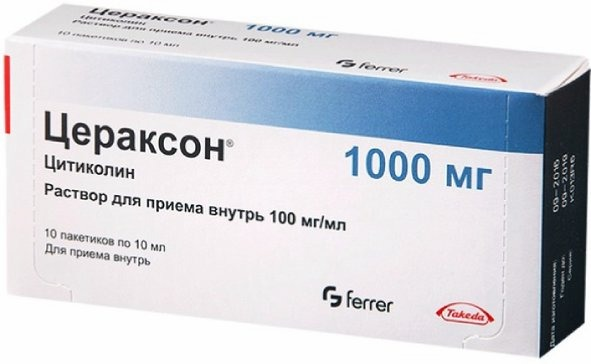
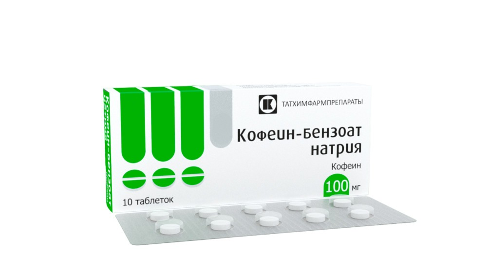
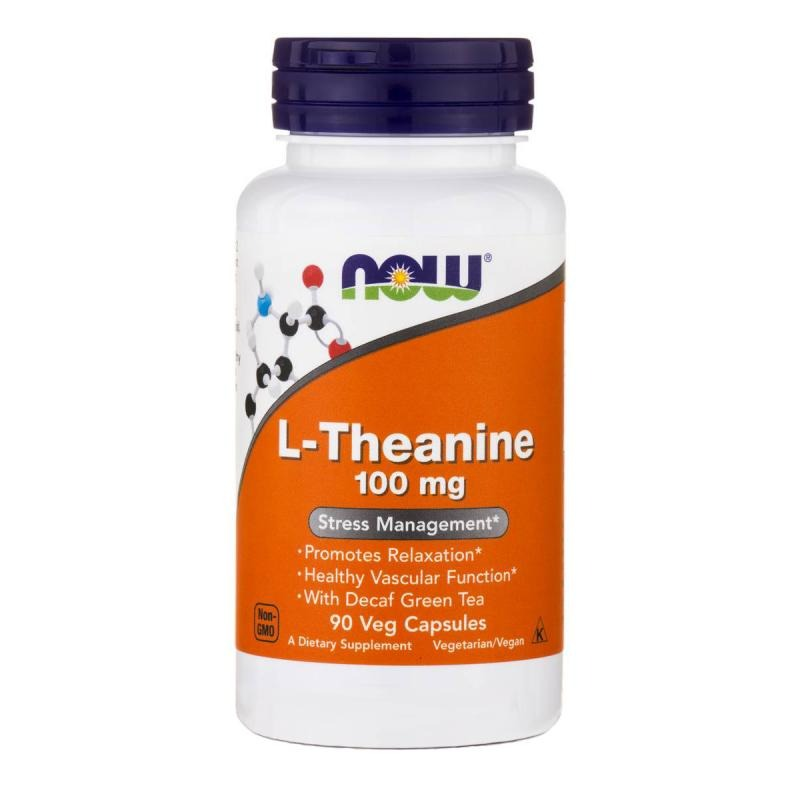
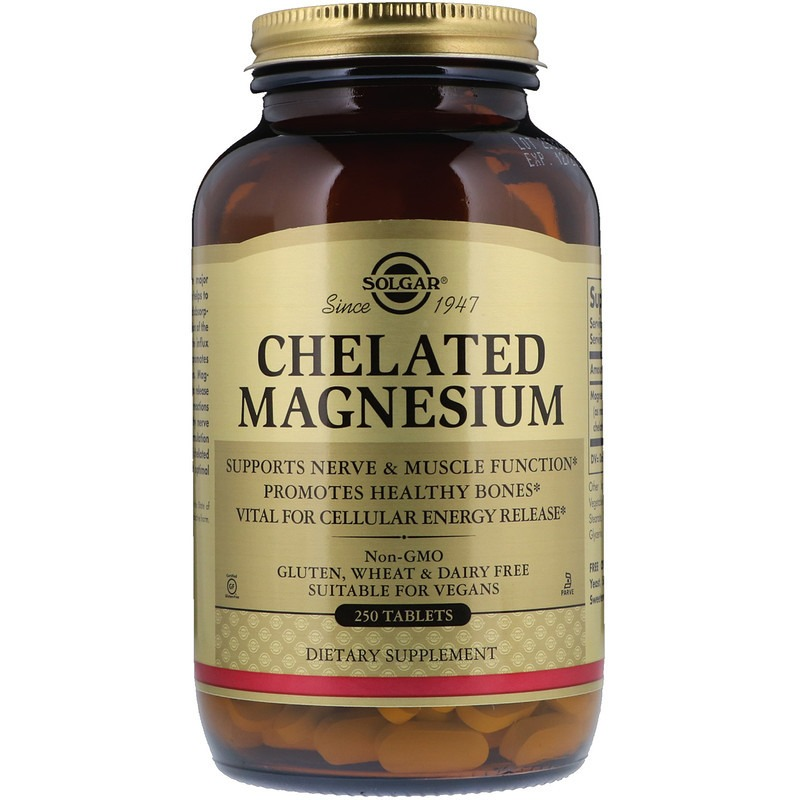
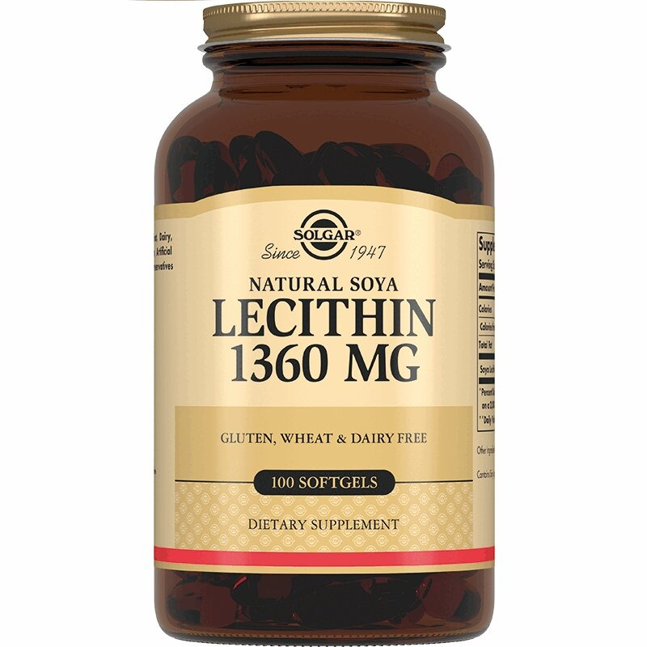

# Ноотропный комплекс для начинающих

Память, скорость мышления, энергия, хорошее настроение - базовые запросы от стека. 

Я постараюсь максимально, по полочкам, рассказать вам о базовом ноотропном комплексе и объясню почему именно эти добавки фигурируют в данной статье.

**Поехали!**

Я выделил два основных критерия, стека для начинающий - это безопасность и действие в долгосрочной перспективе.

#### Ноотропный эффект, основные факторы!
**1. Рост нейронов.** Конкретно - дендриты или разветвленные отростки нейронов, которые выстраиваются как в мозге, так и в теле. В мозге они прокачивают память, а в теле - нейромышечную связь, которая важна спортсменам, для максимальной отдачи со стороны мышц. Помогут в этом бакопа монье, ежовик гребенчатый, рацетамы. 

  **2. Питание нейронов.** Нарастить нейронные связи - это одно дело. Важно еще их сохранить. В первую очередь их целостность зависит от притока крови. А значит важно уделить внимание сосудам головного мозга. Снять спазм и направить приток крови в мозг помогают рацетамы, милдронат, кофеин. 

**3. Защита связи**. Дендриты - это как провода в линии электропередачи. Только покрыты они не резиной, а жировой оболочкой под названием - миелин. Она страдает от окислительного стресса. Снять окислительный стресс и восстановить оболочку помогают антиоксиданты. Витамин С, цинк, L-Теанин.

В нашем стеке мы используем теанин, как антиоксидант и лецитин, как поддержку для миелиновой оболочки и мембран клеток.
#### Как работает каждый компонент стека?
Теперь, когда понятно от чего отталкиваться, давайте разберем каждый компонент по отдельности:

**Ежовик Гребенчатый** - обладает свойством нейрогенеза. Помогает обучаться и запоминать. Терапевтический эффект может проявиться через месяц т.к образование нейронных связей дело не быстрое.

Дозировка: от 500 мг до 5 г в день в зависимости от содержания полисахаридов в составе. Рекомендую принимать натощак, с тёплой водой.

**Источник холина (Alha GPC, цитиколин,холин)** - строительный материал для ацетилхолина. Медиатора памяти и обучения. Отлично дополняет ежовик или рацетамы.   
Дозировка: цитиколин (цераксон) - 250 мг два раза в день утром и в полдень.  

**Кофеин** - повышает уровень дофамина, стимулирует ЦНС, а также улучшает кровообращение в мозге. Лучше кровообращение - лучше питание нейронов.  
Дозировка: 200-400 мг. Лучше вместе с теанином в первой половине дня.  

**Теанин** - уменьшает побочное действие кофеина и пролонгирует стимулирующий эффект. Является антиоксидантом - защита нейронов.  
Дозировка: от 100 до 300 мг раза в день. Можно разбить по 100 на 2-3 раза в течение дня.  

**Магний** - питание ЦНС. Необходим каждой нервной клетке для нормального функционирование.

Дозировка: для энергии принимайте магний утром, для хорошего сна, перед сном. Дозировка 400 мг. Лучшая форма - хелатная: глицинат, треонат, оротат, таурат магния и.т.п
  

**Лецитин** - группа фосфолипидов участвующая в синтезе и защите клеточных мембран. Полезен для организма в целом. Вещество является компонентом миелиновых оболочек.  
Дозировка: от 2-4 мг. Лучше всего принимать во время еды.  
  

#### План может выглядеть так:
9:00 - ежовик с теплой водой
9:30 - завтрак+лецитин+цитиколин
10:00 - теанин+кофеин
12:00 - обед+лецитин
15:00 - перекус+цитиколин
21:00 - магний
#### Вывод
В целом, это оптимальный и безопасный стек, для новичков и для опытных биохакеров. Поможет держать ваш мозг и организм в тонусе. “Вау эффекта” ждать не стоит, но на дистанции 1-2 месяца явно заметите разницу.

Источник: https://telegra.ph/Nootropnyj-kompleks-dlya-nachinayushchih-06-01