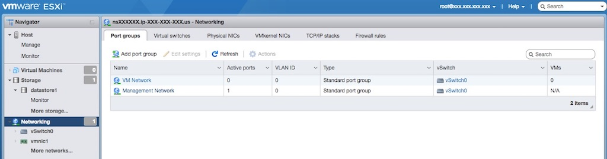
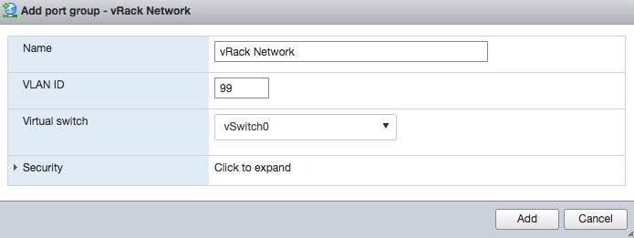
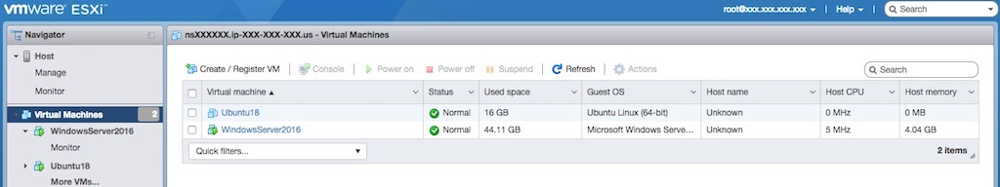
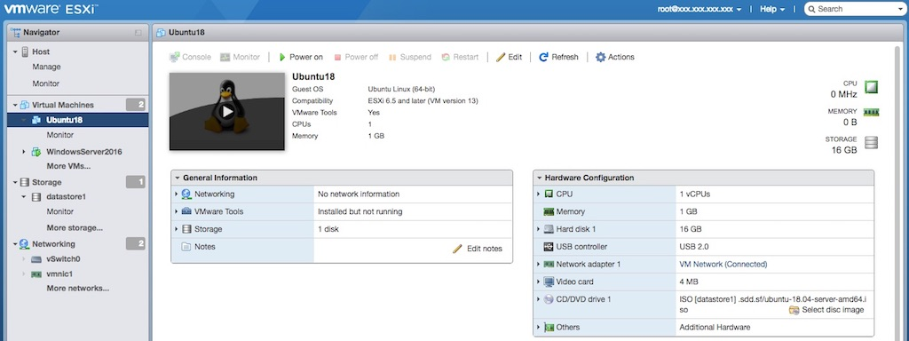
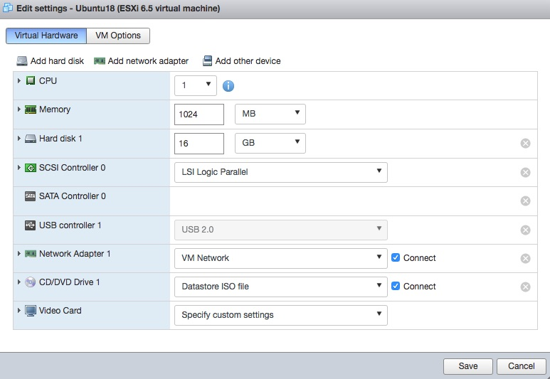
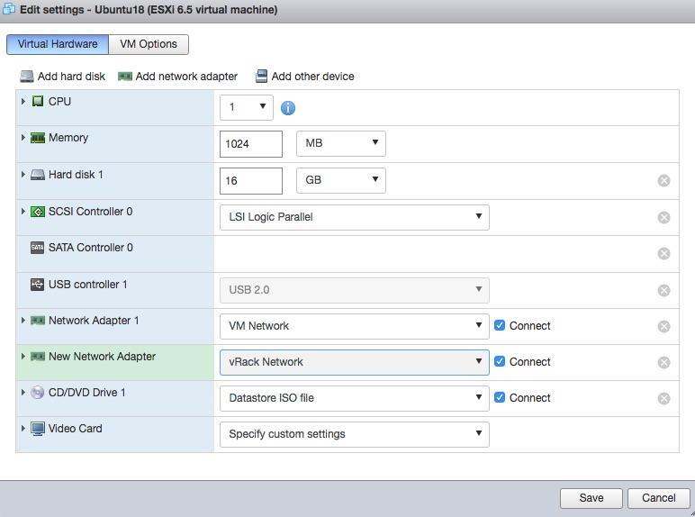

[Источник](https://support.us.ovhcloud.com/hc/en-us/articles/360002411530-How-to-Deploy-VLANs-with-VMware-ESXi-6-5)
### **Setting Up VLANs in VMware ESXi 6.5**

VMware ESXi 6.5 will handle all traffic routing for any VMs on its host. Therefore, we first need to configure networking in ESXi to route traffic over the VLAN(s) we choose. To do this, log in to your ESXi host and then select **Networking** on the left-hand sidebar. By default, you will be taken to the **Port groups** tab.

From this tab, click the **Add port group** button. Choose a name for your port group and a valid VLAN ID over which you want to route traffic.

**Note:** A valid VLAN ID must be between 2 and 4000.

Click the **Add** button when you are done and your new port group will be selected. This concludes all of the networking necessary for ESXi to route VM traffic over VLANs. However, we still need to change certain settings in our VMs to ensure that they have NICs assigned to our new port groups.

**Note:** In this example, we assume that we are changing settings on a preexisting VM. However, these same settings can be changed during the creation of a VM in ESXi.

First, click the **Virtual Machines** tab on the left-hand sidebar.

Click the VM in question.

**Note:** To make the following changes to your VM, the VM must be powered off.

Click the **Edit** button to access your VM's settings.

To route our VLAN tagged traffic, we will need to add another NIC to the VM. To do so, click the **Add network adapter** button and a second NIC will appear. Make sure the new network adapter is put onto the port group you created earlier in this tutorial.

You are now done with all of the network setup you need in ESXi. For examples of how to set up networking on VMs running Ubuntu 18.04 or Windows Server 2016, read on to the next two sections. If you are running a different operating system, the setup required will vary.