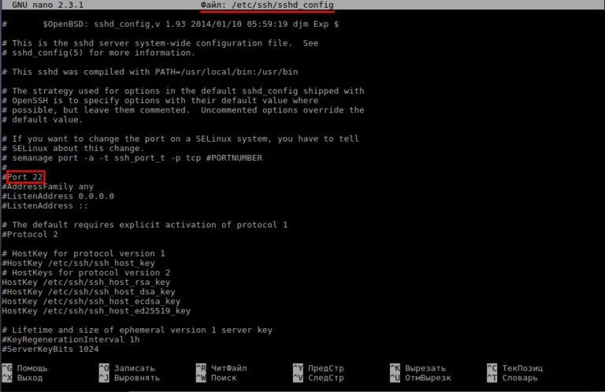

#linux #ssh
https://habr.com/ru/companies/flant/articles/691388/

###  Открытие и смена **ssh** порта по умолчанию
Информация об используемом порте находится на вашем сервере в файле **sshd_config**, который находится в директории **/etc/ssh/**
Посмотреть информацию по открытым портам можно встроенной утилитой `ss` с ключами:
```bash
ss -tupln
```
Таким образом мы проверим какие из портов уже используются, чтобы не использовать их повторно.
Открываем конфиг файл ssh 
```bash
nano /etc/ssh/sshd_config
```

Раскомментируем строку убрав # и меняем номер порта на другой (как пример "58200")
Перезапускаем службу:
```bash
service sshd restart
```
>`ufw` позволяет добавлять правила перед включением брандмауэра. Поэтому, если вы удаленно подключены к своему серверу с помощью ssh, вам следует запустить следующую команду::
```bash
sudo ufw delete allow 22/tcp
sudo ufw allow proto tcp from any to any port 58200
```
>Вывод должен выглядеть примерно так:
```bash
Rule addedRule added (v6)
```
>Порт SSH будет открыт после включения брандмауэра..
#### Для LXC контейнера
нужно добавить в systemd cocked так же новый порт
nano /etc/systemd/system/sockets.target.wants/ssh.socket
```
[Unit]
Description=OpenBSD Secure Shell server socket
Before=sockets.target
ConditionPathExists=!/etc/ssh/sshd_not_to_be_run

[Socket]
ListenStream=62226
Accept=no

[Install]
WantedBy=sockets.target
```
### Ошибка **WARNING: REMOTE HOST IDENTIFICATION HAS CHANGED**
При подключении к серверу по SSH можно столкнуться с ошибкой «_WARNING: REMOTE HOST IDENTIFICATION HAS CHANGED!_»:
```shell
@@@@@@@@@@@@@@@@@@@@@@@@@@@@@@@@@@@@@@@@@@@@@@@@@@@@@@@@@@@
@    WARNING: REMOTE HOST IDENTIFICATION HAS CHANGED!     @
@@@@@@@@@@@@@@@@@@@@@@@@@@@@@@@@@@@@@@@@@@@@@@@@@@@@@@@@@@@
IT IS POSSIBLE THAT SOMEONE IS DOING SOMETHING NASTY!
Someone could be eavesdropping on you right now (man-in-the-middle attack)!
It is also possible that a host key has just been changed.
The fingerprint for the RSA key sent by the remote host is
SHA256:XXXXXXXXXXXXXXXXXXXXXXXXXXXXXXXXXXXXXXXXXXX.
Please contact your system administrator.
Add correct host key in /home/user/.ssh/known_hosts to get rid of this message.
Offending RSA key in /home/user/.ssh/known_hosts:3
RSA host key for example.ftp.tools has changed and you have requested strict checking.
Host key verification failed.
```
Эта ошибка возникает из-за изменения сертификата сервера. Перед устранением ошибки стоит убедиться в том, что к вашей сети нет стороннего доступа и по маршруту к целевому адресу не производится ретрансляции, так как таким образом производится атака MITM (Man In The Middle). Также ошибка может возникать в случае переноса хостинг-аккаунта между нашими серверами (например, при [миграции](https://www.ukraine.com.ua/wiki/hosting/account/migration/) или по техническим причинам). В таком случае ошибка будет чаще всего идти в паре с ошибкой «_[WARNING: POSSIBLE DNS SPOOFING DETECTED!](https://www.ukraine.com.ua/wiki/hosting/cli/ssh/issues/possible-dns-spoofing/)_».

Для устранения ошибки нужно удалить существующий ключ для адреса одним из способов:

- Выполнить команду:
    
    ssh-keygen -R example.ftp.tools
    

- Вместо `example.ftp.tools` укажите адрес, к которому вы подключаетесь.
    
- Удалить ключ в файле `known_hosts` на вашем устройстве (путь к файлу обычно выглядит как `/home/user/.ssh/known_hosts`). Файл содержит примерно записи такого вида:!

- В данном примере нужно удалить весь текст от `example.ftp.tools` до `xxxxxxx.ftp.tools`:!
