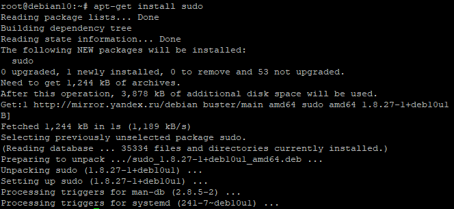
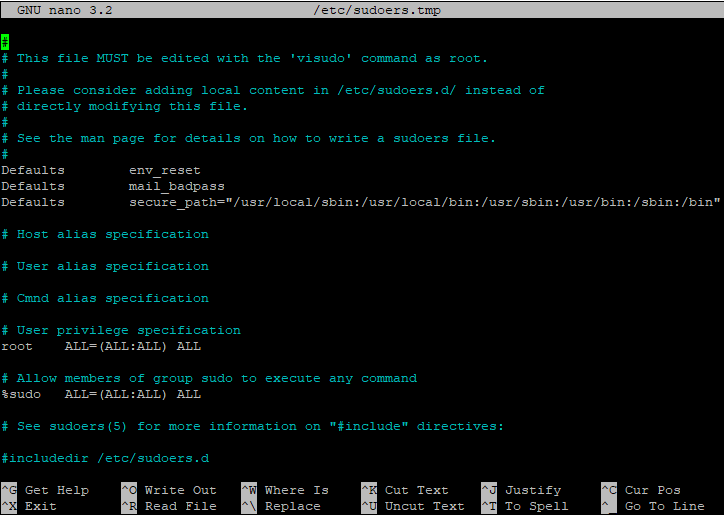
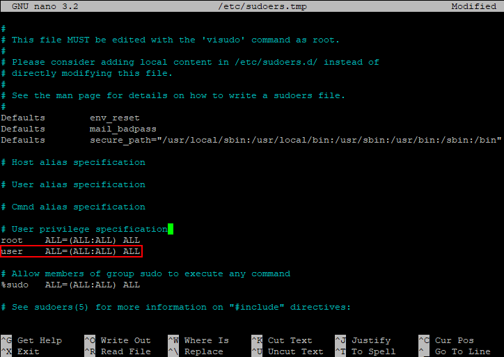
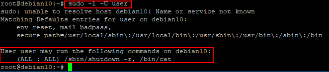

 +++
title = 'Sudo'
date = 2024-02-19T21:09:16+02:00
draft = false
+++
 [Linux](/projects/my_wiki/linux/)
#linux #sudo
### Содержание:
1. **[[#Установка и настройка| Установка и настройка]]**
2. **[[#Тонкая настройка]]**
3. **[[#Полезные команды]]**
### Права суперпользователя Debian (sudo, visudo)
В операционных системах семейства Linux реализован принцип разграничения пользовательских привилегий, то есть у разных учетных записей разный объем прав доступа к каталогам, файлам и программам. Максимальными правами наделена встроенная учетная запись root. Вновь создаваемые пользовательские аккаунты обычно существенно ограничены в доступе к системным конфигурационным файлам, управлении сервисами, установке и удалении программных пакетов. При этом работа в операционной системе под учетной записью root настоятельно не рекомендуется, прежде всего в целях безопасности. В этом случае на помощь приходит утилита командной строки sudo.  

Команда `sudo` позволяет запускать отдельные команды с повышением привилегий (по умолчанию с правами **root**) пользуясь непривилегированной учетной записью. Давайте разберемся, что же требуется для работы этой утилиты.
### Установка и настройка
В **ОС Ubuntu** `sudo` включена по умолчанию, а в **Debian**, если в процессе установки не был выбран соответствующий пакет, скорее всего будет следующая картина:
```bash
root@debian10:~# sudo
-bash: sudo: command not found
```
Значит, требуется установить недостающий пакет. Обновляем информацию о репозиториях и устанавливаем sudo:
```bash
apt-get update
apt-get install sudo
```
Дожидаемся окончания процесса:
Процесс установки sudo  
  
Скриншот №1. Процесс установки sudo

После успешной установки потребуется сконфигурировать sudo, определив, какие пользователи или группы смогут использовать повышение привилегий и в каком объеме. Все эти настройки хранятся в конфигурационном файле `/etc/sudoers`, однако вносить в него изменения напрямую настоятельно не рекомендуется. Для этих целей используется специальная команда:
```bash
visudo
```
которая запускает текстовый редактор с конфигурационным файлом:
Текстовый редактор  
  
Скриншот №2. Текстовый редактор

За предоставление прав здесь отвечают две строки:
```bash
root    ALL=(ALL:ALL) ALL
%sudo   ALL=(ALL:ALL) ALL
```
Первая строка назначает права для учетной записи root, вторая устанавливает права для членов группы sudo, которая была создана при установке пакета (знак % перед названием означает, что имя относится к группе пользователей). Соответственно, у нас есть два основных способа предоставить пользовательской учетной записи право использовать `sudo`:  

Добавить учетную запись пользователя (например, user) в группу sudo на сервере:
```bash
usermod –a –G sudo user
```
После изменения членства в группе, потребуется заново авторизоваться в этой учетной записи для применения новой конфигурации. Данный метод рекомендуется в тех случаях, когда пользователю необходимо предоставить полные права.  
Создать в файле новую запись, например, для учетной записи user. Мы добавляем строку по аналогии с root:
```bash
user ALL=(ALL:ALL) ALL
```
Добавлять новую запись рекомендуется в тех случаях, когда список привилегий будет корректироваться (об этом чуть позднее). Если мы внесли изменения в файл, нужно их сохранить нажатием сочетания клавиш Ctrl-O и выйти из редактора — Ctrl-X.  
Теперь можно проверить корректность работы:
```bash
user@debian10:~$ sudo cat /etc/sudoers
[sudo] password for user:
```
Команда `sudo` запрашивает пароль текущего пользователя (в данном случае это user) — вводим его, и, если все сделано правильно, мы увидим содержание системного конфигурационного файла.
### Тонкая настройка
Таким образом, обычный пользователь может запускать команды с правами учетной записи root не зная ее пароль. Это очень удобно, но может быть небезопасно — есть ли возможность ограничить круг команд, которые можно исполнять посредством `sudo`? Да, и поможет нам в этом тот же самый конфигурационный файл. Снова запускаем visudo и разбираемся дальше. Нас интересуют параметры, указанные после имени пользователя:
Настройки ограничения команд  
  
Скриншот №3. Настройки ограничения команд  
**Разберем их подробнее:**
* **ALL**=(ALL:ALL) ALL — первый параметр определяет к какому хосту применяется конфигурация. При использовании выделенного сервера параметр можно оставить без изменений;
* ALL=(**ALL**:**ALL**) ALL — параметры в скобках определяют с полномочиями какого пользователя (первый параметр) и/или группы (второй параметр) будет выполняться команда. По умолчанию `sudo` выполняет команду от имени root, однако при запуске с ключом `–u` можно указать другую учетную запись, а с ключом `–g` другую группу, чьи полномочия будут использованы при запуске;
* ALL=(ALL:ALL) **ALL** — третий параметр определяет к каким файлам и командам относятся данные настройки.
Исходя из вышесказанного, при необходимости определить перечень разрешенных команд заменяем последний параметр **ALL** тем, что нам требуется, перечисляя команды через запятую. Например, строка:
```bash
user    ALL=(ALL:ALL) /sbin/shutdown –r, /bin/cat
```
дает право пользователю **user** с помощью `sudo` осуществлять перезагрузку сервера командой `sudo /sbin/shutdown –r` и просматривать файлы с помощью `sudo /bin/cat`. Другие команды через `sudo`` выполняться не будут. Например, при попытке выключить сервер командой `sudo /sbin/shutdown –h`, получим ответ:
```bash
Sorry, user user is not allowed to execute '/sbin/shutdown -h' as root on debian10.
```
### Полезные команды
Увидеть список привилегий можно, запустив `sudo –l` (будет отображен список для текущего пользователя), либо `sudo –l –U user` (будет отображен список привилегий пользователя **user**):
Список привилегий пользователя  
  
Скриншот №4. Список привилегий пользователя  

В состав `sudo` входит команда `sudoedit`, которая запускает текстовый редактор с указанным файлом сразу с повышенными привилегиями, то есть вместо команды:
```bash
sudo nano /etc/network/interfaces
```
можно запустить:
```bash
sudoedit /etc/network/interfaces
```
Если требуется длительная работа в режиме повышенных привилегий и вводить `sudo` для каждой команды неудобно, можно запустить через sudo экземпляр командного интерпретатора:
```bash
sudo bash
```
и продолжить работу в нем — все команды будут запускаться с повышенными правами. По завершении работы выходим из интерпретатора командой `exit`.

часть взята с [serverspace](https://serverspace.ru/support/help/debian-superuser-rights-sudo-visudo/?utm_source=google.com&utm_medium=organic&utm_campaign=google.com&utm_referrer=google.com)