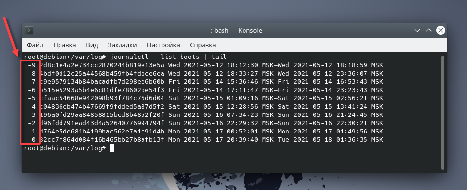
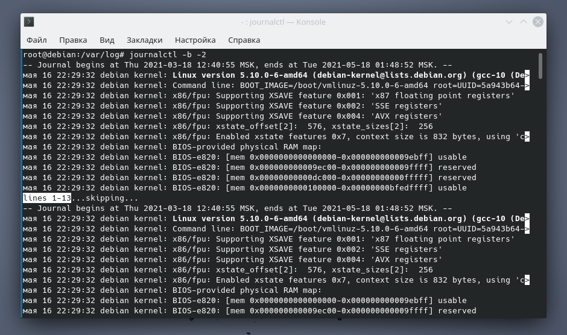
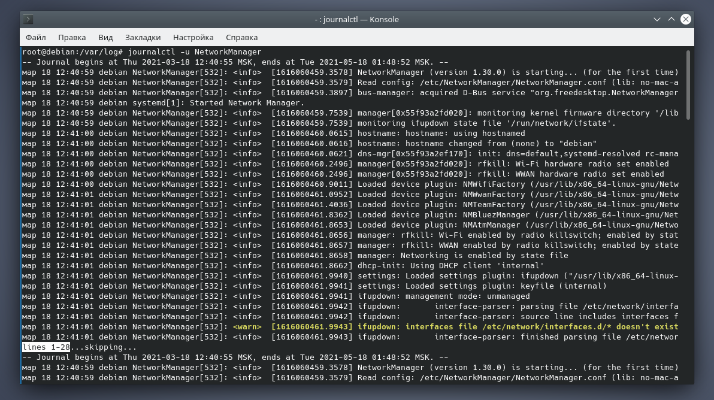

#linux #journalctl #logs #systemd
#### Логи journalctl
Логи **journalctl** могут скапливаться и занимать значительное пространство на диске сервера. Часто в таком объеме они не нужны. Можно ограничить срок хранения логов или общий размер.
journalctl является частью systemd. Предназначение в замене syslog и организации удобного доступа к отладочной информации.
journalctl можно гибко настраивать, в частности ограничивать объем создаваемых логов.
По умолчанию лимита нет и на сервере с небольшим диском можно заметить, что из 5-10 Гб содержимое **/var/log/journal** занимает 1-2 Гб и больше.
Хранить эти логи обычно нет необходимости.  
##### Чтобы просмотреть последние 10 строк логов всех запусков системы, достаточно выполнить следующую команду:
```bash
journalctl --list-boots | tail
```
  
Видите столбец, который я обвел красным? Цифрой 0 в нем обозначена текущая загрузка системы, цифрой -1 — предыдущая и т.д.  
##### Если вы хотите просмотреть логи какой-то конкретной загрузки, например, позапрошлой, то достаточно ввести:
```bash
journalctl -b -2
```
  
##### Для вывода информации только по нескольким последним записям, применяется опция -n, задающая их количество:
```bash
journalctl -u NetworkManager -n 5
```
  
##### Или же вывести сообщения ядра ОС:
```bash
journalctl -k
```
##### Для получения своих, каких-то более конкретных результатов, допускается комбинировать опции и параметры команды journalctl:
```bash
journalctl -b -1 -u NetworkManager
```
##### Просмотреть занимаемый объем можно так:
```bash
du -h --max-depth=1 /var/log/journal
```
*Ответ будет примерно вот такой:*
```bash
876M /var/log/journal/84f9f532cad34cc7b148b944d40c2aff
876M /var/log/journal
```
##### Ограничения можно установить двумя способами
1. по времени хранения логов (например, за последние 7 дней)
```bash
journalctl --vacuum-time=7d
```
2. по занимаемому объему на диске (например, не более 600 Мб)
```bash
journalctl --vacuum-size=600M
```
Вручную удалять содержимое **/var/log/journal** не следует. Приведенные команды сразу зачищают лишние данные, также контролируется соответствие заданным условиям в дальнейшем.  
###### Время загрузки системы
Если говорить про systemd, то, наверное, стоит упомянуть и про команду systemd-analyze, которая отвечает за сбор статистики загрузки системы. Применение данной команды без параметров отобразит общее время загрузки системы:
```bash
systemd-analyze
```
###### Время загрузки каждой службы
```bash
systemd-analyze blame
```
### Приоритет сообщений в лог-файлах
Сообщения в лог-файлах создаются в зависимости от типа событий. В свою очередь, событие имеет определенную степень важности. В зависимости от этой важности событию присваивается определенный приоритет:
* **emerg** — наивысший приоритет, что-то сломалось, повод паниковать;
* **alert** — тревога, стоит волноваться;
* **crit** — критическое событие, стоит насторожиться;
* **err** — ошибка;
* **warning** — предупреждение;
* **notice** — уведомление, можно не заморачиваться;
* **info** — информационное сообщение, принять к сведению и забыть;
* **debug** — отладочная информация.
Применяя вышеописанные значения приоритетов, можно просматривать сообщения лог-файлов, фильтруя их по заданному приоритету:
```bash
journalctl -p warning -b 0
```