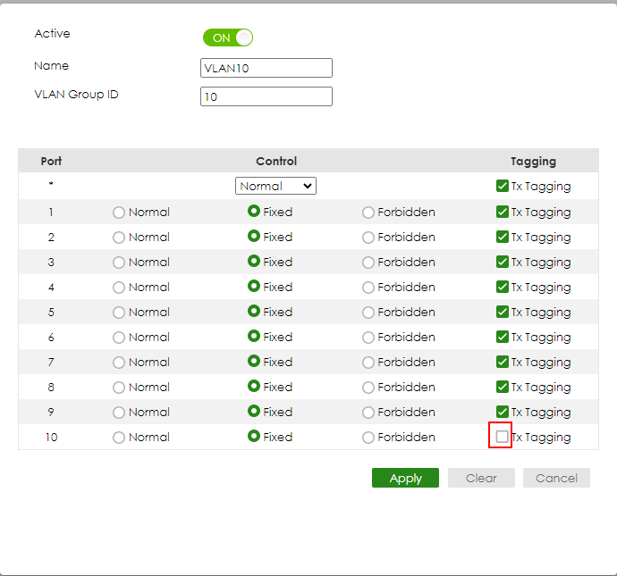

[Источник](https://support.zyxel.eu/hc/en-us/articles/4408118674834-VLAN-Tagged-VLANs-vs-PVID-Setup-Example-Untagged-Tagged-VLAN-on-a-GS22XX-Switch)
В этом пошаговом руководстве мы проведем вас через настройку коммутатора для стандартной конфигурации VLAN.:

Восходящий порт нашего маршрутизатора поддерживает VLAN, а пограничный порт ПК не поддерживает VLAN. В приведенном ниже руководстве на этом примере показано, как настроить порты коммутатора для обоих **тегированные и нетегированные VLAN.**

#### Тегированная VLAN

Если у вас есть устройства с поддержкой VLAN (брандмауэры или точки доступа с предварительно настроенными интерфейсами VLAN/SSID с поддержкой VLAN и т. д.), вам необходимо настроить порт **отмеченный** к VLAN-ID, через который вы хотите пройти. В нашем примере мы настроим VLAN с VID=10 на GS2200. По умолчанию все порты VLAN **нетегированные участники в VLAN1, и все порты имеют PVID = 1.** Это позволяет устройствам, не поддерживающим VLAN, подключенным к портам, взаимодействовать через VLAN.1.

Сначала перейдите к:
**SWITCHING > VLAN > VLAN Setup > Static VLAN**
Затем вы увидите кнопку «Добавить/изменить», чтобы добавить меню VLAN10.:

В этом меню создайте VLAN, активировав VLAN, присвоив ей имя (мы выбрали здесь «VLAN10» и назначили VLAN-ID — в нашем примере 10). После этого установите членство портов, которые вы хотите установить, на « Исправлено», настройте тегирование (поскольку мы хотим, чтобы эти порты были тегированы), а затем нажмите «Добавить», чтобы применить настройку и создать VLAN..   
>Примечание. Не забудьте нажать «Сохранить», если вы хотите, чтобы эти настройки были навсегда сохранены в конфигурации коммутатора.!

#### Нетегированная VLAN
Иногда рассматриваемое конечное устройство не поддерживает VLAN, но все же должно присоединиться к VLAN (например, у большинства компьютеров нет настроек VLAN на сетевых картах). В нашем примере ПК, подключенный к порту 10 нашего коммутатора GS2200, должен стать членом VLAN10 без фактической установки VLAN на его сетевой интерфейсной карте. Для этого снова перейдите к

**SWITCHING > VLAN > VLAN Setup > Static VLAN**

На этот раз мы выберем порт, к которому подключен наш компьютер, чтобы он был нетегированным участником VLAN 10. Для этого мы устанавливаем статус членства на «Фиксированный», а **снятие флажка «Помечено»**.

После этого снова нажимаем «Применить», чтобы применить наши настройки..

Обратите внимание, что **только одно непомеченное членство на порт** позволено! Это автоматически означает, что нам придется удалить немаркированное членство по умолчанию в VLAN1. Отметьте VID1 и нажмите «Добавить/изменить», чтобы отредактировать VLAN.1:

Здесь убедитесь, что для порта без тега VLAN10 для VLAN1 установлено значение «Запрещено», или пометьте его с помощью Tx-Tagged-Checkbox. После этого временно сохраните с помощью кнопки «Применить»..

В качестве следующего шага важно знать, что **PVID порта всегда должен соответствовать его нетегированному членству. -** поэтому нам все равно нужно установить PVID порта 10 коммутатора равным 10. Это можно сделать через:

**SWITCHING > VLAN > VLAN Setup > VLAN Port Setup**

Здесь вы можете установить PVID в соответствии с нашими потребностями.:

Вы знаете, что я могу подключить компьютер к порту 10 вашего коммутатора и получить IP-адрес из VLAN10 универсальной группы безопасности.!

**Примечание. Не забудьте нажать «Сохранить», если вы хотите, чтобы эти настройки были навсегда сохранены в конфигурации коммутатора.!**
