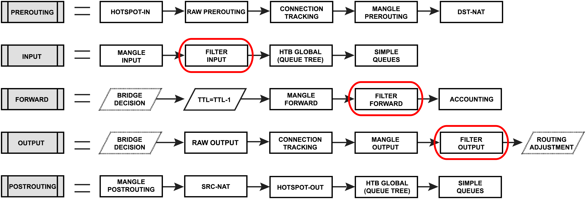

#mikrotik #firewall 
### Теория
Каждый модуль брандмауэра имеет свои собственные предопределенные цепочки.:
- **raw**:
    - prerouting
    - output
- **filter**
    - input
    - forward
    - output
- **mangle**
    - prerouting
    - input
    - forward
    - output
    - postrouting
- **nat**
    - srcnat
    - dstnat

### Цепочка `input`

1. **Accept ICMP** — Разрешает ICMP трафик.
2. **Accept established, related, untracked** — Разрешает уже установленное и связанное соединение.
3. **Drop all not coming from LAN** — Запрещает все входящие соединения, которые не из локальной сети.

### Цепочка `forward`

1. **Accept IPSec policy** — Разрешает IPSec соединения (если включено).
2. **Fasttrack established, related connections** — Ускоряет обработку установленных соединений.
3. **Accept established, related, untracked** — Разрешает установленные и связанные соединения.
4. **Drop invalid** — Запрещает недействительные соединения.
5. **Drop all from WAN not DSTNATed** — Запрещает все новые соединения с WAN, если они не перенаправлены.
6. **Drop bad forward IPs** — Запрещает пересылку пакетов с недопустимыми IP-адресами (source и destination).

### Цепочка `nat`

1. **Accept IPSec policy** — Разрешает IPSec соединения (если включено).
2. **Masquerade** — NAT-маскарад для выходящего трафика через WAN-интерфейс.

### Цепочка `raw`

1. **Accept for transparent firewall** — Разрешает прозрачный фаервол (если включено).
2. **Accept DHCP discover** — Разрешает DHCP запросы.
3. **Drop bogon IPs** — Запрещает пакеты с недопустимыми IP-адресами (source и destination).
4. **Drop non-global from WAN** — Запрещает локальные IP-адреса с WAN.
5. **Drop forward to local lan from WAN** — Запрещает пересылку в локальную сеть с WAN.
6. **Drop local if not from default IP range** — Запрещает локальные пакеты с неправильными IP-адресами.
7. **Drop bad UDP** — Запрещает пакеты UDP с портом 0.
8. **Jump to ICMP chain** — Переход на цепочку `icmp4`.
9. **Jump to TCP chain** — Переход на цепочку `bad_tcp`.
10. **Accept everything else from LAN** — Разрешает все остальные пакеты из LAN.
11. **Accept everything else from WAN** — Разрешает все остальные пакеты с WAN.
12. **Drop the rest** — Запрещает все оставшиеся пакеты.

### Цепочка `bad_tcp`

1. **Drop TCP flag filter** — Запрещает пакеты с неправильными флагами TCP.
2. **Drop TCP port 0** — Запрещает пакеты TCP с портом 0.

### Цепочка `icmp4`

1. **Accept echo reply** — Разрешает ICMP echo reply.
2. **Accept net unreachable** — Разрешает ICMP network unreachable.
3. **Accept host unreachable** — Разрешает ICMP host unreachable.
4. **Accept protocol unreachable** — Разрешает ICMP protocol unreachable.
5. **Accept port unreachable** — Разрешает ICMP port unreachable.
6. **Accept fragmentation needed** — Разрешает ICMP fragmentation needed.
7. **Accept echo** — Разрешает ICMP echo.
8. **Accept time exceeded** — Разрешает ICMP time exceeded.
9. **Drop other ICMP** — Запрещает все остальные пакеты ICMP.

### Вывод

Очередность правил в предоставленных цепочках выглядит правильной. Основные моменты:

- **На первом месте** расположены разрешающие правила для установленных соединений и определенных протоколов (ICMP, IPSec).
- **Правила на отказ** (drop) находятся после правил на разрешение, что позволяет блокировать ненужный трафик после того, как разрешен полезный.
- **Правила на маскарад** и **прием всего остального** расположены в конце цепочек, чтобы разрешить исходящий трафик и оставить минимальный набор правил на отказ.

Эта структура обеспечивает баланс между безопасностью и производительностью, правильно обрабатывая как разрешенный, так и запрещенный трафик.