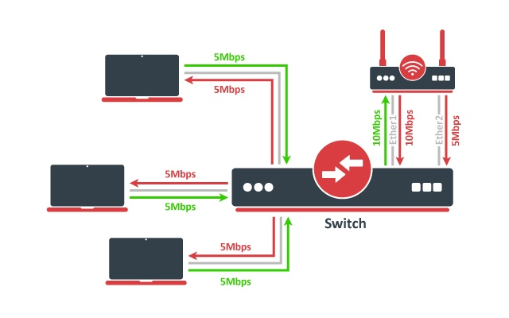

#mikrotik #bonding 
### Краткое содержание
Объединение — это технология, которая позволяет объединять несколько Ethernet-интерфейсов в один виртуальный канал, тем самым обеспечивая более высокую скорость передачи данных и обеспечивая аварийное переключение..
> Объединение интерфейсов не создает интерфейс с большей скоростью соединения. Объединение интерфейсов создает виртуальный интерфейс, который может распределять нагрузку по нескольким интерфейсам. Более подробную информацию можно найти в [Интерфейсы LAG и балансировка нагрузки](https://help.mikrotik.com/docs/display/ROS/Layer2+misconfiguration#Layer2misconfiguration-LAGinterfacesandloadbalancing) страница.
> 
> Коммутаторы серий CRS3xx, CRS5xx, маршрутизаторы CCR2116, CCR2216 и микросхемы коммутаторов 88E6393X, 88E6191X, 88E6190 поддерживают аппаратную разгрузку моста с помощью интерфейсов соединения. Аппаратно разгружаются только режимы соединения 802.3ad и Balance-XOR, другие режимы соединения будут использовать ресурсы ЦП. Встроенный чип коммутатора всегда будет использовать Layer2+Layer3+Layer4 для политики хеширования передачи, изменение политики хеширования передачи вручную не будет иметь никакого эффекта. См. более подробную информацию о функциях микросхемы переключателя CRS3xx, CRS5xx, CCR2116, CCR2216..

### Руководство по быстрой установке 
Предположим, что у нас есть два интерфейса Ethernet на каждом маршрутизаторе (Маршрутизатор1 и Маршрутизатор2) и мы хотим получить максимальную скорость передачи данных между этими двумя маршрутизаторами. Чтобы сделать это возможным, выполните следующие действия: 
1. Убедитесь, что у вас нет IP-адресов на интерфейсах, которые будут привязаны к интерфейсу связывания.
2. Добавьте интерфейс соединения и IP-адрес на Router1: 
```sql
/interface bonding add slaves=ether1,ether2 name=bond1
/ip address add address=172.16.0.1/24 interface=bond1
```
3. Сделайте то же самое на Router2: 
```sql
/interface bonding add slaves=ether1,ether2 name=bond1
/ip address add address=172.16.0.2/24 interface=bond1
```
4. Проверьте соединение с маршрутизатора1:
```sql
[admin@Router1] > ping 172.16.0.2
  SEQ HOST                                 SIZE TTL TIME  STATUS                  
    0 172.16.0.2                             56  64 0ms 
    1 172.16.0.2                             56  64 0ms 
    2 172.16.0.2                             56  64 0ms 
    sent=3 received=3 packet-loss=0% min-rtt=0ms avg-rtt=0ms max-rtt=0ms
```
> Интерфейсу соединения требуется несколько секунд, чтобы установить соединение со своими одноранговыми узлами..

### Link monitoring
Крайне важно, чтобы одна из доступных опций мониторинга каналов была включена. В приведенном выше примере, если один из связанных каналов выйдет из строя, драйвер соединения все равно продолжит отправлять пакеты по неисправному каналу, что приведет к ухудшению качества сети. Объединение в RouterOS в настоящее время поддерживает две схемы мониторинга состояния канала подчиненных устройств: мониторинг MII и ARP. Невозможно использовать оба метода одновременно из-за ограничений драйвера связывания..
##### ARP Monitoring
Мониторинг ARP отправляет запросы ARP и использует ответ как индикатор работоспособности канала. Ответы ARP не проверяются, любой пакет, полученный подчиненным интерфейсом, приведет к тому, что подчиненный интерфейс будет считаться активным. Это дает уверенность в том, что трафик действительно проходит по ссылкам. Если установлены режимы Balance-RR и Balance-XOR, то коммутатор должен быть настроен на равномерное распределение пакетов по всем каналам. В противном случае все ответы от целей ARP будут получены по одному и тому же каналу, что может привести к сбою других каналов. Мониторинг ARP включается путем установки трех свойств - мониторинг ссылок, arp-ip-цели и arp-интервал. Значение каждого параметра описано далее в этой статье. Можно указать несколько целей ARP, что может быть полезно в настройках высокой доступности. Если установлена ​​только одна цель, сама цель может снизиться. Наличие дополнительных целей повышает надежность мониторинга ARP..

Чтобы включить мониторинг ARP на маршрутизаторе1:
```
/interface bonding set [find name=bond1] link-monitoring=arp arp-ip-targets=172.16.0.2
```
и маршрутизатор2:
```
/interface bonding set [find name=bond1] link-monitoring=arp arp-ip-targets=172.16.0.1
```
Мы не изменимся тот arp-интервал значение в нашем примере, RouterOS устанавливает arp-интервал до 100 мс по умолчанию. Отключите один из кабелей, чтобы проверить, правильно ли работает мониторинг соединения. Вы можете заметить некоторые тайм-ауты пинга, пока мониторинг ARP не обнаружит сбой соединения..
```
[admin@MikroTik] > ping 172.16.0.2
  SEQ HOST                                     SIZE TTL TIME  STATUS                                
    0 172.16.0.2                                 56  64 0ms 
    1 172.16.0.2                                 56  64 0ms 
    2 172.16.0.2                                 56  64 0ms 
    3 172.16.0.2                                 56  64 0ms 
    4 172.16.0.2                                              timeout                               
    5 172.16.0.2                                 56  64 0ms 
    6 172.16.0.2                                 56  64 0ms 
    sent=7 received=6 packet-loss=14% min-rtt=0ms avg-rtt=0ms max-rtt=0ms
```
> Для правильной работы ARP-мониторинга не обязательно иметь какой-либо IP-адрес на устройстве, ARP-мониторинг будет работать независимо от IP-адреса, установленного на любом интерфейсе..

>  При использовании мониторинга ARP подчиненные устройства соединения будут отправлять запросы ARP без тега VLAN, даже если IP-адрес установлен на интерфейсе VLAN в той же подсети, что и arp-ip-цели

##### MII monitoring
Мониторинг MII отслеживает только состояние локального интерфейса. _Тип МИИ 1_ - драйвер устройства определяет, работает ли соединение или нет. Если драйвер устройства не поддерживает эту опцию, ссылка будет отображаться как всегда вверху. Основным недостатком является то, что мониторинг MII не может определить, может ли канал действительно передавать пакеты или нет, даже если канал определен как работающий. Мониторинг MII настраивается путем установки переменных - мониторинг ссылок и тысячный радиус действия.

Чтобы включить мониторинг MII Type1 на Router1 и Router2:
```
/interface bonding set [find name=bond1] link-monitoring=mii
```
Мы оставим тысячный радиус действия к значению по умолчанию (100 мс). При отключении одного из кабелей неисправность будет обнаружена практически мгновенно по сравнению с контролем ARP-канала..
### Bonding modes
##### 802.3ad

802.3Режим рекламы — это стандарт IEEE, также называемый LACP (протокол управления агрегацией каналов). Он включает в себя автоматическую настройку агрегатов, поэтому необходима минимальная настройка коммутатора. Этот стандарт также требует, чтобы кадры доставлялись по порядку, и в соединениях не должно быть нарушений порядка пакетов. Стандарт также требует, чтобы все устройства в совокупности работали с одинаковой скоростью и в дуплексном режиме..

LACP балансирует исходящий трафик между активными портами на основе хешированной информации заголовка протокола и принимает входящий трафик от любого активного порта. Хэш включает адрес источника и назначения Ethernet и, если доступен, тег VLAN, а также адрес источника и назначения IPv4/IPv6. Как это рассчитывается, зависит от политика передачи хэша параметр. Мониторинг канала ARP не рекомендуется, поскольку ответы ARP могут поступать только на один подчиненный порт из-за политики хеширования передачи на одноранговом устройстве LACP. Это может привести к несбалансированному передаваемому трафику, поэтому рекомендуемым вариантом является мониторинг канала MII..
> Слой-3-и-4 режим хеширования передачи не полностью совместим с LACP. Более подробную информацию можно найти в [https://www.kernel.org/doc/Documentation/networking/bonding.txt](https://www.kernel.org/doc/Documentation/networking/bonding.txt)
##### balance-xor
Этот режим балансирует исходящий трафик между активными портами на основе хешированной информации заголовка протокола и принимает входящий трафик от любого активного порта. Этот режим очень похож на LACP, за исключением того, что он не стандартизирован и работает с политикой хеширования уровней 3 и 4. Режим может работать вместе со статическими интерфейсами группы агрегации каналов (LAG)..
##### balance-rr
Если этот режим установлен, пакеты передаются в последовательном порядке от первого доступного подчиненного устройства к последнему. Balance-RR — единственный режим, который будет отправлять пакеты через несколько интерфейсов, принадлежащих одному TCP/IP-соединению. При использовании нескольких каналов отправки и получения пакетов пакеты часто принимаются не по порядку, что приводит к повторной передаче сегмента. Для других протоколов, таких как UDP, это не проблема, если клиентское программное обеспечение может допускать пакеты с нарушением порядка. Если коммутатор используется для объединения каналов, требуется соответствующая конфигурация порта коммутатора, однако многие коммутаторы не поддерживают балансировку-RR. Руководство по быстрой настройке демонстрирует использование режима соединения Balance-RR. Как видите, настроить его довольно просто. Balance-rr также полезен для объединения нескольких беспроводных каналов, однако для этого требуется одинаковая пропускная способность для всех связанных каналов. Если пропускная способность одного связанного канала упадет, то общая пропускная способность соединения будет равна пропускной способности самого медленного связанного канала..
##### active-backup
В этом режиме для передачи пакетов используется только один активный подчиненный узел. Дополнительный ведомый становится активным только в случае отказа основного ведомого. MAC-адрес интерфейса соединения отображается на активном порту, чтобы не сбить с толку коммутатор. Активное резервное копирование — лучший выбор в конфигурациях высокой доступности с несколькими соединенными между собой коммутаторами. 
> Мониторинг ARP в этом режиме не будет работать корректно, если оба маршрутизатора подключены напрямую. В таких настройках необходимо использовать мониторинг MII или поставить коммутатор между маршрутизаторами..
##### broadcast
Когда порты настроены на широковещательный режим, все подчиненные порты передают одни и те же пакеты пункту назначения, чтобы обеспечить отказоустойчивость. Этот режим не обеспечивает балансировку нагрузки.
##### balance-tlb
Этот режим балансирует исходящий трафик по узлам. Каждый канал может иметь различную скорость и дуплексный режим, и не требуется никакой специальной настройки коммутатора, как для других режимов. Недостатком этого режима является то, что поддерживается только мониторинг каналов MII (мониторинг ARP-каналов игнорируется при настройке) и входящий трафик не балансируется. Входящий трафик будет использовать ссылку, настроенную как «основная».".
### Configuration example
Let's assume that the router has two links - **ether1** max bandwidth is 10Mbps and **ether2** max bandwidth is 5Mbps. The first link has more bandwidth so we set it as a primary link:
```
/interface bonding add mode=balance-tlb slaves=ether1,ether2 primary=ether1
```

Никакой дополнительной настройки для коммутатора не требуется. Изображение выше иллюстрирует, как работает режим Balance-TLB. Как видите, маршрутизатор может обмениваться данными со всеми клиентами, подключенными к коммутатору, с общей пропускной способностью обоих каналов (15 Мбит/с). Но, как вы уже знаете, баланс-tlb не балансирует входящий трафик. В нашем примере клиенты могут связываться с маршрутизатором с общей пропускной способностью основного канала, которая в нашей конфигурации составляет 10 Мбит/с. 
##### balance-alb
Режим в основном такой же, как и Balance-tlb, но входящий трафик IPv4 также сбалансирован. Балансировка нагрузки приема достигается путем согласования ARP. Драйвер связывания перехватывает локально сгенерированные сообщения ARP на их выходе и перезаписывает исходный аппаратный адрес уникальным адресом одного из подчиненных устройств в соединении, так что разные одноранговые узлы используют разные аппаратные адреса. Поддерживается только мониторинг канала MII (мониторинг канала ARP игнорируется при настройке). Дополнительным недостатком этого режима является то, что для изменения MAC-адреса требуется возможность драйвера устройства. Режим несовместим с настройкой local-proxy-arp..

