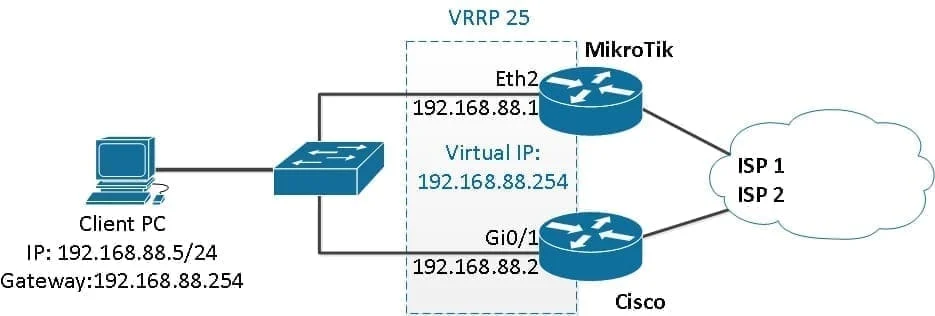
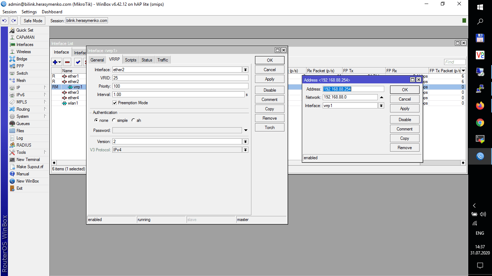

#mikrotik #vrrp 
### Как развернуть и настроить отказоустойчивую локальную сеть на MikroTik и Cisco с помощью VRRP
взято с [blog.sedicomm.com](https://blog.sedicomm.com/2020/07/31/kak-razvernut-i-nastroit-otkazoustojchivuyu-lokalnuyu-set-na-mikrotik-i-cisco-s-pomoshhyu-vrrp/#4)\
Рассмотрим, как настроить резервирование на первом переходе (шлюз по умолчанию) на маршрутизаторах **MikroTik** и **Cisco** с помощью протокола **VRRP** и развернуть отказоустойчивую локальную сеть.
#### Содержание:
1. **[Топология](#топология)**
2. **[Задачи](#задачи)**
3. **[Настройка интерфейса и VRRP на Cisco](#настройка-интерфейса-и-vrrp-на-cisco)**
4. **[Настройка MikroTik](#настройка-mikrotik)**
5. **[Выводы](#выводы)**
### Топология
Схема топологии следующая:\

### Задачи
Наша задача — настроить VRRP в мультивендорной среде (MikroTik + Cisco в связке).
#### Настройка интерфейса и VRRP на Cisco
```cmd
Router#configure terminal
Router(config)#interface gigabitEthernet 0/1
Router(config-if)#vrrp 25 ip 192.168.88.254
Router(config-if)#vrrp 25 preempt
Router(config-if)#vrrp 25 priority 100
```
**Проверяем, в роли slave:**
```cmd
Router#show vrrp brief
Interface Grp Pri Time Own Pre State Master addr Group addr
Gi0/1 25 100 3609 Y Backup 192.168.88.1 192.168.88.254
```
**Еще пример, когда свитч в роли мастера:**
```cmd
Router#show vrrp brief
Interface Grp Pri Time Own Pre State Master addr Group addr
Gi0/1 25 100 3609 Y Master 192.168.88.2 192.168.88.254
```
**Если нужно, меняем параметры таймера:**
```cmd
Router(config-if)#vrrp 25 timers advertise 2
```
### Настройка MikroTik
```cmd
[admin@MikroTik] > /interface vrrp
[admin@MikroTik] /interface vrrp> add interface=ether2 name=vrrp1 priority=100 vrid=25 version=2
[admin@MikroTik] > /ip address
[admin@MikroTik] /ip address> add address=192.168.88.254 interface=vrrp1 network=192.168.88.0
```
**Проверяем что получилось:**\

Вот и все, далее поверяем как работает VRRP. Для этого выключаем один из маршрутизаторов и наблюдаем, что пакеты начинают идти через другой.
### Выводы
Спасибо за уделенное время на прочтение статьи. Теперь вы больше знаете о том, как настроить резервирование на первом переходе (шлюз по умолчанию) на маршрутизаторах MikroTik и Cisco с помощью протокола VRRP и развернуть отказоустойчивую локальную сеть.
