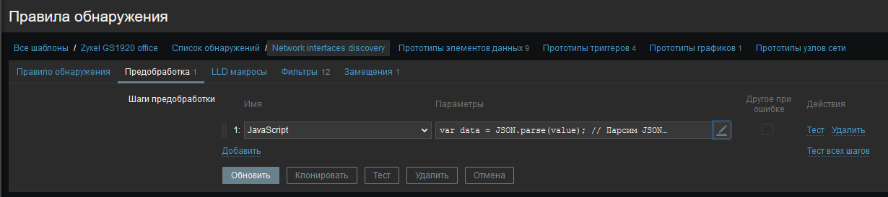
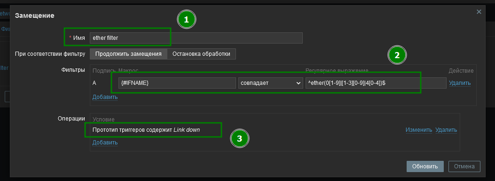
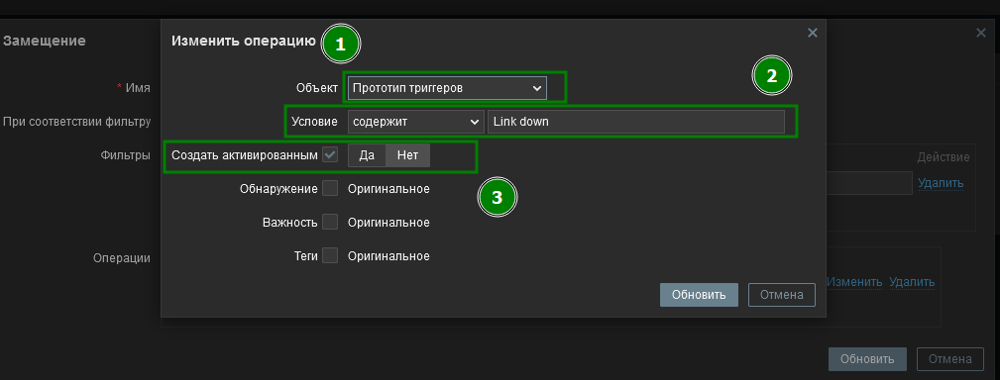

### шаблон для Zyxel GS1920-48 v2
Для свичей Zyxel GS1920-48 v2 по умолчанию в заббиксе нет шаблонов, так же их не предоставляет сама компания, есть только OID файл.
Для сбора метрик мы будем использовать дополненный встроенный шаблон от свича микротика CRS354 G48+4sfp+. Так как зиксель именует сетевые интерфейсы с 0, а не с 1 и  называет их **swp00** для удобности мы в предобработке напишем JSON скрипт, который преобразует имена интерфейсов в более читабельный вид **ether1-50**, что будет совпадать с нумерацией на панели самого свича.

```js
var data = JSON.parse(value); // Парсим JSON

data.forEach(function(interface) {
    ["{#IFNAME}", "{#IFDESCR}"].forEach(function(key) {
        if (interface.hasOwnProperty(key) && interface[key] !== undefined) {
            var ifname = interface[key];
            
            if (ifname.startsWith("swp")) {
                var number = parseInt(ifname.slice(3)); // Извлекаем числовую часть
                if (number >= 0 && number < 50) { // Проверка диапазона
                    number = number + 1; // Увеличиваем на 1
                    interface[key] = "ether" + ("0" + number).slice(-2); // Заменяем значение
                }
            }
        }
    });
});

return JSON.stringify(data); // Возвращаем обработанный JSON
```
Так же отключим срабатывание триггеров "Link down" на acces портах свича, которые для нас не очень важные (интерфейсы часто выключаются при перезагрузке компьютера клиента или выключении в конце рабочего дня, что генерирует много ненужных уведомлений). 
Переходим в наш шаблон, в *Список/Правила обнаружений* => *Network Interface discovery* => *Замещения/Overrides* и добавляем новое:
* **имя** - любое
* **{#IFNAME}** - имя интерфейса 
* **^ether(0[1-9]|[1-3][0-9]|4[0-4])$** - отфильтровать интерфейсы с 01-09 или 10-39 или 40-44

Добавляем так же "Операции/Operations" которые нужно выполнить
* **Объект** - **прототип триггера** - сортировка по тригеру
* **Условие** - **содержит** - **Link down** - само значение тригера 
* **Создать активированным** - **Нет** - отключаем триггеры с `Link down`

Таким образом триггер на `Link down` на интерфейсах ether1-44 не будут срабатывать и не засорать тот же телеграм