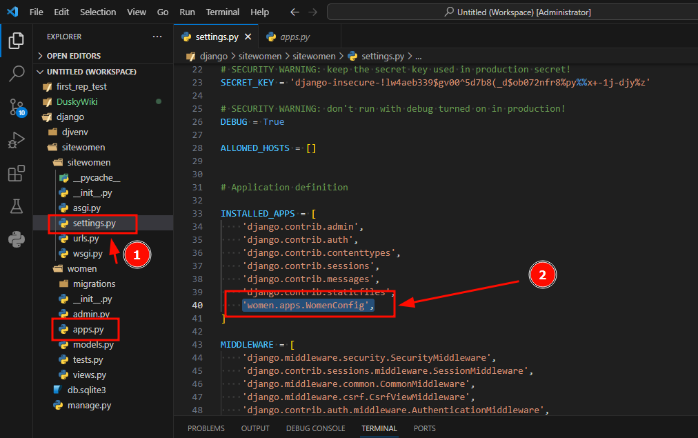
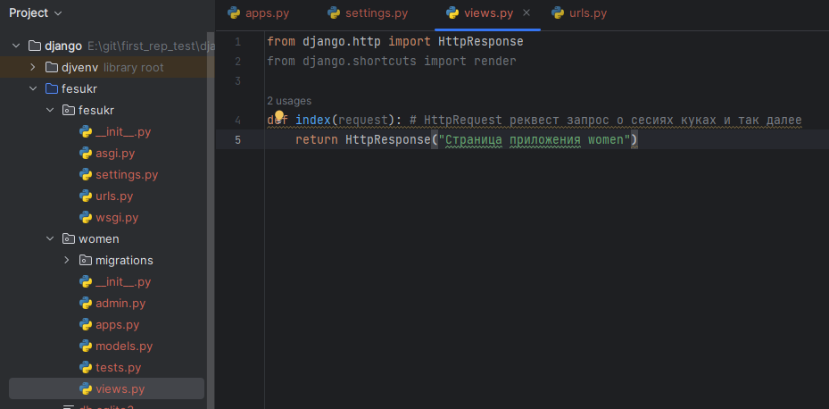
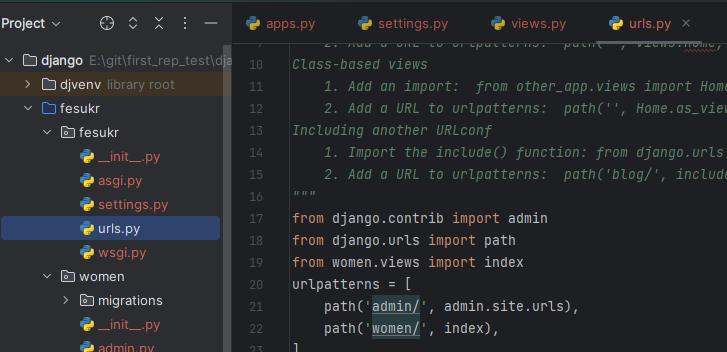

#linux #django
### Структура приложения в Django
В контексте Django, приложение (application) - это модуль Python, который представляет собой самостоятельную часть функциональности вашего веб-приложения. Каждое приложение в Django должно быть максимально независимым и должно выполнять конкретную задачу или предоставлять определенную функциональность. Приложение `women`.\
Вот несколько ключевых моментов, которые следует знать о приложениях в Django:
1. Структура приложения:
В Django, структура приложения обычно выглядит следующим образом:
```markdown
myapp/
├── __init__.py
├── admin.py
├── apps.py
├── migrations/
│   └── __init__.py
├── models.py
├── tests.py
└── views.py
```
* **models.py** Модели данных определяют структуру и типы данных, которые будут храниться в базе данных. Они обычно определяются в файле models.py внутри приложения.
* **views.py** Представления обрабатывают запросы пользователей и возвращают ответы. Они могут возвращать HTML-страницы, JSON-ответы или другие типы данных. 
* **urls.py** Маршруты URL определяют соответствие между URL-адресами и представлениями. Они обычно определяются в файле urls.py в корневом каталоге проекта Django, а также могут быть определены в файлах приложений для более модульной структуры.
* **templates/** Шаблоны используются для формирования HTML-страниц, которые отправляются пользователю. Они обычно хранятся в директории templates/ внутри приложения.
* **admin.py** Django предоставляет встроенный административный интерфейс для управления данными приложения. Модели, зарегистрированные в файле admin.py, могут быть управляемыми через этот интерфейс.
* **apps.py** Конфигурация приложения обычно определяется в файле apps.py. Здесь вы можете настраивать различные аспекты вашего приложения, такие как название, иконка и т.д.
* **migrations/** Директория для миграций базы данных.
* **test.py** Тесты обычно определяются в файле tests.py и используются для проверки работоспособности функциональности вашего приложения.

Каждое приложение в Django должно быть максимально независимым и иметь четкую область ответственности. Хорошая практика - разбивать ваше веб-приложение на несколько небольших и независимых приложений для более легкого управления и поддержки кода.
#### Создаем приложение на сайте и инициализируем его
Создадим первое приложение под названием `women`
```bash
python manage.py startapp women
```
После этого его нужно инициализировать в основном каталоге **из sitewomen/settings.py** в списке переменной `INSTALLED_APPS`, указав название нашего приложения. Для ускорения работы можно указать напрямую имя класса `WomenConfig` (из women/apps.py) этого приложения в созданном ранее каталоге приложения **women**, так как в итоге обработчик Django обращаясь к приложению, будет обращаться именно к файлу women/apps.py и классу в нем WomenConfig.

### Маршруты и представления
Для отображения визуального содержимого нашего приложения **women** пропишем в файле views.py функцию, которая будет выводить свое содержимое при обращении к главной странице приложения (index). Так же импортируем функцию 'from django.http import HttpResponse'
```python
from django.http import HttpResponse
from django.shortcuts import render

def index(request): # HttpRequest реквест запрос о сесcиях куках и так далее
    return HttpResponse("Страница приложения women")
```


После этого нам нужно прописать маршруты к нашему приложению в файле **fesukr/urls.py** `path('women/', index),` так же импортировав туда созданную функцию `index`, в файле **women/view.py**
```python
from women.views import index
urlpatterns = [
    path('admin/', admin.site.urls),
    path('women/', index),
```
  
Теперь мы можем перейти на страничку **http://127.0.0.1:8000/women/** b и увидеть вывод нашей функции `index` с файла **women/view.py**
