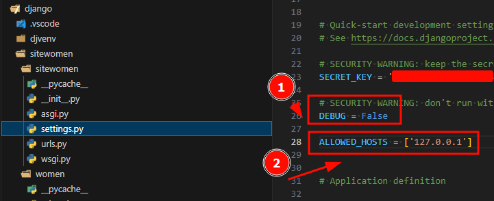

#python #django
По умолчанию в Django включен debag режим. Что бы его отключить, нужно в файле settings.py прописать:


#### Поменять стандартный вывод 404 страницы
sitewomen/sitewomen/settings.py
```python
from django.contrib import admin
from django.urls import path, include
from women.views import page_not_found

urlpatterns = [
    path('admin/', admin.site.urls),
    path('', include('women.urls')),
]

handler404 = page_not_found
```
sitewomen/women/views.py
```python
from django.shortcuts import render
from django.http import HttpResponse, HttpResponseNotFound

def index(request): #HttpRequest
    return HttpResponse("Страница приложения women.")

def categories(request, cat_id):
    return HttpResponse(f"<h1>Куча категорий</h1><p>id: {cat_id}</p>")

def categories_by_slug(request, cat_slug):
    #print (request.GET)  # посмотреть что возвращает GET в консоль /cats/test/?name=red&type=color
    return HttpResponse(f"<h1>Куча категорий</h1><p>slug: {cat_slug}</p>")

def archive(request, year):
    return HttpResponse(f"<h1>Архив</h1><p>regular: {year}</p>")

def page_not_found(request, exception):
    return HttpResponseNotFound("<h1>Страница не найдена!</h1>")
```

## Error handling[¶](https://docs.djangoproject.com/en/5.0/topics/http/urls/#error-handling "Permalink to this headline")

When Django can’t find a match for the requested URL, or when an exception is raised, Django invokes an error-handling view.

The views to use for these cases are specified by four variables. Their default values should suffice for most projects, but further customization is possible by overriding their default values.

See the documentation on [customizing error views](https://docs.djangoproject.com/en/5.0/topics/http/views/#customizing-error-views) for the full details.

Such values can be set in your root URLconf. Setting these variables in any other URLconf will have no effect.

Values must be callables, or strings representing the full Python import path to the view that should be called to handle the error condition at hand.

The variables are:

- `handler400` – See [`django.conf.urls.handler400`](https://docs.djangoproject.com/en/5.0/ref/urls/#django.conf.urls.handler400 "django.conf.urls.handler400").
- `handler403` – See [`django.conf.urls.handler403`](https://docs.djangoproject.com/en/5.0/ref/urls/#django.conf.urls.handler403 "django.conf.urls.handler403").
- `handler404` – See [`django.conf.urls.handler404`](https://docs.djangoproject.com/en/5.0/ref/urls/#django.conf.urls.handler404 "django.conf.urls.handler404").
- `handler500` – See [`django.conf.urls.handler500`](https://docs.djangoproject.com/en/5.0/ref/urls/#django.conf.urls.handler500 "django.conf.urls.handler500").

##### Также дальше нашу прописанную `Http404` можно вызывать принудительно импортировав её предварительно
sitewomen/women/views.py
```python
from django.shortcuts import render
from django.http import HttpResponse, HttpResponseNotFound, Http404

def index(request): #HttpRequest
    return HttpResponse("Страница приложения women.")

def categories(request, cat_id):
    return HttpResponse(f"<h1>Куча категорий</h1><p>id: {cat_id}</p>")

def categories_by_slug(request, cat_slug):
    print (request.GET)
    return HttpResponse(f"<h1>Куча категорий</h1><p>slug: {cat_slug}</p>")

def archive(request, year):
    if year > 2023:
        raise Http404
    return HttpResponse(f"<h1>Архив</h1><p>regular: {year}</p>")

def page_not_found(request, exception):
    return HttpResponseNotFound("<h1>Страница не найдена!</h1>")
```