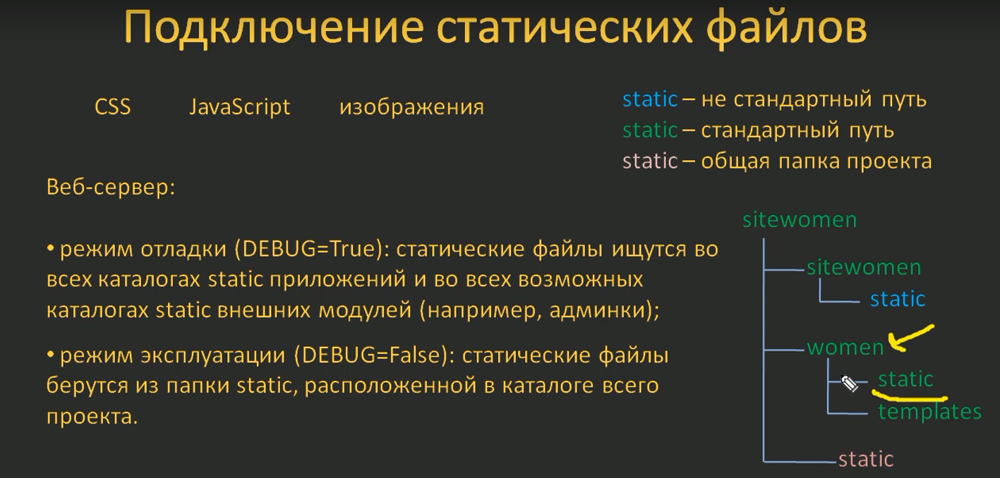
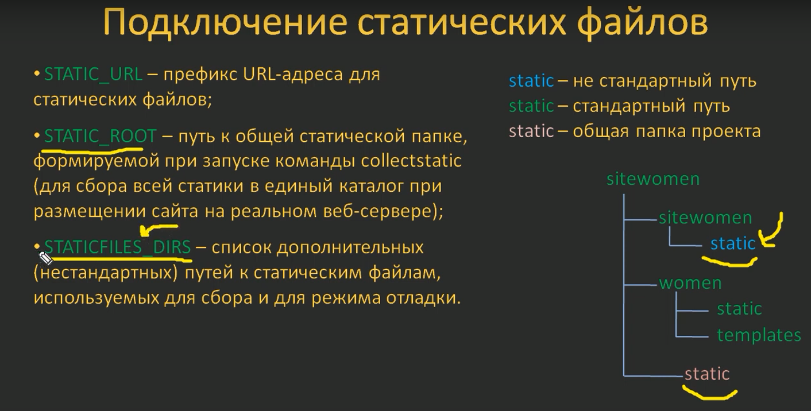
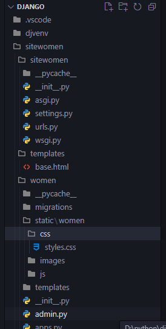

#django #static-files
### Static files
Что б подключить в ваш проект стили, картинки, js-скрипты и другие файлы, джанго использует методику работы с статическими файлами.
Используются два режима (настройка из *settings.py* в корне проекта):
- **режим отладки** (DEBUG=True): статические файлы ищутся во всех каталогах `static`  приложений и во всех возможных каталогах `static` внешних модулей (например, админки);
- **режим эксплуатации** (DEBUG=False): статические файлы берутся из папки `static`, расположеной в каталоге всего проекта.


#### Подключение статических файлов
В файле *settings.py* для подключения статических файлов нужно прописать переменные
-  **STATTIC_URL** префикс URL-адреса для статических файлов
- **STATIC_ROOT** путь к общей статической папке, формируемой при запуске команды cjllectstatic (для сбора всей статики в единый каталог при размещении сайта на реальном веб-сервере)
- **STATICFILES_DIRS** список дополнительных (нестардартных) путей к статическим файлам, используемих для сбора и для режима отладки.


По умолчанию **STATTIC_URL = 'static/'** уже в нем присутствует
Создаем каталог `static` в корне нашего *приложения* - `women/static/` и далее папку с именем приложения  и в ней папки для статических файлов `women/static/women/css`, так же для js и img

##### Подключаем файл шрифтов к шаблону
конструкция:
```django

...

```
Для примера, подключим стили и фавикон к шаблону - переходим `base.html`
```django
  %% тег для подключения статических файлов к шаблону %%
<!DOCTYPE html>
<html>
<head>
    <title>{{title}}</title>
    <link type="text/css" href="" rel="stylesheet" /> %% стили %%
    <meta http-equiv="Content-Type" content="text/html; charset=utf-8">
    <link rel="shortcut icon" href="" type="image/x-icon"/> %% фавикон %%
    <meta name="viewport" content="width=device-width, initial-scale=1.0">
</head>
<body>
</body>
</html>
```
#### Подключим нестандартный путь к статическим файлам
Для примера переместим папку с статическими файлами с каталога приложения `women` в корень проекта. Теперь при перезапуске веб сервера - у нас слетают все стили, так как джанго не понимает где их искать. Это можно исправить дополнительно указав директорию в settings.py нашего проекта 
```py
STATICFILES_DIRS = [ BASE_DIR / 'sitewomen/static']
```
> не забываем про то что данные пути к статическим файлам работают только в режиме отладки (он должен быть включен в **settings.py**)
```py
# SECURITY WARNING: don't run with debug turned on in production!
DEBUG = True
```
**Если мы не хотим включать режим отладки - веб сервер можно запустить с дополнительным параметром:**
```cmd
python manage.py runserver --insecure
```