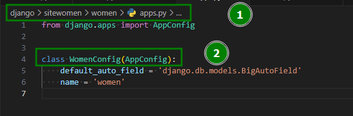
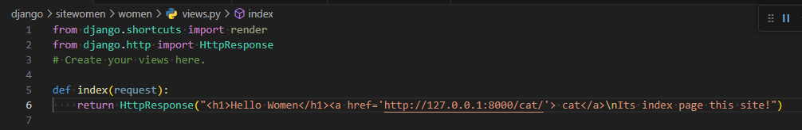
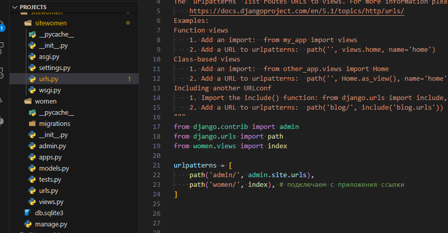

#linux #python #django
### Установка и запуск Django
###### Заходим в [Venv](../../linux/venv/venv.md) и устанавливаем django
```bash
pip install django
```
###### Посмотреть все возможные команды django движка
```bash
django-admin
```
###### Запускаем django проект
```bash
django-admin startproject fesukr
```
> посмотреть все команды сервера джанго можно введя django-admin
###### Переходим в созданную папку проекта fesukr
```bash
cd fesukr
```
###### Запускаем веб сервер джанги
```bash
python manage.py runserver
```
> По умолчанию сервер запускается на 8000 порту, пожно его изменить например на 4000
```bash
python manage.py runserver 4000
```
### Приложения/Apps в Django
В контексте Django, приложение (application) - это модуль Python, который представляет собой самостоятельную часть функциональности вашего веб-приложения. Каждое приложение в Django должно быть максимально независимым и должно выполнять конкретную задачу или предоставлять определенную функциональность. Приложение `women`.\
Вот несколько ключевых моментов, которые следует знать о приложениях в Django:
##### Структура приложения:
В Django, структура приложения обычно выглядит следующим образом:
```markdown
myapp/
├── __init__.py
├── admin.py
├── apps.py
├── migrations/
│   └── __init__.py
├── models.py
├── tests.py
└── views.py
```
* **models.py** Модели данных определяют структуру и типы данных, которые будут храниться в базе данных. Они обычно определяются в файле models.py внутри приложения.
* **views.py** Представления обрабатывают запросы пользователей и возвращают ответы. Они могут возвращать HTML-страницы, JSON-ответы или другие типы данных. 
* **urls.py** Маршруты URL определяют соответствие между URL-адресами и представлениями. Они обычно определяются в файле urls.py в корневом каталоге проекта Django, а также могут быть определены в файлах приложений для более модульной структуры.
* **templates/** Шаблоны используются для формирования HTML-страниц, которые отправляются пользователю. Они обычно хранятся в директории templates/ внутри приложения.
* **admin.py** Django предоставляет встроенный административный интерфейс для управления данными приложения. Модели, зарегистрированные в файле admin.py, могут быть управляемыми через этот интерфейс.
* **apps.py** Конфигурация приложения обычно определяется в файле apps.py. Здесь вы можете настраивать различные аспекты вашего приложения, такие как название, иконка и т.д.
* **migrations/** Директория для миграций базы данных.
* **test.py** Тесты обычно определяются в файле tests.py и используются для проверки работоспособности функциональности вашего приложения.
##### Философия
Каждое приложение в Django должно быть максимально независимым и иметь четкую область ответственности. Хорошая практика - разбивать ваше веб-приложение на несколько небольших и независимых приложений для более легкого управления и поддержки кода.
##### Создаем приложение на сайте и инициализируем его
Создадим первое приложение под названием `women`
```bash
python manage.py startapp women
```
После этого его нужно инициализировать в основном каталоге **из sitewomen/settings.py** в списке переменной `INSTALLED_APPS`, указав название нашего приложения. Для ускорения работы можно указать напрямую имя класса `WomenConfig` (из women/apps.py) этого приложения в созданном ранее каталоге приложения **women**, так как в итоге обработчик Django обращаясь к приложению, будет обращаться именно к файлу women/apps.py и классу в нем WomenConfig.


### Маршруты и представления
[Оф инструкция](https://docs.djangoproject.com/en/5.0/topics/http/urls/)
#### Статические маршруты
##### Простой пример
Для отображения визуального содержимого нашего приложения **women** пропишем в файле `views.py` функцию, которая будет выводить свое содержимое при обращении к главной странице приложения (index). Так же импортируем функцию `from django.http import HttpResponse`
```python
from django.http import HttpResponse
from django.shortcuts import render

def index(request): # HttpRequest реквест запрос о сесcиях куках и так далее
    return HttpResponse("Страница приложения women")
```

После этого нам нужно прописать маршруты к нашему приложению в файле **sitewomen/urls.py** `path('women/', index),` так же импортировав туда созданную функцию `index`, в файле **women/view.py**
```python
from django.contrib import admin
from django.urls import path
from women.views import index # самый тупой и простой вариант

urlpatterns = [
    path('admin/', admin.site.urls),
    path('women/', index),
]
```

Теперь мы можем перейти на страничку **http://127.0.0.1:8000/women/** b и увидеть вывод нашей функции `index` с файла **women/view.py**
##### Более элегантный вариант маршрутов, учитывая, что страниц у нас будет много
sitewomen/**sitewomen**/==urls.py==
```python
from django.contrib import admin
from django.urls import path
from women import views

urlpatterns = [
    path('admin/', admin.site.urls),
    path('women/', views.index),
    path('', cat.index),
    path('', price.index), # и тд.
]   
```
##### Наиболее правильный вариант
Представим, что приложений у нас на сайте будет много и мы захотим импортировать их на другие сайты или наоборот... Что бы не прописывать на каждое новое приложение ссылки в sitewomen/**sitewomen**/==urls.py==, мы можем создать такой же файл для маршрутов в самом приложении, импортировав их далее в основной сайт всего одной строкой. 
- Меняем ссылки в корне нашего сайта на наше приложение  
sitewomen/**sitewomen**/urls.py
```python
from django.contrib import admin
from django.urls import path, include  # импортируем include

urlpatterns = [
    path('admin/', admin.site.urls),
    path('', include('women.urls')),  # если в приложении создали urls.py
]
```
- Создаем дополнительную функцию для категорий  
sitewomen/**women**/views.py
```python
from django.shortcuts import render
from django.http import HttpResponse

def index(request): #HttpRequest http://127.0.0.1:8000/
    return HttpResponse("Страница приложения women.")

def categories(request):  # http://127.0.0.1:8000/cats
    return HttpResponse(f"<h1>Куча категорий</h1>")
```
- Создаем sitewomen/**women**/==urls.py== и прописываем пути в самом приложении на которое ссылается urls.py в корне сайта  
sitewomen/**women**/urls.py
```python
from django.urls import path
from . import views

urlpatterns = [
    path('', views.index),
    path('cats/', views.categories),  # категории
]
```
#### Динамические маршруты
По умолчанию доступны следующие преобразователи путей:
 - `str` - Соответствует любой непустой строке, за исключением разделителя пути `'/'`. Это значение по умолчанию, если преобразователь не включен в выражение. 
 - `int` — соответствует нулю или любому положительному целому числу. Возвращает `int`.
 - `slug` – соответствует любой короткой строке, состоящей из букв или цифр ASCII, а также символов дефиса и подчеркивания.  
 - `uuid` — соответствует отформатированному UUID. Чтобы предотвратить сопоставление нескольких URL-адресов с одной и той же страницей, необходимо включить дефисы, а буквы должны быть строчными. Например, `075194d3-6885-417e-a8a8-6c931e272f00`. Возвращает экземпляр [`UUID`](https://docs.python.org/3/library/uuid.html#uuid.UUID "(in Python v3.12)"). 
 - `path` — соответствует любой непустой строке, включая разделитель пути `'/'`. Это позволяет вам сопоставлять полный путь URL-адреса, а не его сегмент, как в случае с `str`.
 
sitewomen/**sitewomen**/urls.py
```python
from django.contrib import admin
from django.urls import path, include  # импортируем include

urlpatterns = [
    path('admin/', admin.site.urls),
    path('', include('women.urls')),  # если в приложении создали urls.py
]
```
sitewomen/**women**/urls.py
```python
from django.urls import path, re_path
from . import views

urlpatterns = [
    path('', views.index),
    path('cats/<int:cat_id>/', views.categories),  # только цифры
    path('cats/<slug:cat_slug>/', views.categories_by_slug),  # и цифры и слова
    re_path(r"^archive/(?P<year>[0-9]{4})/$", views.archive),  # маршрут использует регулярное выражение для обработки URL с годом в архиве.
]
```
> **re_path** - функция которая дает возможность использовать регулярные выражения (нужно импортировать с `django.urls`). 
> Регулярное выражение 4цифры от 0-9. Значения регулярного выражения передаются в переменную `year`, которая будет обработана в файле `views.py` функции `archive`

sitewomen/**women**/views.py
```python
from django.shortcuts import render
from django.http import HttpResponse

def index(request): #HttpRequest
    return HttpResponse("Страница приложения women.")

def categories(request, cat_id):
    return HttpResponse(f"<h1>Куча категорий</h1><p>id: {cat_id}</p>")

def categories_by_slug(request, cat_slug):
    return HttpResponse(f"<h1>Куча категорий</h1><p>slug: {cat_slug}</p>")

def archive(request, year):
    return HttpResponse(f"<h1>Архив</h1><p>regular: {year}</p>")
```
##### Пример с оф инструкции
```python
from django.urls import path, re_path

from . import views

urlpatterns = [
    path("articles/2003/", views.special_case_2003),
    re_path(r"^articles/(?P<year>[0-9]{4})/$", views.year_archive),
    re_path(r"^articles/(?P<year>[0-9]{4})/(?P<month>[0-9]{2})/$", views.month_archive),
    re_path(
        r"^articles/(?P<year>[0-9]{4})/(?P<month>[0-9]{2})/(?P<slug>[\w-]+)/$",
        views.article_detail,
    ),
]
```
#### Динамические маршруты через собственные классы
Маршруты с использованием регулярных выражений не всегда хорошо читабельны, джанго дает возможность создавать собственные маршруты через классы.

Не меняем `sitewomen/sitewomen/urls.py`
```python
from django.contrib import admin
from django.urls import path, include  # импортируем include

urlpatterns = [
    path('admin/', admin.site.urls),
    path('', include('women.urls')),  # если в приложении создали urls.py
]
```
Создаем `sitewomen/women/converter.py` и закидываем туда класс, 
```python
class FourDigitYearConverter:
    regex = "[0-9]{4}"

    def to_python(self, value):
        return int(value)

    def to_url(self, value):
        return "%04d" % value
```
**FourDigitYearConverter** — это класс конвертер, который включает в себя следующее: 
* Атрибут класса `regex` регулярного выражения в виде строки. 
* Метод `to_python(self, value)`, который обрабатывает преобразование совпавшей строки в тип, который должен быть передан в функцию представления. Он должен вызвать ValueError, если не может преобразовать данное значение. Ошибка ValueError интерпретируется как отсутствие совпадения, и, как следствие, пользователю отправляется ответ 404, если не совпадает другой шаблон URL-адреса. 
* Метод `to_url(self, value)`, который обрабатывает преобразование типа Python в строку, которая будет использоваться в URL-адресе. Он должен вызвать ValueError, если не может преобразовать данное значение. ValueError интерпретируется как отсутствие совпадения, и, как следствие, метод `reverse()` вызывает NoReverseMatch, если не совпадает другой шаблон URL.

Далее в `sitewomen/women/urls.py` регистрируем его. Класс конвертирует цифры в строку для ссылок и с строки в цифры - для питона. Так же через атрибут `regex = "[0-9]{4}"` он принимает только 4цифры.

Юрлс `sitewomen/women/urls.py`
```python
from django.urls import path, register_converter
from . import views, converters

register_converter(converters.FourDigitYearConverter, "year4")

urlpatterns = [
    path('', views.index),
    path('cats/<int:cat_id>/', views.categories),
    path('cats/<slug:cat_slug>/', views.categories_by_slug),
    path('archive/<year4:year>/', views.archive),  #333  
]
```
Вьюха `sitewomen/women/views.py`
```python
from django.shortcuts import render
from django.http import HttpResponse

def index(request): #HttpRequest
    return HttpResponse("Страница приложения women.")

def categories(request, cat_id):
    return HttpResponse(f"<h1>Куча категорий</h1><p>id: {cat_id}</p>")

def categories_by_slug(request, cat_slug):
    return HttpResponse(f"<h1>Куча категорий</h1><p>slug: {cat_slug}</p>")

def archive(request, year):
    return HttpResponse(f"<h1>Архив</h1><p>regular: {year}</p>")
```
### Debug and errors handlers
По умолчанию в Django включен debag режим. Что бы его отключить, нужно в файле settings.py прописать:


#### Поменять стандартный вывод 404 страницы
Дописываем в `sitewomen/sitewomen/settings.py`
```python
from django.contrib import admin
from django.urls import path, include
from women.views import page_not_found

urlpatterns = [
    path('admin/', admin.site.urls),
    path('', include('women.urls')),
]

handler404 = page_not_found
```
sitewomen/women/views.py
```python
from django.shortcuts import render
from django.http import HttpResponse, HttpResponseNotFound

def index(request): #HttpRequest
    return HttpResponse("Страница приложения women.")

def categories(request, cat_id):
    return HttpResponse(f"<h1>Куча категорий</h1><p>id: {cat_id}</p>")

def categories_by_slug(request, cat_slug):
    #print (request.GET)  # посмотреть что возвращает GET в консоль /cats/test/?name=red&type=color
    return HttpResponse(f"<h1>Куча категорий</h1><p>slug: {cat_slug}</p>")

def archive(request, year):
    return HttpResponse(f"<h1>Архив</h1><p>regular: {year}</p>")

def page_not_found(request, exception):
    return HttpResponseNotFound("<h1>Страница не найдена!</h1>")
```

#### Error handling
[Источник](https://docs.djangoproject.com/en/5.0/topics/http/urls/#error-handling "Permalink to this headline")

Если Django не может найти соответствие запрошенному URL или возникает исключение, Django вызывает представление обработки ошибок.
Представления, которые следует использовать в этих случаях, определяются четырьмя переменными. Их значений по умолчанию должно быть достаточно для большинства проектов, но возможна дальнейшая настройка путем переопределения их значений по умолчанию.
Подробности см. в   [документации](https://docs.djangoproject.com/en/5.0/topics/http/views/#customizing-error-views) по настройке представлений ошибок.
Такие значения можно задать в корневом URLconf. Установка этих переменных в любом другом URLconf не даст никакого эффекта.
Значения должны быть вызываемыми или строками, представляющими полный путь импорта Python к представлению, которое должно быть вызвано для обработки текущего состояния ошибки.

Переменные:
* **handler400** – Вызываемый объект или строка, представляющая полный путь импорта Python в представление. его следует вызывать, если HTTP-клиент отправил запрос, вызвавший ошибку. состояние и ответ с кодом состояния 400. 
  По умолчанию это [`django.views.defaults.bad_request()`](https://docs.djangoproject.com/en/5.0/ref/views/#django.views.defaults.bad_request "django.views.defaults.bad_request"). Если вы реализовали собственное представление, убедитесь, что оно принимает `request` и `exception` аргументы и возвращает [`HttpResponseBadRequest`](https://docs.djangoproject.com/en/5.0/ref/request-response/#django.http.HttpResponseBadRequest "django.http.HttpResponseBadRequest").
* **handler403** – Вызываемый объект или строка, представляющая полный путь импорта Python в представление. это следует вызывать, если у пользователя нет разрешений, необходимых для получить доступ к ресурсу.
  По умолчанию это [`django.views.defaults.permission_denied()`](https://docs.djangoproject.com/en/5.0/ref/views/#django.views.defaults.permission_denied "django.views.defaults.permission_denied"). Если вы реализовали собственное представление, убедитесь, что оно принимает `request` и `exception` аргументы и возвращает [`HttpResponseForbidden`](https://docs.djangoproject.com/en/5.0/ref/request-response/#django.http.HttpResponseForbidden "django.http.HttpResponseForbidden").
* **handler404** – Вызываемый объект или строка, представляющая полный путь импорта Python в представление. его следует вызывать, если ни один из шаблонов URL-адресов не соответствует.
  По умолчанию это [`django.views.defaults.page_not_found()`](https://docs.djangoproject.com/en/5.0/ref/views/#django.views.defaults.page_not_found "django.views.defaults.page_not_found"). Если вы реализовали собственное представление, убедитесь, что оно принимает `request` и `exception` аргументы и возвращает [`HttpResponseNotFound`](https://docs.djangoproject.com/en/5.0/ref/request-response/#django.http.HttpResponseNotFound "django.http.HttpResponseNotFound").
* **handler500** – Вызываемый объект или строка, представляющая полный путь импорта Python в представление. это следует вызывать в случае ошибок сервера. Ошибки сервера случаются, когда вы имеют ошибки времени выполнения в коде представления.
  По умолчанию это [`django.views.defaults.server_error()`](https://docs.djangoproject.com/en/5.0/ref/views/#django.views.defaults.server_error "django.views.defaults.server_error"). Если ты реализовать собственное представление, убедитесь, что оно принимает `request` аргумент и возврат а [`HttpResponseServerError`](https://docs.djangoproject.com/en/5.0/ref/request-response/#django.http.HttpResponseServerError "django.http.HttpResponseServerError").
##### Ручной вызов `Http404` как обработчика недопустимых значений
В `sitewomen/women/views.py` импортируем  `Http404`  и вызовем, если год в архиве будет превышать 2023+

```python
from django.shortcuts import render
from django.http import HttpResponse, HttpResponseNotFound, Http404

def index(request): #HttpRequest
    return HttpResponse("Страница приложения women.")

def categories(request, cat_id):
    return HttpResponse(f"<h1>Куча категорий</h1><p>id: {cat_id}</p>")

def categories_by_slug(request, cat_slug):
    print (request.GET)
    return HttpResponse(f"<h1>Куча категорий</h1><p>slug: {cat_slug}</p>")

def archive(request, year):
    if year > 2023:
        raise Http404()
    return HttpResponse(f"<h1>Архив</h1><p>regular: {year}</p>")

def page_not_found(request, exception):
    return HttpResponseNotFound("<h1>Страница не найдена!</h1>")
```
### Redirect
* **302** - страница перемещена временно на другой URL-адрес
* **301** - страница перемещена на другой постоянный URL-адрес
#### Простые примеры функции **redirect**
Импортируем функцию `redirect` в `/sitewomen/**women**/views.py` и ,для примера, пропишем перенаправление, если `year > 2023`  
##### Временный редирект
```python
from django.shortcuts import render, redirect
from django.http import HttpResponse
  
def archive(request, year):
    if year > 2023:
        return redirect('/')
    return HttpResponse(f"<h1>Архив</h1><p>regular: {year}</p>")
```
##### Постоянный редирект
```python
from django.shortcuts import render, redirect
from django.http import HttpResponse
  
def archive(request, year):
    if year > 2023:
        return redirect('/', permanent=True)
    return HttpResponse(f"<h1>Архив</h1><p>regular: {year}</p>")
```
Вместо указания пути `redirect('/', permanent=True)` можно указывать функцию, например `index`
```python
from django.shortcuts import render, redirect
from django.http import HttpResponse
  
def archive(request, year):
    if year > 2023:
        return redirect(index, permanent=True)
        #return redirect(index)  # для перманентного
    return HttpResponse(f"<h1>Архив</h1><p>regular: {year}</p>")
```
#### Продвинутый пример **redirect**
Для большей читабельности и универсальности кода, принято в маршрутах прописывать имена/псевдонимы типа `name='cats_id'`, на случай изменения маршрута или функции представления маршрута. 
Пропишем в `/sitewomen/women/urls.py`
```python
from django.urls import path, re_path, register_converter
from . import views, converters
  
register_converter(converters.FourDigitYearConverter, "year4")

urlpatterns = [
    path('', views.index, name='home'),
    path('cats/<int:cat_id>/', views.categories, name='cats_id'),
    path('cats/<slug:cat_slug>/', views.categories_by_slug, name='cats'),
    #re_path(r"^archive/(?P<year>[0-9]{4})/", views.archive, name='archive'),
    path('archive/<year4:year>/', views.archive, name='archive'),  # вариант с классом для рег. выражения
]
```
далее в вьюшке `/sitewomen/women/views.py`
```python
from django.shortcuts import render, redirect
from django.http import HttpResponse

def categories_by_slug(request, cat_slug):
	if cat_slug == 'music':
        return redirect('cats', 'limp_bizkit')  # при вводе cats/music => cats/limp_bizkit, cats - имя маршрута прописанное в women/urls.py (name='cats')
    return HttpResponse(f"<h1>Куча категорий</h1><p>slug: {cat_slug}</p>")

def archive(request, year):
    if year > 2023:
        return redirect('home')
    return HttpResponse(f"<h1>Архив</h1><p>regular: {year}</p>")
```
#### Функция **reverse** 
Для красивого синтаксиса и более понятного вычисления маршрута можно использовать функцию `reverse`
Импортируем reverse в `/sitewomen/women/views.py`
```python
from django.shortcuts import render, redirect
from django.http import HttpResponse
from django.urls import reverse

def categories_by_slug(request, cat_slug):
    if cat_slug == 'music':
        ury = reverse('cats', args=('limb_bizkit', ))  # в args можно прописывать много значений
        return redirect(ury, permanent=True)
    return HttpResponse(f"<h1>Куча категорий</h1><p>slug: {cat_slug}</p>")

def archive(request, year):
    if year > 2023:
        ury = reverse('home')
        return redirect(ury)
    return HttpResponse(f"<h1>Архив</h1><p>regular: {year}</p>")
```
#### Использование классов для редиректа
Вместо функции `redirect` можно использовать классы:
* **HttpResponseRedirect** - временный (код 302)
* **HttpResponsePermanentRedirect** - постоянный (код 301)
```python
from django.shortcuts import render
from django.http import HttpResponse, HttpResponseRedirect, HttpResponsePermanentRedirect
from django.urls import reverse

def categories_by_slug(request, cat_slug):
    if cat_slug == 'music':
        ury = reverse('cats', args=('limb_bizkit', 'best', ))  # cats/limp_bizkit/best
        return HttpResponseRedirect(ury)  # код 302
    return HttpResponse(f"<h1>Куча категорий</h1><p>slug: {cat_slug}</p>")

def archive(request, year):
    if year > 2023:
        ury = reverse('home')
        return HttpResponsePermanentRedirect(ury)  # код 301
        #return HttpResponsePermanentRedirect('home')  # либо без reverse
    return HttpResponse(f"<h1>Архив</h1><p>regular: {year}</p>")
```
