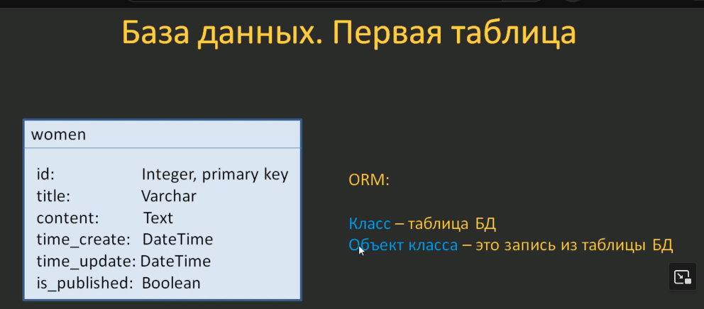

## таблица
### Подключение базы данных к проекту
Подключение определяется в файле `settings.py` в коллекции **DATABASES**
```python
# Database
# https://docs.djangoproject.com/en/5.1/ref/settings/#databases

DATABASES = {
    'default': {
        'ENGINE': 'django.db.backends.sqlite3',
        'NAME': BASE_DIR / 'db.sqlite3',
    }
}
```
### **ipyton** и **django-extensions**
Для удобства работы с базой, подключим два разширения для командной строки
```cmd
pip install ipython django-extensions
```
 - **ipython** меняет стандартный шел, давая возможность табом дописывать команды, плюс показывает возможные
 ```cmd
 python manage.py shell
```
 - **django-extensions** разширения для джанго которое добавляет много полезных субкоманд. Для работы помимо установки, его нужно подключить в приложениях в `settings.py` нашего проекта
 ```python
 INSTALLED_APPS = [
    'django.contrib.admin',
    'django.contrib.auth',
    'django.contrib.contenttypes',
    'django.contrib.sessions',
    'django.contrib.messages',
    'django.contrib.staticfiles',
    'django_extensions', # тут
    'women.apps.WomenConfig'
]
```
 Пример:
 с ключем --print-sql - будет выводить скль запросы после сохранения обьекта класса нашей таблицы
 ```sql
 python manage.py shell_plus --print-sql
```
Вывод:
```sql
In [1]: a = Women(title="Екатерина Гусева", content="Биография Екатерины Гусевой")

In [2]: a.save
Out[2]: <bound method Model.save of <Women: Women object (None)>>

In [3]:

In [3]: a.save()
INSERT INTO "women_women" ("title", "content", "time_create", "time_update", "is_published")
VALUES ('Екатерина Гусева', 'Биография Екатерины Гусевой', '2025-01-13 19:45:58.633892', '2025-01-13 19:45:58.633920', 1) RETURNING "women_women"."id"

Execution time: 0.001504s [Database: default]
```
### Создаем первую таблицу в базе
Работа с базами в джанго производиться через классы в файлах миграций, в которых мы задаем структуру наших таблиц, обновляем данные и тд.

Каталог и сам файл миграций создается автоматически движком, нам нужно только создать в нем класс таблици. Делается это прописыванием класса таблици в файле `models.py`. 

Для примера, создадим таблицу `women` с такими столбцами в `models.py`
> путь `sitewomen>women>models.py`


```python
from django.db import models

# Create your models here.
class Women(models.Model):
    title = models.CharField(max_length=255)  # название статьи
    content = models.TextField(blank=True)  # текстовое поле, blank=True - можно не заполнять при создании
    time_create = models.DateTimeField(auto_now_add=True)  # время создания
    time_update = models.DateTimeField(auto_now=True)  # время обновления
    is_published = models.BooleanField(default=True)  # по умолчанию - опубликовано
```
> описание всех полей можно глянуть в оф [документации](https://docs.djangoproject.com/en/4.2/ref/models/fields/)

##### Создаем миграцию
В консоли виртуального окружения, в папке проекта прописываем `python manage.py makemigrations`
```cmd
(djvenv) PS D:\python\django\sitewomen> python manage.py makemigrations
Migrations for 'women':
  women\migrations\0001_initial.py
    + Create model Women
```
Движек автоматически создаст файл миграции в папке `sitewomen>women>migrations/0001_initial.py`
```python
# Generated by Django 5.1.4 on 2025-01-12 19:12

from django.db import migrations, models

class Migration(migrations.Migration):
    initial = True
    dependencies = [
    ]

	operations = [
        migrations.CreateModel(
            name='Women',
            fields=[
                ('id', models.BigAutoField(auto_created=True, primary_key=True, serialize=False, verbose_name='ID')),
                ('title', models.CharField(max_length=255)),
                ('content', models.TextField(blank=True)),
                ('time_create', models.DateTimeField(auto_now_add=True)),
                ('time_update', models.DateTimeField(auto_now=True)),
                ('is_published', models.BooleanField(default=True)),
            ],
        ),
    ]
```
Можно посмотреть сформированный sql запрос с выше созданной миграции введя её идентефикатор 
```sql
python manage.py sqlmigrate women 0001

# вывод
BEGIN;
--
-- Create model Women
--
CREATE TABLE "women_women" ("id" integer NOT NULL PRIMARY KEY AUTOINCREMENT, "title" varchar(255) NOT NULL, "content" text NOT NULL, "time_create" datetime NOT NULL, "time_update" datetime NOT NULL, "is_published" bool NOT NULL);
COMMIT;
```
##### Применяем миграцию создавая в базе данных таблицу
В консоли
```cmd
python manage.py sqlmigrate
```
Таблица создана (при первой миграции создаются ещё много вспомагательных таблиц, типа админ панели, авторизации и тд.)
```cmd
(djvenv) PS D:\python\django\sitewomen> python manage.py migrate              
Operations to perform:
  Apply all migrations: admin, auth, contenttypes, sessions, women
Running migrations:
  Applying contenttypes.0001_initial... OK
  Applying auth.0001_initial... OK
  Applying admin.0001_initial... OK
  Applying admin.0002_logentry_remove_auto_add... OK
  Applying admin.0003_logentry_add_action_flag_choices... OK
  Applying contenttypes.0002_remove_content_type_name... OK
  Applying auth.0002_alter_permission_name_max_length... OK
  Applying auth.0003_alter_user_email_max_length... OK
  Applying auth.0004_alter_user_username_opts... OK
  Applying auth.0005_alter_user_last_login_null... OK
  Applying auth.0006_require_contenttypes_0002... OK
  Applying auth.0007_alter_validators_add_error_messages... OK
  Applying auth.0008_alter_user_username_max_length... OK
  Applying auth.0009_alter_user_last_name_max_length... OK
  Applying auth.0010_alter_group_name_max_length... OK
  Applying auth.0011_update_proxy_permissions... OK
  Applying auth.0012_alter_user_first_name_max_length... OK
  Applying sessions.0001_initial... OK
  Applying women.0001_initial... OK
```
Видим все таблице в базе

### Добавляем данные в таблицу
##### Добавление данных происходит посредством встроенного ORM, c shell оболочки движка джанго
```sql
python manage.py shell

#вывод
Python 3.13.0 (tags/v3.13.0:60403a5, Oct  7 2024, 09:38:07) [MSC v.1941 64 bit (AMD64)] on win32
Type "help", "copyright", "credits" or "license" for more information.
(InteractiveConsole)
>>>
```
##### Импортируем модель c women приложения (нашу таблицу **women** с класса **Women**)
```sql
>>> from women.models import Women
```
##### Добавим данные в таблицу через класс **Women**
```sql
>>> Women(title='Анджелина Джоли', content='Биография Анджелині Джоли')
```
##### Присвоим переменной наш єкземпляр класса
```sql
>>> w1 = _
```
> [!note] _ последняя введенная команда
##### Сохраним в баззу
```sql
>>> w1.save()
```
##### Можно мосмотреть вывод нашей переменной
```sql
>>> w1
<Women: Women object (1)>

>>> w1.id
1

>>> w1.title
'Анджелина Джоли'

>>> w1.time_create
datetime.datetime(2025, 1, 12, 20, 59, 47, 727924, tzinfo=datetime.timezone.utc)
```
##### Посмотреть тело запроса
```sql
>>> from django.db import connection
>>> connection
<django.utils.connection.ConnectionProxy object at 0x000002511A281310>
>>> connection.queries  
[{'sql': 'INSERT INTO "women_women" ("title", "content", "time_create", "time_update", "is_published") VALUES (\'Анджелина Джоли\', \'Биография Анджелині Джоли\', \'2025-01-12 20:59:47.727924\', \'2025-01-12 20:59:47.727954\', 1) RETURNING "women_women"."id"', 'time': '0.001'}]
```
Последний запрос
```sql
>>> connection.queries[-1] 
{'sql': 'INSERT INTO "women_women" ("title", "content", "time_create", "time_update", "is_published") VALUES (\'Анджелина Джоли\', \'Биография Анджелині Джоли\', \'2025-01-12 20:59:47.727924\', \'2025-01-12 20:59:47.727954\', 1) RETURNING "women_women"."id"', 'time': '0.001'}
```
Добавим ещё данных
```sql
>>> w2 = Women(title='Энн Хэтэуей', content='Биография Энн Хэтэуей')
>>> w2
<Women: Women object (None)>
>>> w2.save()
>>> connection.queries[-1]
{'sql': 'INSERT INTO "women_women" ("title", "content", "time_create", "time_update", "is_published") VALUES (\'Энн Хэтэуей\', \'Биография Энн Хэтэуей\', \'2025-01-12 21:15:00.829291\', \'2025-01-12 21:15:00.829320\', 1) RETURNING "women_women"."id"', 'time': '0.001'}
>>> connection.queries    
[{'sql': 'INSERT INTO "women_women" ("title", "content", "time_create", "time_update", "is_published") VALUES (\'Анджелина Джоли\', \'Биография Анджелині Джоли\', \'2025-01-12 20:59:47.727924\', \'2025-01-12 20:59:47.727954\', 1) RETURNING "women_women"."id"', 'time': '0.001'}, {'sql': 'INSERT INTO "women_women" ("title", "content", "time_create", "time_update", "is_published") VALUES (\'Энн Хэтэуей\', \'Биография Энн Хэтэуей\', \'2025-01-12 21:15:00.829291\', \'2025-01-12 21:15:00.829320\', 1) RETURNING "women_women"."id"', 'time': '0.001'}]
```
Можно так
```sql
>>> w3 = Women()
>>> w3.title='Джулия Робертс'
>>> w3.content='Биография Джулии Робертс' 
>>> w3.save()
```
##### Самый простой вариант (работая с экземплярот класса 
```sql
In [9]: Women.objects

Out[9]: <django.db.models.manager.Manager at 0x1ad6e4aefd0>)
```
Сам запрос создания
```sql
In [8]: Women.objects.create(title='Ума Турман', content='Биография Умы Турман')

INSERT INTO "women_women" ("title", "content", "time_create", "time_update", "is_published")
VALUES ('Ума Турман', 'Биография Умы Турман', '2025-01-13 20:14:38.319857', '2025-01-13 20:14:38.319877', 1) RETURNING "women_women"."id"

Execution time: 0.000566s [Database: default]
Out[8]: <Women: Women object (5)>
```
Просмотр значений запроса
```sql
In [10]: ee = Women.objects.create(title='Кира найтли', content='Биография Киры найтли')

INSERT INTO "women_women" ("title", "content", "time_create", "time_update", "is_published")
VALUES ('Кира найтли', 'Биография Киры найтли', '2025-01-13 20:18:43.972924', '2025-01-13 20:18:43.972947', 1) RETURNING "women_women"."id"

Execution time: 0.000559s [Database: default]

In [11]: ee.content
Out[11]: 'Биография Киры найтли'

In [12]: ee.pk
Out[12]: 6
```
### Read (**all()**, **filter()**, **get()**, **order_by()**)
#### Выборка всех данных с таблицы (метод **all()**)
```sql
In [5]: Women.objects.all()
Out[5]: SELECT "women_women"."id",
       "women_women"."title",
       "women_women"."content",
       "women_women"."time_create",
       "women_women"."time_update",
       "women_women"."is_published"
  FROM "women_women"
 LIMIT 21

Execution time: 0.000124s [Database: default]
<QuerySet [<Women: Women object (1)>, <Women: Women object (2)>, <Women: Women object (3)>, <Women: Women object (4)>, <Women: Women object (5)>, <Women: Women object (6)>]>
```
> [!info] если применить в `models.py` метод преобразования типа `object` в текст для title, наш запрос будет выглядеть более понят и читабельно

`sitewomen/women/models.py`
```python
from django.db import models

# Create your models here.
class Women(models.Model):
    title = models.CharField(max_length=255)  # название статьи
    content = models.TextField(
        blank=True
    )  # текстовое поле, blank=True - можно не заполнять при создании
    time_create = models.DateTimeField(auto_now_add=True)  # время создания
    time_update = models.DateTimeField(auto_now=True)  # время обновления
    is_published = models.BooleanField(default=True)  # по умолчанию - опубликовано

    def __str__(self):
        return self.title
```

```sql
In [1]: Women.objects.all()
Out[1]: SELECT "women_women"."id",
       "women_women"."title",
       "women_women"."content",
       "women_women"."time_create",
       "women_women"."time_update",
       "women_women"."is_published"
  FROM "women_women"
 LIMIT 21

Execution time: 0.000392s [Database: default]
<QuerySet [<Women: Анджелина Джоли>, <Women: Энн Хэтэуей>, <Women: Джулия Робертс>, <Women: Екатерина Гусева>, <Women: Кира Найтли>, <Women: Ума Турман>]>
```
##### Выборка только первой записи
```sql
In [2]: Women.objects.all()[0]
SELECT "women_women"."id",
       "women_women"."title",
       "women_women"."content",
       "women_women"."time_create",
       "women_women"."time_update",
       "women_women"."is_published"
  FROM "women_women"
 LIMIT 1

Execution time: 0.000129s [Database: default]
Out[2]: <Women: Анджелина Джоли>
```
##### Первые три записи
```sql
In [6]: Women.objects.all()[:3]
Out[6]: SELECT "women_women"."id",
       "women_women"."title",
       "women_women"."content",
       "women_women"."time_create",
       "women_women"."time_update",
       "women_women"."is_published"
  FROM "women_women"
 LIMIT 3

Execution time: 0.000103s [Database: default]
<QuerySet [<Women: Анджелина Джоли>, <Women: Энн Хэтэуей>, <Women: Джулия Робертс>]>
```
##### Ленивый запрос к баззе (выполняется только при обращении к переменной)
```sql
In [7]: q = Women.objects.all()[:3]

In [8]: q
Out[8]: SELECT "women_women"."id",
       "women_women"."title",
       "women_women"."content",
       "women_women"."time_create",
       "women_women"."time_update",
       "women_women"."is_published"
  FROM "women_women"
 LIMIT 3

Execution time: 0.000082s [Database: default]
<QuerySet [<Women: Анджелина Джоли>, <Women: Энн Хэтэуей>, <Women: Джулия Робертс>]>
```
Пример с циклом (запрос выполняется только при итерации цикла)
```sql
In [13]: q = Women.objects.all()

In [14]: for qq in q:
    ...:     print (qq)
    ...:
SELECT "women_women"."id",
       "women_women"."title",
       "women_women"."content",
       "women_women"."time_create",
       "women_women"."time_update",
       "women_women"."is_published"
  FROM "women_women"

Execution time: 0.000222s [Database: default]
Анджелина Джоли
Энн Хэтэуей
Джулия Робертс
Екатерина Гусева
Кира Найтли
Ума Турман
```
#### Выборка методом **filter()**
##### Выбрать все записи title которые имеют в себе запись "Энн Хэтэуей"
```sql
In [15]: Women.objects.filter(title='Энн Хэтэуей')
Out[15]: SELECT "women_women"."id",
       "women_women"."title",
       "women_women"."content",
       "women_women"."time_create",
       "women_women"."time_update",
       "women_women"."is_published"
  FROM "women_women"
 WHERE "women_women"."title" = 'Энн Хэтэуей'
 LIMIT 21

Execution time: 0.000127s [Database: default]
<QuerySet [<Women: Энн Хэтэуей>]>
```
> [!missing] сли указать неправельные данные - получим пустой список (в данном случае запрос должен быть точным)
```sql
In [18]: Women.objects.filter(title='Энн Хэвв')
Out[18]: SELECT "women_women"."id",
       "women_women"."title",
       "women_women"."content",
       "women_women"."time_create",
       "women_women"."time_update",
       "women_women"."is_published"
  FROM "women_women"
 WHERE "women_women"."title" = 'Энн Хэвв'
 LIMIT 21

Execution time: 0.000085s [Database: default]
<QuerySet []>
```
#### filter FIeld lookups
[оф дока](https://docs.djangoproject.com/en/4.2/ref/models/querysets/#field-lookups)
Вместо стандартных знаков > >= <= и тд. в джанго ORM используются  lookups запросы
 
##### Пример: выберем данные где `id` больше 2
```sql
In [19]: Women.objects.filter(pk__gt=2)
Out[19]: SELECT "women_women"."id",
       "women_women"."title",
       "women_women"."content",
       "women_women"."time_create",
       "women_women"."time_update",
       "women_women"."is_published"
  FROM "women_women"
 WHERE "women_women"."id" > 2
 LIMIT 21

Execution time: 0.000138s [Database: default]
<QuerySet [<Women: Джулия Робертс>, <Women: Екатерина Гусева>, <Women: Кира Найтли>, <Women: Ума Турман>]>
```
##### Пример: выберем записи где **title** включаюеn в себя **"ли"**
```sql
In [21]: Women.objects.filter(title__contains='ли')
Out[21]: SELECT "women_women"."id",
       "women_women"."title",
       "women_women"."content",
       "women_women"."time_create",
       "women_women"."time_update",
       "women_women"."is_published"
  FROM "women_women"
 WHERE "women_women"."title" LIKE '%ли%' ESCAPE '\'
 LIMIT 21

Execution time: 0.000148s [Database: default]
<QuerySet [<Women: Анджелина Джоли>, <Women: Джулия Робертс>, <Women: Кира Найтли>]>
```
Без учета регистра (в sqlite не работает)
```sql
In [23]: Women.objects.filter(title__icontains='ЛИ')
Out[23]: SELECT "women_women"."id",
       "women_women"."title",
       "women_women"."content",
       "women_women"."time_create",
       "women_women"."time_update",
       "women_women"."is_published"
  FROM "women_women"
 WHERE "women_women"."title" LIKE '%ЛИ%' ESCAPE '\'
 LIMIT 21

Execution time: 0.000145s [Database: default]
<QuerySet []>
```
##### Выбрать записи **id** где равен 2, 5, 11, 13
```sql
In [24]: Women.objects.filter(pk__in=[2, 5, 11, 13])
Out[24]: SELECT "women_women"."id",
       "women_women"."title",
       "women_women"."content",
       "women_women"."time_create",
       "women_women"."time_update",
       "women_women"."is_published"
  FROM "women_women"
 WHERE "women_women"."id" IN (2, 5, 11, 13)
 LIMIT 21

Execution time: 0.000173s [Database: default]
<QuerySet [<Women: Энн Хэтэуей>, <Women: Кира Найтли>]>
```
Дополнительно, где **is_published=1** (у нас у всех полей = 1)
```sql
In [25]: Women.objects.filter(pk__in=[2, 5, 11, 13], is_published=1)     
Out[25]: SELECT "women_women"."id",
       "women_women"."title",
       "women_women"."content",
       "women_women"."time_create",
       "women_women"."time_update",
       "women_women"."is_published"
  FROM "women_women"
 WHERE ("women_women"."is_published" AND "women_women"."id" IN (2, 5, 11,
 13))
 LIMIT 21

Execution time: 0.000166s [Database: default]
<QuerySet [<Women: Энн Хэтэуей>, <Women: Кира Найтли>]>
```
#### filter exclude
#exclude
Выберает все записи которые не являются критерием запроса
##### Пример: Выбрать все записи где **id** не рано 2
```sql
In [26]: Women.objects.exclude(pk=2)
Out[26]: SELECT "women_women"."id",
       "women_women"."title",
       "women_women"."content",
       "women_women"."time_create",
       "women_women"."time_update",
       "women_women"."is_published"
  FROM "women_women"
 WHERE NOT ("women_women"."id" = 2)
 LIMIT 21

Execution time: 0.000147s [Database: default]
<QuerySet [<Women: Анджелина Джоли>, <Women: Джулия Робертс>, <Women: Екатерина Гусева>, <Women: Кира Найтли>, <Women: Ума Турман>]>
```
#### метод get()
Возвращает не список, как методы **filter** и **exclude**, а строго одну запись. Применяется когда нужно получить строго одну запись, например - при авторизации пользователя (должні найти одну уникальную запись связанную друг с другом и никакую другую)
```sql
In [27]: Women.objects.get(pk=2)
SELECT "women_women"."id",
       "women_women"."title",
       "women_women"."content",
       "women_women"."time_create",
       "women_women"."time_update",
       "women_women"."is_published"
  FROM "women_women"
 WHERE "women_women"."id" = 2
 LIMIT 21

Execution time: 0.000205s [Database: default]
Out[27]: <Women: Энн Хэтэуей>
```
> при вызове несуществующей записи или нескольких записей - **возвращает ошибку!**
```sql
In [28]: Women.objects.get(pk__gte=2)
SELECT "women_women"."id",
       "women_women"."title",
       "women_women"."content",
       "women_women"."time_create",
       "women_women"."time_update",
       "women_women"."is_published"
  FROM "women_women"
 WHERE "women_women"."id" >= 2
 LIMIT 21

Execution time: 0.000230s [Database: default]
-------------------------------------------------------------------------
MultipleObjectsReturned                 Traceback (most recent call last)
Cell In[28], line 1
----> 1 Women.objects.get(pk__gte=2)

File D:\python\django\djvenv\Lib\site-packages\django\db\models\manager.py:87, in BaseManager._get_queryset_methods.<locals>.create_method.<locals>.manager_method(self, *args, **kwargs)
     85 @wraps(method)
     86 def manager_method(self, *args, **kwargs):
---> 87     return getattr(self.get_queryset(), name)(*args, **kwargs)   

File D:\python\django\djvenv\Lib\site-packages\django\db\models\query.py:652, in QuerySet.get(self, *args, **kwargs)
    648 if not num:
    649     raise self.model.DoesNotExist(
    650         "%s matching query does not exist." % self.model._meta.object_name
    651     )
--> 652 raise self.model.MultipleObjectsReturned(
    653     "get() returned more than one %s -- it returned %s!"
    654     % (
    655         self.model._meta.object_name,
    656         num if not limit or num < limit else "more than %s" % (limit - 1),
    657     )
    658 )

MultipleObjectsReturned: get() returned more than one Women -- it returned 5!
```
#### метод order_by
Метод для сортировки выборки
##### Сортировка по алфавиту по полю **title**
```sql
In [29]: Women.objects.all().order_by("title")
Out[29]: SELECT "women_women"."id",
       "women_women"."title",
       "women_women"."content",
       "women_women"."time_create",
       "women_women"."time_update",
       "women_women"."is_published"
  FROM "women_women"
 ORDER BY "women_women"."title" ASC
 LIMIT 21

Execution time: 0.000160s [Database: default]
<QuerySet [<Women: Анджелина Джоли>, <Women: Джулия Робертс>, <Women: Екатерина Гусева>, <Women: Кира Найтли>, <Women: Ума Турман>, <Women: Энн Хэтэуей>]>
```
##### Выбрать записи где **id** <= 4 отсортировав по title
```sql
In [30]: Women.objects.filter(pk__lte=4).order_by("title")
Out[30]: SELECT "women_women"."id",
       "women_women"."title",
       "women_women"."content",
       "women_women"."time_create",
       "women_women"."time_update",
       "women_women"."is_published"
  FROM "women_women"
 WHERE "women_women"."id" <= 4
 ORDER BY "women_women"."title" ASC
 LIMIT 21

Execution time: 0.000184s [Database: default]
<QuerySet [<Women: Анджелина Джоли>, <Women: Джулия Робертс>, <Women: Екатерина Гусева>, <Women: Энн Хэтэуей>]>
```
Сортировка с конца алфавита
```sql
In [31]: Women.objects.filter(pk__lte=4).order_by("-title")
Out[31]: SELECT "women_women"."id",
       "women_women"."title",
       "women_women"."content",
       "women_women"."time_create",
       "women_women"."time_update",
       "women_women"."is_published"
  FROM "women_women"
 WHERE "women_women"."id" <= 4
 ORDER BY "women_women"."title" DESC
 LIMIT 21

Execution time: 0.000129s [Database: default]
<QuerySet [<Women: Энн Хэтэуей>, <Women: Екатерина Гусева>, <Women: Джулия Робертс>, <Women: Анджелина Джоли>]>
```
##### Так же сортировку можно делать на уровне класса таблици, задав **Meta** класс в `models.py`
```python
from django.db import models

# Create your models here.
class Women(models.Model):
    title = models.CharField(max_length=255)  # название статьи
    content = models.TextField(
        blank=True
    )  # текстовое поле, blank=True - можно не заполнять при создании
    time_create = models.DateTimeField(auto_now_add=True)  # время создания
    time_update = models.DateTimeField(auto_now=True)  # время обновления
    is_published = models.BooleanField(default=True)  # по умолчанию - опубликовано

    def __str__(self):
        return self.title  #делаем текстовый тип вывода

    class Meta:
        ordering = ["-time_create"]  # указываем обратную сортировку по времени создания
        indexes = [models.Index(fields=["-time_create"])]  #индексируем, так же по обратной сортировке
```
Петерь, при выборке, у нас автоматически идет сортировка по обратной дате создания
```sql
In [1]: Women.objects.all()
Out[1]: SELECT "women_women"."id",
       "women_women"."title",
       "women_women"."content",
       "women_women"."time_create",
       "women_women"."time_update",
       "women_women"."is_published"
  FROM "women_women"
 ORDER BY "women_women"."time_create" DESC
 LIMIT 21

Execution time: 0.000577s [Database: default]
<QuerySet [<Women: Ума Турман>, <Women: Кира Найтли>, <Women: Екатерина Гусева>, <Women: Джулия Робертс>, <Women: Энн Хэтэуей>, <Women: Анджелина Джоли>]>
```
### Update()
Для начала прочитаем запись с id=2
```sql
In [2]: Women.objects.get(pk=2)
SELECT "women_women"."id",
       "women_women"."title",
       "women_women"."content",
       "women_women"."time_create",
       "women_women"."time_update",
       "women_women"."is_published"
  FROM "women_women"
 WHERE "women_women"."id" = 2
 LIMIT 21

Execution time: 0.000230s [Database: default]
Out[2]: <Women: Энн Хэтэуей>
```
Меняем заголовок и контент
```sql
In [3]: wu = _

In [4]: wu
Out[4]: <Women: Энн Хэтэуей>

In [5]: wu.title = 'Марго Роби'

In [6]: wu.content = 'Биография Марго Роби'

In [7]: wu
Out[7]: <Women: Марго Роби>

In [8]: wu.content
Out[8]: 'Биография Марго Роби'

In [9]: wu.save()
UPDATE "women_women"
   SET "title" = 'Марго Роби',
       "content" = 'Биография Марго Роби',
       "time_create" = '2025-01-12 21:15:00.829291',
       "time_update" = '2025-01-14 20:17:55.509451',
       "is_published" = 1
 WHERE "women_women"."id" = 2

Execution time: 0.094949s [Database: default]
```
#### метод **update**
##### Меняем все записи **is_published** на 0
```sql
In [10]: Women.objects.update(is_published=0)
UPDATE "women_women"
   SET "is_published" = 0

Execution time: 0.091059s [Database: default]
Out[10]: 6
```
##### Меняем записи к первым 4, где **id** <= 4
```sql
In [12]: Women.objects.filter(pk__lte=4).update(is_published=1)
UPDATE "women_women"
   SET "is_published" = 1
 WHERE "women_women"."id" <= 4

Execution time: 0.091185s [Database: default]
Out[12]: 4
```
>[!bug] update нельзя применять к методам **all()** и **get()**
### Delete()
Удалим записи где **id** больше 5
```sql
In [20]: ww = Women.objects.filter(pk__gte=5).delete()
BEGIN

Execution time: 0.000037s [Database: default]
DELETE
  FROM "women_women"
 WHERE "women_women"."id" >= 5

Execution time: 0.000637s [Database: default]
```
## DrawDB
https://github.com/drawdb-io/drawdb
## Связи между таблицами
### Виды связей
[Оф сайт](https://docs.djangoproject.com/en/4.2/ref/models/fields/#module-django.db.models.fields.related)

### ForeignKey (для связей Many to One (многие к одному))

> [!info] множество постов имеет одну категорию и одна категория связана с множеством постов
#### Реализация связи в Many To One

#### Значения параметра on_delete
[Оф дока](https://docs.djangoproject.com/en/4.2/ref/models/fields/#arguments)


>[!]example] Для примера определим таблицу категорий **Category** связанную с **Women**
```python
from pyexpat import model
from django.db import models
from django.urls import reverse

class PublishedManager(models.Manager):
    def get_queryset(self):
        return super().get_queryset().filter(is_published=Women.Status.PUBLISHED)

# Create your models here.
class Women(models.Model):
    class Status(models.IntegerChoices):
        DRAFT = 0, "Черновик"
        PUBLISHED = 1, "Опубликовано"

    title = models.CharField(max_length=255)  # название статьи
    slug = models.SlugField(
        max_length=255,
        unique=True,
        db_index=True,
    )
    content = models.TextField(
        blank=True
    )  # текстовое поле, blank=True - можно не заполнять при создании
    time_create = models.DateTimeField(auto_now_add=True)  # время создания
    time_update = models.DateTimeField(auto_now=True)  # время обновления
    is_published = models.BooleanField(
        choices=Status.choices, default=Status.PUBLISHED
    )  # по умолчанию - опубликовано

	objects = models.Manager()  # возвращаем менеджер по умолчанию
    published = PublishedManager()  # наш кастомный менеджер

    cat = models.ForeignKey('Category', on_delete=models.PROTECT) # прописываемкак текст, так как наш Клас Category ещё не определен и про него ничего не знает. Если бы он шёл первый по порядку, то можно было прописать как класс

    def __str__(self):
        return self.title

    class Meta:
        ordering = ["-time_create"]  # указываем обратную сортировку по времени создания
        indexes = [models.Index(fields=["-time_create"])]

    def get_absolute_url(self):
        return reverse("post", kwargs={"post_slug": self.slug})


class Category(models.Model):
    name = models.CharField(max_length=100, db_index=True)
    slug = models.SlugField(max_length=254, unique=True, db_index=True)

    def __str__(self):
        return self.name
``` 
>[!info] on_delete=models.PROTECT защищаем строку от удаления

#### ORM команды для связи
##### Подключимся к нашей таблице Women и через нее обращаемся к связанной таблице Category
```sql
In [4]: w = Women.objects.get(id=1)
SELECT "women_women"."id",
       "women_women"."title",
       "women_women"."slug",
       "women_women"."content",
       "women_women"."time_create",
       "women_women"."time_update",
       "women_women"."is_published",
       "women_women"."cat_id"
  FROM "women_women"
 WHERE "women_women"."id" = 1
 LIMIT 21

Execution time: 0.000149s [Database: default]

In [5]: w
Out[5]: <Women: Анджелина Джоли>
```
Выведем категорию с таблици 'Women' и с связанной таблици 'Category'
```sql
In [6]: w.cat_id
Out[6]: 1

In [7]: w.cat
SELECT "women_category"."id",
       "women_category"."name",
       "women_category"."slug"
  FROM "women_category"
 WHERE "women_category"."id" = 1
 LIMIT 21

Execution time: 0.000544s [Database: default]
Out[7]: <Category: Актрисы>
```
> [!info] На втором запросе видно, как интерпретатор обращается к Category для вывода идентификатора "Актрисы"

Теперь можно вывести другие поля с таблици Category через экземпляр класса Women
```sql
In [8]: w.cat.name
Out[8]: 'Актрисы'

In [9]: w.cat.pk
Out[9]: 1

In [10]: w.cat.slug
Out[10]: 'aktrisy'
```
##### Теперь наоборот через Category свяжемся с Women
```sql
In [11]: ww = Category.objects.get(slug="aktrisy")
SELECT "women_category"."id",
       "women_category"."name",
       "women_category"."slug"
  FROM "women_category"
 WHERE "women_category"."slug" = 'aktrisy'
 LIMIT 21

Execution time: 0.000541s [Database: default]

In [12]: ww
Out[12]: <Category: Актрисы>
```
>[!warning] Подключение производиться через конструкцию `ww.women_set`
```sql
In [22]: ww.women_set

Out[22]: <django.db.models.fields.related_descriptors.create_reverse_many_to_one_manager.<locals>.RelatedManager at 0x1b8c6e0b380>
```
> [!info]  Для удобоности можно прописать псевдоним **posts**
```python
cat = models.ForeignKey("Category", on_delete=models.PROTECT, related_name="posts")
```
Выберем все записи через всевдоним
```sql
In [26]: ww.posts.all()
Out[26]: SELECT "women_women"."id",
       "women_women"."title",
       "women_women"."slug",
       "women_women"."content",
       "women_women"."time_create",
       "women_women"."time_update",
       "women_women"."is_published",
       "women_women"."cat_id"
  FROM "women_women"
 WHERE "women_women"."cat_id" = 1
 ORDER BY "women_women"."time_create" DESC
 LIMIT 21

Execution time: 0.000208s [Database: default]
<QuerySet [<Women: Дженнифер Лоуренс>, <Women: Джулия Робертс>, <Women: Марго Робби>, <Women: Анджелина Джоли>]>
```
То же самое можно получить через таблицу Категорий
```sql
In [27]: w = Category.objects.get(id=1)
SELECT "women_category"."id",
       "women_category"."name",
       "women_category"."slug"
  FROM "women_category"
 WHERE "women_category"."id" = 1
 LIMIT 21

Execution time: 0.000103s [Database: default]

In [28]: w.posts.all()
Out[28]: SELECT "women_women"."id",
       "women_women"."title",
       "women_women"."slug",
       "women_women"."content",
       "women_women"."time_create",
       "women_women"."time_update",
       "women_women"."is_published",
       "women_women"."cat_id"
  FROM "women_women"
 WHERE "women_women"."cat_id" = 1
 ORDER BY "women_women"."time_create" DESC
 LIMIT 21

Execution time: 0.000136s [Database: default]
<QuerySet [<Women: Дженнифер Лоуренс>, <Women: Джулия Робертс>, <Women: Марго Робби>, <Women: Анджелина Джоли>]>
```
##### Фильтрация по внешнему ключу
```sql
In [34]: Women.objects.filter(cat_id=1)
Out[34]: SELECT "women_women"."id",
       "women_women"."title",
       "women_women"."slug",
       "women_women"."content",
       "women_women"."time_create",
       "women_women"."time_update",
       "women_women"."is_published",
       "women_women"."cat_id"
  FROM "women_women"
 WHERE "women_women"."cat_id" = 1
 ORDER BY "women_women"."time_create" DESC
 LIMIT 21

Execution time: 0.000151s [Database: default]
<QuerySet [<Women: Дженнифер Лоуренс>, <Women: Джулия Робертс>, <Women: Марго Робби>, <Women: Анджелина Джоли>]>
```
C лукапом на проверку постов - категория 1 или 2
```sql
Women.objects.filter(cat_id__in=[1, 2])

Out[34]: SELECT "women_women"."id",
       "women_women"."title",
       "women_women"."slug",
       "women_women"."content",
       "women_women"."time_create",
       "women_women"."time_update",
       "women_women"."is_published",
       "women_women"."cat_id"
  FROM "women_women"
 WHERE "women_women"."cat_id" IN (1, 2)
 ORDER BY "women_women"."time_create" DESC
 LIMIT 21

Execution time: 0.000151s [Database: default]
<QuerySet [<Women: Дженнифер Лоуренс>, <Women: Джулия Робертс>, <Women: Марго Робби>, <Women: Анджелина Джоли>]>
```
либо так прописать - вывод один и тот же
```sql
Women.objects.filter(cat__in=[1, 2])
```
Либо через переменную
```sql
cats = Category.objects.all()
Women.objects.filter(cat__in=cats)

Out[37]: SELECT "women_women"."id",
       "women_women"."title",
       "women_women"."slug",
       "women_women"."content",
       "women_women"."time_create",
       "women_women"."time_update",
       "women_women"."is_published",
       "women_women"."cat_id"
  FROM "women_women"
 WHERE "women_women"."cat_id" IN (
        SELECT "women_category"."id"
          FROM "women_category"
       )
 ORDER BY "women_women"."time_create" DESC
 LIMIT 21

Execution time: 0.000544s [Database: default]
<QuerySet [<Women: Дженнифер Лоуренс>, <Women: Джулия Робертс>, <Women: Марго Робби>, <Women: Анджелина Джоли>]>
```
Фильтруем по `slug`
```sql

In [38]: Women.objects.filter(cat__slug='aktrisy')
Out[38]: SELECT "women_women"."id",
       "women_women"."title",
       "women_women"."slug",
       "women_women"."content",
       "women_women"."time_create",
       "women_women"."time_update",
       "women_women"."is_published",
       "women_women"."cat_id"
  FROM "women_women"
 INNER JOIN "women_category"
    ON ("women_women"."cat_id" = "women_category"."id")
 WHERE "women_category"."slug" = 'aktrisy'
 ORDER BY "women_women"."time_create" DESC
 LIMIT 21

Execution time: 0.000183s [Database: default]
<QuerySet [<Women: Дженнифер Лоуренс>, <Women: Джулия Робертс>, <Women: Марго Робби>, <Women: Анджелина Джоли>]>
```
По имени
```sql
In [39]: Women.objects.filter(cat__name='Певицы')
Out[39]: SELECT "women_women"."id",
       "women_women"."title",
       "women_women"."slug",
       "women_women"."content",
       "women_women"."time_create",
       "women_women"."time_update",
       "women_women"."is_published",
       "women_women"."cat_id"
  FROM "women_women"
 INNER JOIN "women_category"
    ON ("women_women"."cat_id" = "women_category"."id")
 WHERE "women_category"."name" = 'Певицы'
 ORDER BY "women_women"."time_create" DESC
 LIMIT 21

Execution time: 0.000189s [Database: default]
<QuerySet [<Women: Джулия Робертс>]>
```

По имени в котором присутствует "цы"
```sql
In [41]: Women.objects.filter(cat__name__contains='цы')
Out[41]: SELECT "women_women"."id",
       "women_women"."title",
       "women_women"."slug",
       "women_women"."content",
       "women_women"."time_create",
       "women_women"."time_update",
       "women_women"."is_published",
       "women_women"."cat_id"
  FROM "women_women"
 INNER JOIN "women_category"
    ON ("women_women"."cat_id" = "women_category"."id")
 WHERE "women_category"."name" LIKE '%цы%' ESCAPE '\'
 ORDER BY "women_women"."time_create" DESC
 LIMIT 21

Execution time: 0.000160s [Database: default]
<QuerySet [<Women: Джулия Робертс>]>
```
Через таблицу категорий
```sql
In [43]: Category.objects.filter(posts__title__contains='ли')
Out[43]: SELECT "women_category"."id",
       "women_category"."name",
       "women_category"."slug"
  FROM "women_category"
 INNER JOIN "women_women"
    ON ("women_category"."id" = "women_women"."cat_id")
 WHERE "women_women"."title" LIKE '%ли%' ESCAPE '\'
 LIMIT 21

Execution time: 0.000163s [Database: default]
<QuerySet [<Category: Актрисы>, <Category: Певицы>]>
```
> [!note] Фрафмент есть у 1 и 3й записи 

Вібрать ещё и уникальные данные
```sql
In [45]: Category.objects.filter(posts__title__contains='л').distinct()
Out[45]: SELECT DISTINCT "women_category"."id",
       "women_category"."name",
       "women_category"."slug"
  FROM "women_category"
 INNER JOIN "women_women"
    ON ("women_category"."id" = "women_women"."cat_id")
 WHERE "women_women"."title" LIKE '%л%' ESCAPE '\'
 LIMIT 21

Execution time: 0.000155s [Database: default]
<QuerySet [<Category: Актрисы>, <Category: Певицы>]>
```
### ManyToManyField для связей Many to Many (многие ко многим)

> [!info]  Описание [**ManyToManyFields**](https://docs.djangoproject.com/en/4.2/ref/models/fields/#manytomanyfield)


> [!info] связи студентов и преподавателей... У каждого студента есть множество преподавателей и у каждого преподавателя есть множество студентов. Реализуется через вспомагательную таблицу (когда в джанго определяем `Many to Many` класс промежуточная таблица формируется автоматически - с такими полями `id`, `table_a_id`, `table_b_id`)
#### 28. Пример на основе реализации тегов
> [!info] Тегирование в джанго уже реализовано приложением [**django-taggit**](https://django-taggit.readthedocs.io/en/latest/)

Определим для примера теги: *оскар*, *высокие,* *блондинки*, *брюнетки,* *олимпийская чемпионка* простым способом. Создадим клас для тегов ** TagPost** и соедением его с таблицей **Women** посредством колонки `tags`. 
##### Создаем класс для таблицы
```python
from pyexpat import model
from django.db import models
from django.urls import reverse

class PublishedManager(models.Manager):
    def get_queryset(self):
        return super().get_queryset().filter(is_published=Women.Status.PUBLISHED)

# Create your models here.
class Women(models.Model):

    class Status(models.IntegerChoices):
        DRAFT = 0, "Черновик"
        PUBLISHED = 1, "Опубликовано"

    title = models.CharField(max_length=255)  # название статьи
    slug = models.SlugField(
        max_length=255,
        unique=True,
        db_index=True,
    )
    content = models.TextField(
        blank=True
    )  # текстовое поле, blank=True - можно не заполнять при создании
    time_create = models.DateTimeField(auto_now_add=True)  # время создания
    time_update = models.DateTimeField(auto_now=True)  # время обновления
    is_published = models.BooleanField(
        choices=Status.choices, default=Status.PUBLISHED
    )  # по умолчанию - опубликовано
    cat = models.ForeignKey("Category", on_delete=models.PROTECT, related_name="posts")
    tags = models.ManyToManyField('TagPost', blank=True, related_name='tags')
  
    objects = models.Manager()  # возвращаем менеджер по умолчанию
    published = PublishedManager()  # наш кастомный менеджер

    def __str__(self):
        return self.title

    class Meta:
        ordering = ["-time_create"]  # указываем обратную сортировку по времени создания
        indexes = [models.Index(fields=["-time_create"])]

    def get_absolute_url(self):
        return reverse("post", kwargs={"post_slug": self.slug})

class Category(models.Model):
    name = models.CharField(max_length=100, db_index=True)
    slug = models.SlugField(max_length=254, unique=True, db_index=True)

    def __str__(self):
        return self.name

	def get_absolute_url(self):
        return reverse("category", kwargs={"cat_slug": self.slug})

class TagPost(models.Model):
    tag = models.CharField(max_length=100, db_index=True)
    slug = models.SlugField(max_length=255, unique=True, db_index=True)

    def __str__(self):
        return self.tag
```
##### Создаем таблицу методом миграции
```cmd
python mange.py makemigrations
python manage.py migrate

python manage.py shell_plus --print-sql
```
##### Заполним таблицу
```sql
In [1]: TagPost.objects.create(tag='Блондинки', slug='blonde')
INSERT INTO "women_tagpost" ("tag", "slug")
VALUES ('Блондинки', 'blonde') RETURNING "women_tagpost"."id"

Execution time: 0.001124s [Database: default]
Out[1]: <TagPost: Блондинки>

In [2]: TagPost.objects.create(tag='Брюнетки', slug='brunetky')
INSERT INTO "women_tagpost" ("tag", "slug")
VALUES ('Брюнетки', 'brunetky') RETURNING "women_tagpost"."id"

Execution time: 0.000893s [Database: default]
Out[2]: <TagPost: Брюнетки>

In [3]: TagPost.objects.create(tag='Оскар', slug='oskar')
INSERT INTO "women_tagpost" ("tag", "slug")
VALUES ('Оскар', 'oskar') RETURNING "women_tagpost"."id"

Execution time: 0.000788s [Database: default]
Out[3]: <TagPost: Оскар>

In [4]: TagPost.objects.create(tag='Олимпиада', slug='olimpiada')
INSERT INTO "women_tagpost" ("tag", "slug")
VALUES ('Олимпиада', 'olimpiada') RETURNING "women_tagpost"."id"

Execution time: 0.000849s [Database: default]
Out[4]: <TagPost: Олимпиада>

In [5]: TagPost.objects.create(tag='Высокие', slug='visokie')
INSERT INTO "women_tagpost" ("tag", "slug")
VALUES ('Высокие', 'visokie') RETURNING "women_tagpost"."id"

Execution time: 0.000715s [Database: default]
Out[5]: <TagPost: Высокие>

In [6]: TagPost.objects.create(tag='Средние', slug='srednie')
INSERT INTO "women_tagpost" ("tag", "slug")
VALUES ('Средние', 'srednie') RETURNING "women_tagpost"."id"

Execution time: 0.000860s [Database: default]
Out[6]: <TagPost: Средние>

In [7]: TagPost.objects.create(tag='Низкие', slug='niskie')
INSERT INTO "women_tagpost" ("tag", "slug")
VALUES ('Низкие', 'niskie') RETURNING "women_tagpost"."id"

Execution time: 0.000743s [Database: default]
Out[7]: <TagPost: Низкие>
```
##### Назначим наши теги к постам таблици Women
выберем 1й пост с таблицы Women
```sql
In [8]: w = Women.objects.get(pk=1)
SELECT "women_women"."id",
       "women_women"."title",
       "women_women"."slug",
       "women_women"."content",
       "women_women"."time_create",
       "women_women"."time_update",
       "women_women"."is_published",
       "women_women"."cat_id"
  FROM "women_women"
 WHERE "women_women"."id" = 1
 LIMIT 21

Execution time: 0.000192s [Database: default]

In [9]: w
Out[9]: <Women: Анджелина Джоли>
```
выберем 2й тег с таблицы TagPost
```sql
In [10]: tag_br = TagPost.objects.all()[1]
SELECT "women_tagpost"."id",
       "women_tagpost"."tag",
       "women_tagpost"."slug"
  FROM "women_tagpost"
 LIMIT 1
OFFSET 1

Execution time: 0.000118s [Database: default]

In [11]: tag_br
Out[11]: <TagPost: Брюнетки>
```
выберем ещё теги 3 и 5
```sql
In [13]: tag_o, tag_v = TagPost.objects.filter(id__in=[3, 5])
SELECT "women_tagpost"."id",
       "women_tagpost"."tag",
       "women_tagpost"."slug"
  FROM "women_tagpost"
 WHERE "women_tagpost"."id" IN (3, 5)

Execution time: 0.000179s [Database: default]

In [14]: tag_o
Out[14]: <TagPost: Оскар>

In [15]: tag_v
Out[15]: <TagPost: Высокие>
```
Добавим 1му посту Women наши вібранные теги методом `set`
```sql
In [17]: w.tags
Out[17]: <django.db.models.fields.related_descriptors.create_forward_many_to_many_manager.<locals>.ManyRelatedManager at 0x2c0259d6270>

In [18]: w.tags.set([tag_br, tag_o, tag_v])
BEGIN

Execution time: 0.000038s [Database: default]
SELECT "women_tagpost"."id"
  FROM "women_tagpost"
 INNER JOIN "women_women_tags"
    ON ("women_tagpost"."id" = "women_women_tags"."tagpost_id")
 WHERE "women_women_tags"."women_id" = 1

Execution time: 0.000143s [Database: default]
INSERT
    OR
IGNORE INTO "women_women_tags" ("women_id", "tagpost_id")
VALUES (1, 2), (1, 3), (1, 5)

Execution time: 0.000838s [Database: default]
```
Видим что посту 1 (с Анджелиной Джоли) назнечено 3тега (2, 3 и 5)

###### Удалить тег
```sql
In [19]: w.tags.remove(tag_o)
BEGIN

Execution time: 0.000035s [Database: default]
DELETE
  FROM "women_women_tags"
 WHERE ("women_women_tags"."women_id" = 1 AND "women_women_tags"."tagpost_id" IN (3))

Execution time: 0.001165s [Database: default]
```
######
```sql
In [20]: w.tags.add(tag_br)
BEGIN

Execution time: 0.000030s [Database: default]
INSERT
    OR
IGNORE INTO "women_women_tags" ("women_id", "tagpost_id")
VALUES (1, 2)

Execution time: 0.000645s [Database: default]
```
> [!info]  ничего не добавит, так как такой тег уже добавлен

##### через тег можно глянуть к какой записи он относится в таблице **Women** через параметр `related_name` который прописан в таблице
```sql
In [21]: tag_br.tags.all()
Out[21]: SELECT "women_women"."id",
       "women_women"."title",
       "women_women"."slug",
       "women_women"."content",
       "women_women"."time_create",
       "women_women"."time_update",
       "women_women"."is_published",
       "women_women"."cat_id"
  FROM "women_women"
 INNER JOIN "women_women_tags"
    ON ("women_women"."id" = "women_women_tags"."women_id")
 WHERE "women_women_tags"."tagpost_id" = 2
 ORDER BY "women_women"."time_create" DESC
 LIMIT 21

Execution time: 0.000186s [Database: default]
<QuerySet [<Women: Анджелина Джоли>]>
```

##### через тег добавить его к записи cтатьи
выберем 2ю запись с  Women
```sql
In [22]: b = Women.objects.get(pk=2)
SELECT "women_women"."id",
       "women_women"."title",
       "women_women"."slug",
       "women_women"."content",
       "women_women"."time_create",
       "women_women"."time_update",
       "women_women"."is_published",
       "women_women"."cat_id"
  FROM "women_women"
 WHERE "women_women"."id" = 2
 LIMIT 21

Execution time: 0.000147s [Database: default]

In [23]: b
Out[23]: <Women: Марго Робби>
```
Добавим в неё тег
```sql
In [24]: tag_br.tags.add(b)
BEGIN

Execution time: 0.000029s [Database: default]
INSERT
    OR
IGNORE INTO "women_women_tags" ("women_id", "tagpost_id")
VALUES (2, 2)

Execution time: 0.000778s [Database: default]
```


##### Добавим запись в *Women* и добавим ей теги
```sql
In [25]: Women.objects.create(title='Ариана Гранде', slug='ariana-grande', cat_id=2)
INSERT INTO "women_women" ("title", "slug", "content", "time_create", "time_update", "is_published", "cat_id")
VALUES ('Ариана Гранде', 'ariana-grande', '', '2025-01-28 19:20:54.786991', '2025-01-28 19:20:54.787016', 1, 2) RETURNING "women_women"."id"

Execution time: 0.000837s [Database: default]
Out[25]: <Women: Ариана Гранде>

In [26]: w = _

In [27]: w.tags.set([tag_br, tag_v])
BEGIN

Execution time: 0.000034s [Database: default]
SELECT "women_tagpost"."id"
  FROM "women_tagpost"
 INNER JOIN "women_women_tags"
    ON ("women_tagpost"."id" = "women_women_tags"."tagpost_id")
 WHERE "women_women_tags"."women_id" = 5

Execution time: 0.000078s [Database: default]
INSERT
    OR
IGNORE INTO "women_women_tags" ("women_id", "tagpost_id")
VALUES (5, 2), (5, 5)

Execution time: 0.000800s [Database: default]
```
> [!bug]  За один вызов не добавить, так как для добавления тегов, должна существовать запись к которой они добавляются (**id**)
### 30.OneToOneField для связей One to One (один к одному)

> [!info] хорошо подходит по описанию между гражданином и его персональными данными - инн с каждым человеком, либо паспорт с гражданином
#### Добавим таблицу мужей **Husband** для наших девушек (1н муж может иметь 1ну женщину)
>[!abstract]  `sitewomen/women/manage.py`
```python
from pyexpat import model
from django.db import models
from django.urls import reverse

class PublishedManager(models.Manager):
    def get_queryset(self):
        return super().get_queryset().filter(is_published=Women.Status.PUBLISHED)

# Create your models here.
class Women(models.Model):

	class Status(models.IntegerChoices):
        DRAFT = 0, "Черновик"
        PUBLISHED = 1, "Опубликовано"

    title = models.CharField(max_length=255)  # название статьи
    slug = models.SlugField(
        max_length=255,
        unique=True,
        db_index=True,
    )
    content = models.TextField(
        blank=True
    )  # текстовое поле, blank=True - можно не заполнять при создании
    time_create = models.DateTimeField(auto_now_add=True)  # время создания
    time_update = models.DateTimeField(auto_now=True)  # время обновления
    is_published = models.BooleanField(
        choices=Status.choices, default=Status.PUBLISHED
    )  # по умолчанию - опубликовано
    cat = models.ForeignKey(
        "Category", on_delete=models.PROTECT, related_name="posts"
    )  # связь для категорий
    tags = models.ManyToManyField(
        "TagPost", blank=True, related_name="tags"
    )  # связь для тегов
    husband = models.OneToOneField(
        "Husband",
        on_delete=models.SET_NULL,
        null=True,
        blank=True,
        related_name="wuman",
    )  # связь для мужей

    objects = models.Manager()  # возвращаем менеджер по умолчанию
    published = PublishedManager()  # наш кастомный менеджер

    def __str__(self):
        return self.title

    class Meta:
        ordering = ["-time_create"]  # указываем обратную сортировку по времени создания
        indexes = [models.Index(fields=["-time_create"])]

    def get_absolute_url(self):
        return reverse("post", kwargs={"post_slug": self.slug})

class Category(models.Model):
    name = models.CharField(max_length=100, db_index=True)
    slug = models.SlugField(max_length=254, unique=True, db_index=True)

    def __str__(self):
        return self.name

    def get_absolute_url(self):
        return reverse("category", kwargs={"cat_slug": self.slug})

class TagPost(models.Model):
    tag = models.CharField(max_length=100, db_index=True)
    slug = models.SlugField(max_length=255, unique=True, db_index=True)

    def __str__(self):
        return self.tag
  
    def get_absolute_url(self):
        return reverse(
            "tag", kwargs={"tag_slug": self.slug}
        )  # "tag" маршрут с urls.py (name='tag') возвращает tag_slug c значением slug в данном случае из таблици TagPost

class Husband(models.Model):
    name = models.CharField(max_length=100)
    age = models.IntegerField(null=True)

    def __str__(self):
        return self.name
```
#### Сделаем миграцию новой таблици и добавим в нее записи
```sql
In [1]: h1 = Husband.objects.create(name='Брет Пит', age=59)
INSERT INTO "women_husband" ("name", "age")
VALUES ('Брет Пит', 59) RETURNING "women_husband"."id"

Execution time: 0.001298s [Database: default]

In [2]: h2 = Husband.objects.create(name='Том Акерли', age=31)
INSERT INTO "women_husband" ("name", "age")
VALUES ('Том Акерли', 31) RETURNING "women_husband"."id"

Execution time: 0.000753s [Database: default]

In [3]: h3 = Husband.objects.create(name='Дэниель Модер')
INSERT INTO "women_husband" ("name", "age")
VALUES ('Дэниель Модер', NULL) RETURNING "women_husband"."id"

Execution time: 0.000694s [Database: default]

In [4]: h4 = Husband.objects.create(name='Кук Марони')
INSERT INTO "women_husband" ("name", "age")
VALUES ('Кук Марони', NULL) RETURNING "women_husband"."id"

Execution time: 0.000695s [Database: default]
```
#### Добавим мужа Анджолине Джоли (первая запись)
```sql
In [5]: w1 = Women.objects.get(pk=1)
SELECT "women_women"."id",
       "women_women"."title",
       "women_women"."slug",
       "women_women"."content",
       "women_women"."time_create",
       "women_women"."time_update",
       "women_women"."is_published",
       "women_women"."cat_id",
       "women_women"."husband_id"
  FROM "women_women"
 WHERE "women_women"."id" = 1
 LIMIT 21

Execution time: 0.000129s [Database: default]

In [6]: w1
Out[6]: <Women: Анджелина Джоли>

In [9]: w1.husband = h1

In [10]: w1.husband
Out[10]: <Husband: Брет Пит>

In [11]: w1.save()
```
#### То же самое только со стороны таблици мужа
```sql
In [17]: w2 = Women.objects.get(pk=2)
SELECT "women_women"."id",
       "women_women"."title",
       "women_women"."slug",
       "women_women"."content",
       "women_women"."time_create",
       "women_women"."time_update",
       "women_women"."is_published",
       "women_women"."cat_id",
       "women_women"."husband_id"
  FROM "women_women"
 WHERE "women_women"."id" = 2
 LIMIT 21

Execution time: 0.000114s [Database: default]

In [18]: w2
Out[18]: <Women: Марго Робби>

In [19]: h2.wuman = w2

In [20]: h2.wuman
Out[20]: <Women: Марго Робби>

In [21]: w2.save()
```
>[! error]  Если присвоить занятого мужа к другой девушке то получим ошибку, так как поле **husband** в таблице **Women** уникально!
```sql
In [22]: w3 = Women.objects.get(pk=3)
SELECT "women_women"."id",
       "women_women"."title",
       "women_women"."slug",
       "women_women"."content",
       "women_women"."time_create",
       "women_women"."time_update",
       "women_women"."is_published",
       "women_women"."cat_id",
       "women_women"."husband_id"
  FROM "women_women"
 WHERE "women_women"."id" = 3
 LIMIT 21

Execution time: 0.000108s [Database: default]

In [23]: w3
Out[23]: <Women: Джулия Робертс>

In [24]: h2.wuman = w3

In [25]: w3.save()
```
Нужно убрать мужа у девушки и тогда его можно переназначить))
```sql
In [26]: w2.husband = None

In [27]: w2.save()
Execution time: 0.102292s [Database: default]

In [28]: w3.husband = h2

In [29]: w3.save()
Execution time: 0.111364s [Database: default]
```
> [!info] Через таблицу Woman можно переназначать данные мужей
```sql
In [30]: w1.husband.age = 30

In [31]: w1.husband.save()
UPDATE "women_husband"
   SET "name" = 'Брет Пит',
       "age" = 30
 WHERE "women_husband"."id" = 1

Execution time: 0.109241s [Database: default]
```
## 31. **ORM** команды с классом *Q* (QuerySet)
[Оф. дока](https://docs.djangoproject.com/en/4.2/ref/models/querysets/)
> [!info]  Импортируется с `from django.db.models import Q`

> [!info]  В `shell_plus` уже есть
Позволяет применять в запросах к базе данных логические операторы типа **OR**

**Приоритет**

> [!example] По стандартным запросам в орм джанго выполняется оператор **AND**, то есть выборка идет по ключу и по опубликованным статьям
```sql
In [6]: Women.objects.filter(pk__in=[2,5,7,10], is_published=True)
Out[6]: SELECT "women_women"."id",
       "women_women"."title",
       "women_women"."slug",
       "women_women"."content",
       "women_women"."time_create",
       "women_women"."time_update",
       "women_women"."is_published",
       "women_women"."cat_id",
       "women_women"."husband_id"
  FROM "women_women"
 WHERE ("women_women"."is_published" AND "women_women"."id" IN (2, 5, 7, 10))
 ORDER BY "women_women"."time_create" DESC
 LIMIT 21

Execution time: 0.000174s [Database: default]
<QuerySet [<Women: Ариана Гранде>, <Women: Марго Робби>]>
```
> [!example]  или так
```sql
In [7]:  Women.objects.filter(pk__lt=5, cat_id=2)
Out[7]: SELECT "women_women"."id",
       "women_women"."title",
       "women_women"."slug",
       "women_women"."content",
       "women_women"."time_create",
       "women_women"."time_update",
       "women_women"."is_published",
       "women_women"."cat_id",
       "women_women"."husband_id"
  FROM "women_women"
 WHERE ("women_women"."cat_id" = 2 AND "women_women"."id" < 5)
 ORDER BY "women_women"."time_create" DESC
 LIMIT 21

Execution time: 0.000153s [Database: default]
<QuerySet [<Women: Дженнифер Лоуренс>]>
```
### С классом **Q** и оператором **OR**
```sql
In [1]: Women.objects.filter(Q(pk__lt=5) | Q(cat_id=2))
Out[1]: SELECT "women_women"."id",
       "women_women"."title",
       "women_women"."slug",
       "women_women"."content",
       "women_women"."time_create",
       "women_women"."time_update",
       "women_women"."is_published",
       "women_women"."cat_id",
       "women_women"."husband_id"
  FROM "women_women"
 WHERE ("women_women"."id" < 5 OR "women_women"."cat_id" = 2)
 ORDER BY "women_women"."time_create" DESC
 LIMIT 21

Execution time: 0.000751s [Database: default]
<QuerySet [<Women: Ариана Гранде>, <Women: Дженнифер Лоуренс>, <Women: Джулия Робертс>, <Women: Марго Робби>, <Women: Анджелина Джоли>]>
```
### С классом **Q** и оператором **AND**
```sql
In [2]: Women.objects.filter(Q(pk__lt=5) & Q(cat_id=2))
Out[2]: SELECT "women_women"."id",
       "women_women"."title",
       "women_women"."slug",
       "women_women"."content",
       "women_women"."time_create",
       "women_women"."time_update",
       "women_women"."is_published",
       "women_women"."cat_id",
       "women_women"."husband_id"
  FROM "women_women"
 WHERE ("women_women"."id" < 5 AND "women_women"."cat_id" = 2)
 ORDER BY "women_women"."time_create" DESC
 LIMIT 21

Execution time: 0.000187s [Database: default]
<QuerySet [<Women: Дженнифер Лоуренс>]>
```
###С классом **Q** и оператором **AND** и **NOT**
```sql
In [3]: Women.objects.filter(~Q(pk__lt=5) | Q(cat_id=2))
Out[3]: SELECT "women_women"."id",
       "women_women"."title",
       "women_women"."slug",
       "women_women"."content",
       "women_women"."time_create",
       "women_women"."time_update",
       "women_women"."is_published",
       "women_women"."cat_id",
       "women_women"."husband_id"
  FROM "women_women"
 WHERE (NOT ("women_women"."id" < 5) OR "women_women"."cat_id" = 2)
 ORDER BY "women_women"."time_create" DESC
 LIMIT 21

Execution time: 0.000144s [Database: default]
<QuerySet [<Women: Ариана Гранде>, <Women: Дженнифер Лоуренс>]>
```
 ### Комбинируем запрос
```sql
 In [5]: Women.objects.filter(~Q(pk__in=[1,2,5]) | Q(cat_id=2), title__icontains="ра")
Out[5]: SELECT "women_women"."id",
       "women_women"."title",
       "women_women"."slug",
       "women_women"."content",
       "women_women"."time_create",
       "women_women"."time_update",
       "women_women"."is_published",
       "women_women"."cat_id",
       "women_women"."husband_id"
  FROM "women_women"
 WHERE ((NOT ("women_women"."id" IN (1, 2, 5)) OR "women_women"."cat_id" = 2) AND "women_women"."title" LIKE '%ра%' ESCAPE '\')
 ORDER BY "women_women"."time_create" DESC
 LIMIT 21

Execution time: 0.000185s [Database: default]
<QuerySet [<Women: Ариана Гранде>]>
```
>[!warning] Если нужно перед *Q* поставить какие параметры, то нужно их оборачивать в *Q* 

## 32. **ORM** *first*, *last*, *earliest*, *latest*, *get_previous_by*, *get_next_by*, *exist, count*
### метод **first()** - первая запись
```sql
In [9]: Women.objects.first()
SELECT "women_women"."id",
       "women_women"."title",
       "women_women"."slug",
       "women_women"."content",
       "women_women"."time_create",
       "women_women"."time_update",
       "women_women"."is_published",
       "women_women"."cat_id",
       "women_women"."husband_id"
  FROM "women_women"
 ORDER BY "women_women"."time_create" DESC
 LIMIT 1

Execution time: 0.000214s [Database: default]
Out[9]: <Women: Ариана Гранде>
```
####  Сортируем по pk + 1я запись
```sql
In [10]: Women.objects.order_by("pk").first()
SELECT "women_women"."id",
       "women_women"."title",
       "women_women"."slug",
       "women_women"."content",
       "women_women"."time_create",
       "women_women"."time_update",
       "women_women"."is_published",
       "women_women"."cat_id",
       "women_women"."husband_id"
  FROM "women_women"
 ORDER BY "women_women"."id" ASC
 LIMIT 1

Execution time: 0.000209s [Database: default]
Out[10]: <Women: Анджелина Джоли>
```
### метод **last()**
```sql
In [11]: Women.objects.order_by("pk").last()
SELECT "women_women"."id",
       "women_women"."title",
       "women_women"."slug",
       "women_women"."content",
       "women_women"."time_create",
       "women_women"."time_update",
       "women_women"."is_published",
       "women_women"."cat_id",
       "women_women"."husband_id"
  FROM "women_women"
 ORDER BY "women_women"."id" DESC
 LIMIT 1

Execution time: 0.000167s [Database: default]
Out[11]: <Women: Ариана Гранде>
```
### earliest ранняя запись по дате (в скобках указываем по какому полю отбирать)
```sql
In [13]: Women.objects.all().earliest("time_update")
SELECT "women_women"."id",
       "women_women"."title",
       "women_women"."slug",
       "women_women"."content",
       "women_women"."time_create",
       "women_women"."time_update",
       "women_women"."is_published",
       "women_women"."cat_id",
       "women_women"."husband_id"
  FROM "women_women"
 ORDER BY "women_women"."time_update" ASC
 LIMIT 1

Execution time: 0.000237s [Database: default]
Out[13]: <Women: Дженнифер Лоуренс>
```
```sql
In [14]: Women.objects.all().earliest("time_create")
SELECT "women_women"."id",
       "women_women"."title",
       "women_women"."slug",
       "women_women"."content",
       "women_women"."time_create",
       "women_women"."time_update",
       "women_women"."is_published",
       "women_women"."cat_id",
       "women_women"."husband_id"
  FROM "women_women"
 ORDER BY "women_women"."time_create" ASC
 LIMIT 1

Execution time: 0.000216s [Database: default]
Out[14]: <Women: Анджелина Джоли>
```
### latest самая поздняя
```sql
In [15]: Women.objects.all().latest("time_create")
SELECT "women_women"."id",
       "women_women"."title",
       "women_women"."slug",
       "women_women"."content",
       "women_women"."time_create",
       "women_women"."time_update",
       "women_women"."is_published",
       "women_women"."cat_id",
       "women_women"."husband_id"
  FROM "women_women"
 ORDER BY "women_women"."time_create" DESC
 LIMIT 1

Execution time: 0.000154s [Database: default]
Out[15]: <Women: Ариана Гранде>
```
можно без all()
```sql
In [16]: Women.objects.latest("time_create")
SELECT "women_women"."id",
       "women_women"."title",
       "women_women"."slug",
       "women_women"."content",
       "women_women"."time_create",
       "women_women"."time_update",
       "women_women"."is_published",
       "women_women"."cat_id",
       "women_women"."husband_id"
  FROM "women_women"
 ORDER BY "women_women"."time_create" DESC
 LIMIT 1

Execution time: 0.000111s [Database: default]
Out[16]: <Women: Ариана Гранде>
```
### get_previous_by предыдущая запись
 Конструкция **get_previous_by_time_update** - `time_update` поле по которому будет отбираться предыдущая запись
```sql
In [17]: w=Women.objects.get(pk=2)
SELECT "women_women"."id",
       "women_women"."title",
       "women_women"."slug",
       "women_women"."content",
       "women_women"."time_create",
       "women_women"."time_update",
       "women_women"."is_published",
       "women_women"."cat_id",
       "women_women"."husband_id"
  FROM "women_women"
 WHERE "women_women"."id" = 2
 LIMIT 21

Execution time: 0.000208s [Database: default]

In [18]: w
Out[18]: <Women: Марго Робби>

In [19]: w.get_previous_by_time_update()
SELECT "women_women"."id",
       "women_women"."title",
       "women_women"."slug",
       "women_women"."content",
       "women_women"."time_create",
       "women_women"."time_update",
       "women_women"."is_published",
       "women_women"."cat_id",
       "women_women"."husband_id"
  FROM "women_women"
 WHERE (("women_women"."time_update" = '2025-01-29 19:41:08.820024' AND "women_women"."id" < 2) OR "women_women"."time_update" < '2025-01-29 19:41:08.820024')
 ORDER BY "women_women"."time_update" DESC,
          "women_women"."id" DESC
 LIMIT 1

Execution time: 0.000211s [Database: default]
Out[19]: <Women: Анджелина Джоли>
```
### get_next_by следущая запись
```sql
In [20]: w.get_next_by_time_update()
SELECT "women_women"."id",
       "women_women"."title",
       "women_women"."slug",
       "women_women"."content",
       "women_women"."time_create",
       "women_women"."time_update",
       "women_women"."is_published",
       "women_women"."cat_id",
       "women_women"."husband_id"
  FROM "women_women"
 WHERE (("women_women"."time_update" = '2025-01-29 19:41:08.820024' AND "women_women"."id" > 2) OR "women_women"."time_update" > '2025-01-29 19:41:08.820024')
 ORDER BY "women_women"."time_update" ASC,
          "women_women"."id" ASC
 LIMIT 1

Execution time: 0.000211s [Database: default]
Out[20]: <Women: Джулия Робертс>
```

#### можно в скобках указывать параметры
```sql
In [22]: w.get_next_by_time_update(pk__gt=2)
SELECT "women_women"."id",
       "women_women"."title",
       "women_women"."slug",
       "women_women"."content",
       "women_women"."time_create",
       "women_women"."time_update",
       "women_women"."is_published",
       "women_women"."cat_id",
       "women_women"."husband_id"
  FROM "women_women"
 WHERE ("women_women"."id" > 2 AND (("women_women"."time_update" = '2025-01-29 19:41:08.820024' AND "women_women"."id" > 2) OR "women_women"."time_update" > '2025-01-29 19:41:08.820024'))
 ORDER BY "women_women"."time_update" ASC,
          "women_women"."id" ASC
 LIMIT 1

Execution time: 0.000216s [Database: default]
Out[22]: <Women: Джулия Робертс>
```
### exists() - существование выборки
СОздадим новую категорию и при выборке её с методом exists - видим, что к этой категории не принадлежить ни один posts
```sql
In [23]: Category.objects.create(name="Спортсменки", slug="sportsmenki")
INSERT INTO "women_category" ("name", "slug")
VALUES ('Спортсменки', 'sportsmenki') RETURNING "women_category"."id"

Execution time: 0.014754s [Database: default]
Out[23]: <Category: Спортсменки>

In [24]: c3 = Category.objects.get(pk=3)
SELECT "women_category"."id",
       "women_category"."name",
       "women_category"."slug"
  FROM "women_category"
 WHERE "women_category"."id" = 3
 LIMIT 21

Execution time: 0.000172s [Database: default]

In [25]: c3
Out[25]: <Category: Спортсменки>

In [26]: c3.posts.exists()
SELECT 1 AS "a"
  FROM "women_women"
 WHERE "women_women"."cat_id" = 3
 LIMIT 1

Execution time: 0.000234s [Database: default]
Out[26]: False
```
Проверим выбрав все записи - видим пустой список
```sql
In [27]: c3.posts.all()
Out[27]: SELECT "women_women"."id",
       "women_women"."title",
       "women_women"."slug",
       "women_women"."content",
       "women_women"."time_create",
       "women_women"."time_update",
       "women_women"."is_published",
       "women_women"."cat_id",
       "women_women"."husband_id"
  FROM "women_women"
 WHERE "women_women"."cat_id" = 3
 ORDER BY "women_women"."time_create" DESC
 LIMIT 21

Execution time: 0.000149s [Database: default]
<QuerySet []>
```
Пример с существующими данными
```sql
In [28]: c2 = Category.objects.get(pk=2)
SELECT "women_category"."id",
       "women_category"."name",
       "women_category"."slug"
  FROM "women_category"
 WHERE "women_category"."id" = 2
 LIMIT 21

Execution time: 0.000120s [Database: default]

In [29]: c2.posts.exists()
SELECT 1 AS "a"
  FROM "women_women"
 WHERE "women_women"."cat_id" = 2
 LIMIT 1

Execution time: 0.000141s [Database: default]
Out[29]: True

In [30]: c2.posts.all()
Out[30]: SELECT "women_women"."id",
       "women_women"."title",
       "women_women"."slug",
       "women_women"."content",
       "women_women"."time_create",
       "women_women"."time_update",
       "women_women"."is_published",
       "women_women"."cat_id",
       "women_women"."husband_id"
  FROM "women_women"
 WHERE "women_women"."cat_id" = 2
 ORDER BY "women_women"."time_create" DESC
 LIMIT 21

Execution time: 0.000097s [Database: default]
<QuerySet [<Women: Ариана Гранде>, <Women: Дженнифер Лоуренс>]>
```
### count() - количество записей
```sql
In [28]: c2 = Category.objects.get(pk=2)
SELECT "women_category"."id",
       "women_category"."name",
       "women_category"."slug"
  FROM "women_category"
 WHERE "women_category"."id" = 2
 LIMIT 21

Execution time: 0.000120s [Database: default]

In [31]: c2.posts.count()
SELECT COUNT(*) AS "__count"
  FROM "women_women"
 WHERE "women_women"."cat_id" = 2

Execution time: 0.000209s [Database: default]
Out[31]: 2
```
## 33. **ORM** команды с классом *F* и *annotate*
*F* позволяет внутри запросов сравнивать значения с данными полей
Например сравнения *pk* с *cat_id* (выводит записи у которых ид больше cat_id )
```sql
In [32]: Women.objects.filter(pk__gt=F("cat_id"))
Out[32]: SELECT "women_women"."id",
       "women_women"."title",
       "women_women"."slug",
       "women_women"."content",
       "women_women"."time_create",
       "women_women"."time_update",
       "women_women"."is_published",
       "women_women"."cat_id",
       "women_women"."husband_id"
  FROM "women_women"
 WHERE "women_women"."id" > ("women_women"."cat_id")
 ORDER BY "women_women"."time_create" DESC
 LIMIT 21

Execution time: 0.000156s [Database: default]
<QuerySet [<Women: Ариана Гранде>, <Women: Дженнифер Лоуренс>, <Women: Джулия Робертс>, <Women: Марго Робби>]>
```
### Как пример -добавим в нашу таблицу мужей поле количества женитьб **m_count**
> [!abstract] sitewomen/women/models.py
```python
############ данные
class Husband(models.Model):
    name = models.CharField(max_length=100)
    age = models.IntegerField(null=True)
    m_count = models.IntegerField(blank=True, default=0)

    def __str__(self):
        return self.name
```
Увеличим количество женитьб всем на +1
```sql
In [1]: Husband.objects.update(m_count=F("m_count")+1)
UPDATE "women_husband"
   SET "m_count" = ("women_husband"."m_count" + 1)

Execution time: 0.085400s [Database: default]
Out[1]: 4
```
или только одной записи
```sql
In [4]: Husband.objects.get(pk=1)
SELECT "women_husband"."id",
       "women_husband"."name",
       "women_husband"."age",
       "women_husband"."m_count"
  FROM "women_husband"
 WHERE "women_husband"."id" = 1
 LIMIT 21

Execution time: 0.000150s [Database: default]
Out[4]: <Husband: Брет Пит>

In [5]: h = _

In [6]: h.m_count = F("m_count")+1

In [9]: h.save()
UPDATE "women_husband"
   SET "name" = 'Брет Пит',
       "age" = 30,
       "m_count" = ("women_husband"."m_count" + 1)
 WHERE "women_husband"."id" = 1

Execution time: 0.082881s [Database: default]
```
### метод annotate
дает возможность добавлять поля к таблице
нужно импортировать `from django.db.models import Value`

Добавим к всем строкам поля `is_married=True`
```sql
In [21]: lst = Husband.objects.all().annotate(is_married=Value(True))

In [22]: for i, x in enumerate(lst):
    ...:     if i == 0:
    ...:         print (list(x.__dict__)[1:])
    ...:     print(list(x.__dict__.values())[1:])
    ...:
SELECT "women_husband"."id",
       "women_husband"."name",
       "women_husband"."age",
       "women_husband"."m_count",
       1 AS "is_married"
  FROM "women_husband"

Execution time: 0.000181s [Database: default]
['id', 'name', 'age', 'm_count', 'is_married']
[1, 'Брет Пит', 30, 2, True]
[2, 'Том Акерли', 31, 1, True]
[3, 'Дэниель Модер', None, 1, True]
[4, 'Кук Марони', None, 1, True]
```
Также внутри можно проводить операции
```sql
In [23]: lst = Husband.objects.all().annotate(is_married=Value(2+5))

In [24]: for i, x in enumerate(lst):
    ...:     if i == 0:
    ...:         print (list(x.__dict__)[1:])
    ...:     print(list(x.__dict__.values())[1:])
    ...:
SELECT "women_husband"."id",
       "women_husband"."name",
       "women_husband"."age",
       "women_husband"."m_count",
       7 AS "is_married"
  FROM "women_husband"

Execution time: 0.000167s [Database: default]
['id', 'name', 'age', 'm_count', 'is_married']
[1, 'Брет Пит', 30, 2, 7]
[2, 'Том Акерли', 31, 1, 7]
[3, 'Дэниель Модер', None, 1, 7]
[4, 'Кук Марони', None, 1, 7]
```
Прописать строку
```sql
In [26]: lst = Husband.objects.all().annotate(is_married=Value("hi"*5))

In [27]: for i, x in enumerate(lst):
    ...:     if i == 0:
    ...:         print (list(x.__dict__)[1:])
    ...:     print(list(x.__dict__.values())[1:])
    ...:
SELECT "women_husband"."id",
       "women_husband"."name",
       "women_husband"."age",
       "women_husband"."m_count",
       'hihihihihi' AS "is_married"
  FROM "women_husband"

Execution time: 0.000158s [Database: default]
['id', 'name', 'age', 'm_count', 'is_married']
[1, 'Брет Пит', 30, 2, 'hihihihihi']
[2, 'Том Акерли', 31, 1, 'hihihihihi']
[3, 'Дэниель Модер', None, 1, 'hihihihihi']
[4, 'Кук Марони', None, 1, 'hihihihihi']
```
Либо использовать другие поля таблици (Value не нужно если используем F класс)
```sql
In [30]: lst = Husband.objects.all().annotate(is_married=F("m_count")*5)

In [31]: for i, x in enumerate(lst):
    ...:     if i == 0:
    ...:         print (list(x.__dict__)[1:])
    ...:     print(list(x.__dict__.values())[1:])
    ...:
SELECT "women_husband"."id",
       "women_husband"."name",
       "women_husband"."age",
       "women_husband"."m_count",
       ("women_husband"."m_count" * 5) AS "is_married"
  FROM "women_husband"

Execution time: 0.000135s [Database: default]
['id', 'name', 'age', 'm_count', 'is_married']
[1, 'Брет Пит', 30, 2, 10]
[2, 'Том Акерли', 31, 1, 5]
[3, 'Дэниель Модер', None, 1, 5]
[4, 'Кук Марони', None, 1, 5]
```
Вычислим стаж работы
```sql
In [32]: lst = Husband.objects.all().annotate(work_age=F("age")-20)

In [33]: for i, x in enumerate(lst):
    ...:     if i == 0:
    ...:         print (list(x.__dict__)[1:])
    ...:     print(list(x.__dict__.values())[1:])
    ...:
SELECT "women_husband"."id",
       "women_husband"."name",
       "women_husband"."age",
       "women_husband"."m_count",
       ("women_husband"."age" - 20) AS "work_age"
  FROM "women_husband"

Execution time: 0.000192s [Database: default]
['id', 'name', 'age', 'm_count', 'work_age']
[1, 'Брет Пит', 30, 2, 10]
[2, 'Том Акерли', 31, 1, 11]
[3, 'Дэниель Модер', None, 1, None]
[4, 'Кук Марони', None, 1, None]
```
Добавим вычисление зарплаты
```sql
In [35]: lst = Husband.objects.all().annotate(work_age=F("age")-20, salary=F("age")*1.1)

In [36]: for i, x in enumerate(lst):
    ...:     if i == 0:
    ...:         print (list(x.__dict__)[1:])
    ...:     print(list(x.__dict__.values())[1:])
    ...:
SELECT "women_husband"."id",
       "women_husband"."name",
       "women_husband"."age",
       "women_husband"."m_count",
       ("women_husband"."age" - 20) AS "work_age",
       ("women_husband"."age" * 1.1) AS "salary"
  FROM "women_husband"

Execution time: 0.000190s [Database: default]
['id', 'name', 'age', 'm_count', 'work_age', 'salary']
[1, 'Брет Пит', 30, 2, 10, 33.0]
[2, 'Том Акерли', 31, 1, 11, 34.1]
[3, 'Дэниель Модер', None, 1, None, None]
[4, 'Кук Марони', None, 1, None, None]
```
## 34. **ORM** *counts*, *Sum*, *Avg*, *Max*, *Min*, *values*
нужно импортировать `from django.db.models import Count, Sum, Avg, Max, Min`

для примера возмем таблицу

### Min
минимальное значение
```sql
In [39]: Husband.objects.aggregate(Min("age"))
SELECT MIN("women_husband"."age") AS "age__min"
  FROM "women_husband"

Execution time: 0.000143s [Database: default]
Out[39]: {'age__min': 25}
```
### Max
максимальное
```sql

In [40]: Husband.objects.aggregate(Min("age"), Max("age"))
SELECT MIN("women_husband"."age") AS "age__min",
       MAX("women_husband"."age") AS "age__max"
  FROM "women_husband"

Execution time: 0.000203s [Database: default]
Out[40]: {'age__min': 25, 'age__max': 40}
```
Можно присваивать вывод переменным
```sql
In [41]: Husband.objects.aggregate(young=Min("age"), old=Max("age"))
SELECT MIN("women_husband"."age") AS "young",
       MAX("women_husband"."age") AS "old"
  FROM "women_husband"

Execution time: 0.000212s [Database: default]
Out[41]: {'young': 25, 'old': 40}
```
Выполнять логические функции
```sql
In [44]: Husband.objects.aggregate(res=Max("age") - Min("age"))
SELECT (MAX("women_husband"."age") - MIN("women_husband"."age")) AS "res"
  FROM "women_husband"

Execution time: 0.000207s [Database: default]
Out[44]: {'res': 15}
```
### Avg 
среднее значение
```sql
In [45]: Husband.objects.aggregate(res=Max("age") - Avg("age"))
SELECT (MAX("women_husband"."age") - AVG("women_husband"."age")) AS "res"
  FROM "women_husband"

Execution time: 0.000179s [Database: default]
Out[45]: {'res': 8.5}
```
### values
Можно выборочно выбирать поля с таблицы
```sql
In [46]: Women.objects.values("title", "cat_id")
Out[46]: SELECT "women_women"."title",
       "women_women"."cat_id"
  FROM "women_women"
 ORDER BY "women_women"."time_create" DESC
 LIMIT 21

Execution time: 0.000125s [Database: default]
<QuerySet [{'title': 'Ариана Гранде', 'cat_id': 2}, {'title': 'Дженнифер Лоуренс', 'cat_id': 2}, {'title': 'Джулия Робертс', 'cat_id': 1}, {'title': 'Марго Робби', 'cat_id': 1}, {'title': 'Анджелина Джоли', 'cat_id': 1}]>
```
Выбрать титле и имя категории с связанной таблицы
```sql
In [47]: Women.objects.values("title", "cat__name").get(pk=1)
SELECT "women_women"."title",
       "women_category"."name"
  FROM "women_women"
 INNER JOIN "women_category"
    ON ("women_women"."cat_id" = "women_category"."id")
 WHERE "women_women"."id" = 1
 LIMIT 21

Execution time: 0.000198s [Database: default]
Out[47]: {'title': 'Анджелина Джоли', 'cat__name': 'Актрисы'}
```
## 35. **ORM** *values+count*
Если выбрать данные с таблици по values, то получим просто список с категориями
```sql
In [2]: Women.objects.values("cat_id")
Out[2]: SELECT "women_women"."cat_id"
  FROM "women_women"
 ORDER BY "women_women"."time_create" DESC
 LIMIT 21

Execution time: 0.003917s [Database: default]
<QuerySet [{'cat_id': 2}, {'cat_id': 2}, {'cat_id': 1}, {'cat_id': 1}, {'cat_id': 1}]>
```
Если добавить annotate(Count("id")), то получим групировку по cat_id и количество статей с таким айди
```sql
In [3]: Women.objects.values("cat_id").annotate(Count("id"))
Out[3]: SELECT "women_women"."cat_id",
       COUNT("women_women"."id") AS "id__count"
  FROM "women_women"
 GROUP BY "women_women"."cat_id"
 LIMIT 21

Execution time: 0.000577s [Database: default]
<QuerySet [{'cat_id': 1, 'id__count': 3}, {'cat_id': 2, 'id__count': 2}]>
```
Либо с своим значением имени
```sql
In [4]: Women.objects.values("cat_id").annotate(total=Count("id"))
Out[4]: SELECT "women_women"."cat_id",
       COUNT("women_women"."id") AS "total"
  FROM "women_women"
 GROUP BY "women_women"."cat_id"
 LIMIT 21

Execution time: 0.000105s [Database: default]
<QuerySet [{'cat_id': 1, 'total': 3}, {'cat_id': 2, 'total': 2}]>
```
### Групировка записей
С помощью метода *annotate* мы можем получать количество связанных записей с категориями
`Count("posts")` related_name указанный для связывания таблиц *Women* и *Category* в `models.py`
```sql
In [1]: Category.objects.annotate(total=Count("posts"))
Out[1]: SELECT "women_category"."id",
       "women_category"."name",
       "women_category"."slug",
       COUNT("women_women"."id") AS "total"
  FROM "women_category"
  LEFT OUTER JOIN "women_women"
    ON ("women_category"."id" = "women_women"."cat_id")
 GROUP BY "women_category"."id",
          "women_category"."name",
          "women_category"."slug"
 LIMIT 21

Execution time: 0.000537s [Database: default]
<QuerySet [<Category: Актрисы>, <Category: Певицы>, <Category: Спортсменки>]>

In [2]: lst = _

In [3]: for i, x in enumerate(lst):
   ...:     if i == 0:
   ...:         print (list(x.__dict__)[1:])
   ...:     print(list(x.__dict__.values())[1:])
   ...:
SELECT "women_category"."id",
       "women_category"."name",
       "women_category"."slug",
       COUNT("women_women"."id") AS "total"
  FROM "women_category"
  LEFT OUTER JOIN "women_women"
    ON ("women_category"."id" = "women_women"."cat_id")
 GROUP BY "women_category"."id",
          "women_category"."name",
          "women_category"."slug"

Execution time: 0.000195s [Database: default]
['id', 'name', 'slug', 'total']
[1, 'Актрисы', 'aktrisy', 3]
[2, 'Певицы', 'pevicy', 2]
[3, 'Спортсменки', 'sportsmenki', 0]
```
> [!note] можно фильтровать запросы по созданным полям
```sql
In [7]: lst = Category.objects.annotate(total=Count("posts")).filter(total__gt=0)

In [8]: for i, x in enumerate(lst):
   ...:     if i == 0:
   ...:         print (list(x.__dict__)[1:])
   ...:     print(list(x.__dict__.values())[1:])
   ...:
SELECT "women_category"."id",
       "women_category"."name",
       "women_category"."slug",
       COUNT("women_women"."id") AS "total"
  FROM "women_category"
  LEFT OUTER JOIN "women_women"
    ON ("women_category"."id" = "women_women"."cat_id")
 GROUP BY "women_category"."id",
          "women_category"."name",
          "women_category"."slug"
HAVING COUNT("women_women"."id") > 0

Execution time: 0.000177s [Database: default]
['id', 'name', 'slug', 'total']
[1, 'Актрисы', 'aktrisy', 3]
[2, 'Певицы', 'pevicy', 2]
```
для тегов
```sql
In [10]: lst = TagPost.objects.annotate(total=Count("tags")).filter(total__gt=0)

In [11]: for i, x in enumerate(lst):
    ...:     if i == 0:
    ...:         print (list(x.__dict__)[1:])
    ...:     print(list(x.__dict__.values())[1:])
    ...:
SELECT "women_tagpost"."id",
       "women_tagpost"."tag",
       "women_tagpost"."slug",
       COUNT("women_women_tags"."women_id") AS "total"
  FROM "women_tagpost"
  LEFT OUTER JOIN "women_women_tags"
    ON ("women_tagpost"."id" = "women_women_tags"."tagpost_id")
 GROUP BY "women_tagpost"."id",
          "women_tagpost"."tag",
          "women_tagpost"."slug"
HAVING COUNT("women_women_tags"."women_id") > 0

Execution time: 0.014256s [Database: default]
['id', 'tag', 'slug', 'total']
[2, 'Брюнетки', 'brunetky', 3]
[5, 'Высокие', 'visokie', 2]
```
### функция **length**
**Вычисляет длину поля**
> [!info] Нужно импортировать `from django.db.models.functions import Length`

[агрегирующие функции](https://docs.djangoproject.com/en/4.2/ref/models/database-functions/) на уровне базы данных
Вычислим длину поля `name`
```sql
In [15]: lst = Husband.objects.all().annotate(len_mane=Length("name"))

In [16]: for i, x in enumerate(lst):
    ...:     if i == 0:
    ...:         print (list(x.__dict__)[1:])
    ...:     print(list(x.__dict__.values())[1:])
    ...:
SELECT "women_husband"."id",
       "women_husband"."name",
       "women_husband"."age",
       "women_husband"."m_count",
       LENGTH("women_husband"."name") AS "len_mane"
  FROM "women_husband"

Execution time: 0.000535s [Database: default]
['id', 'name', 'age', 'm_count', 'len_mane']
[1, 'Брет Пит', 30, 2, 8]
[2, 'Том Акерли', 31, 1, 10]
[3, 'Дэниель Модер', 25, 1, 13]
[4, 'Кук Марони', 40, 1, 10]
```
