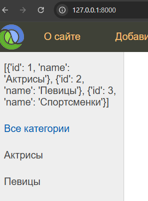
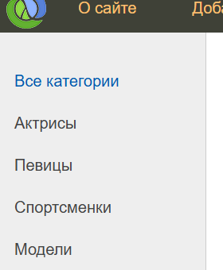
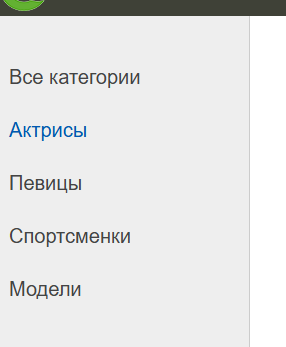

### Simple tags (простые теги)
Пользовательские теги должны храниться в каталоге нашего приложения - `women/templatetags`

Так же в папке тегов нужно создать пустой файл `__init__.py`
Создадим файл для пользовательских тегов `women_tags.py` 
```
sitewomen
	women
		static
		templates
		templatetags
			__init__.py
			women_tags.py
```
Импортируем библиотеку с шаблонами, так же для удобства дадим алиас *views* для функций с `women.views.py`. Зарегистрируем библиотеку `Library`
```py
from django import template
import women.views as views

register = template.Library()
```
#### Простой пример
Пропишем функцию вывода списка данных из views и вставим их в шаблон base.html
```py
# women_tags.py
from django import template
import women.views as views

register = template.Library()

@register.simple_tag()  # можно переименовывать функцию тега @register.simple_tag(name='getcats') и в шаблонах подключать по имени
def get_categories():
    return views.cats_db
```
Пропишем список з словарями в вьюхе
```py
#views.py

cats_db = [{'id': 1, 'name': 'Актрисы'},
           {'id': 2, 'name': 'Певицы'},
           {'id': 3, 'name': 'Спортсменки'}]
```
Подключаем наш тег  в шаблоне *base.html* указав файл с тегами `` и сам тег - указав имя функции ``
```django
# base.html



```
Видим на сайте наш список


Для возможности перебора словаря в списке нашего пользовательского тега, можно прописать такую конструкцию
```django



<!DOCTYPE html>
<html>
<head>
    <title>{{title}}</title>
    <link type="text/css" href="" rel="stylesheet" />
    <meta http-equiv="Content-Type" content="text/html; charset=utf-8">
    <link rel="shortcut icon" href="" type="image/x-icon"/>
    <meta name="viewport" content="width=device-width, initial-scale=1.0">
</head>

<body>
<table class="table-page" border=0 cellpadding="0" cellspacing="0">
<tr><td valign=top>

        <div class="header">
            <ul id="mainmenu" class="mainmenu">
            <li class="logo"><a href=""><div class="logo"></div></a></li>

    <li><li class="last">
        <a href="">{{m.title}}</a></li>

            </ul>
            <div class="clear"></div>
        </div>

<table class="table-content" border=0 cellpadding="0" cellspacing="0">
<tr>
<!-- Sidebar слева -->
    <td valign="top" class="left-chapters">
    <ul id="leftchapters">
        
        <li class="selected">Все категории</li>
            
                <li><a href="">{{ cat.name }}</a></li>
            
        <li class="share">
        <p>Наш канал</p>
        <a class="share-yt" href="https://www.youtube.com/channel/UClJzWfGWuGJL2t-3dYKcHTA/playlists" target="_blank" rel="nofollow"></a>
        </li>
    </ul>
</td>
<!-- Конец Sidebar'а -->
<td valign="top" class="content">
    <!-- Хлебные крошки -->
    
    
<!-- Блок контента -->
    <div class="content-text">


    </div>
<!-- Конец блока контента -->
</td></tr></table>
</td></tr>
<!-- Footer -->
<tr><td valign=top>
    <div id="footer">
        <p>&copy; 2023 Частичное или полное копирование информации с данного сайта для распространения на других ресурсах, в том числе и бумажных, строго запрещено.</p>
    </div>
</td></tr></table>
<!-- Конец footer'а и страницы -->
</body>
</html>
```

#### Дополним категории с примера выше ссылками
urls.py
```py
from django.urls import path, re_path, register_converter
from . import views
from . import converters

register_converter(converters.FourDigitYearConverter, "year4")

urlpatterns = [
    path('', views.index, name='home'),
    path('about/', views.about, name='about'),
    path('addpage/', views.addpage, name='add_page'),
    path('contact/', views.contact, name='contact'),
    path('login/', views.login, name='login'),
    path('post/<int:post_id>/', views.show_post, name='post'),
    path('category/<int:cat_id>/', views.show_category, name='category'),  # тут
]
```
views.py
```py
from django.http import HttpResponse, HttpResponseNotFound, Http404, HttpResponseRedirect, HttpResponsePermanentRedirect
from django.shortcuts import render, redirect
from django.urls import reverse
from django.template.loader import render_to_string
from django.template.defaultfilters import slugify

menu = [{'title': "О сайте", 'url_name': 'about'},
        {'title': "Добавить статью", 'url_name': 'add_page'},
        {'title': "Обратная связь", 'url_name': 'contact'},
        {'title': "Войти", 'url_name': 'login'}]

data_db = [
    {'id': 1, 'title': 'Анджелина Джоли', 'content': '''<h1>Анджелина Джоли</h1> (англ. Angelina Jolie[7], при рождении Войт (англ. Voight), ранее Джоли Питт (англ. Jolie Pitt); род. 4 июня 1975, Лос-Анджелес, Калифорния, США) — американская актриса кино, телевидения и озвучивания, кинорежиссёр, сценаристка, продюсер, фотомодель, посол доброй воли ООН.
    Обладательница премии «Оскар», трёх премий «Золотой глобус» (первая актриса в истории, три года подряд выигравшая премию) и двух «Премий Гильдии киноактёров США».''',
     'is_published': True},
    {'id': 2, 'title': 'Марго Робби', 'content': 'Биография Марго Робби', 'is_published': False},
    {'id': 3, 'title': 'Джулия Робертс', 'content': 'Биография Джулия Робертс', 'is_published': True},]

cats_db = [{'id': 1, 'name': 'Актрисы'},
           {'id': 2, 'name': 'Певицы'},
           {'id': 3, 'name': 'Спортсменки'},
           {'id': 4, 'name': 'Модели'}]

def index(request):
    data = {
        'title': 'Главная страница',
        'menu': menu,
        'posts': data_db,
    }
    return render(request, 'women/index.html', context=data)

def about(request):
    return render(request, 'women/about.html', {'title': 'О сайте', 'menu': menu})

def show_post(request, post_id):
    return HttpResponse(f"Отображение статьи с id = {post_id}")

def addpage(request):
    return HttpResponse("Добавление статьи")

def contact(request):
    return HttpResponse("Обратная связь")
def login(request):
    return HttpResponse("Авторизация")

def show_category(request, cat_id):  # простая заглушка для категорий
    return index(request)

def page_not_found(request, exception):
    return HttpResponseNotFound("<h1>Страница не найдена</h1>")
```
base.html
```django



  %% вместо get_categories - getcats если переименовали %%

	<li><a href="">{{ cat.name }}</a></li>

```


### Inclusion tags (включающие теги)
Позволяет возращать фрагмент штмл страницы

Создадим второй тег который будет передавать штмл блок из `women/list_categories.html`. Сама функция так же в шаблон `women/list_categories.html` передает из `women.views.py` список с данными *cats_db*, которые мы возращаем в шаблон в виде словаря `cats`
`templatestags/`
```python
from django import template
import women.views as views

register = template.Library()

@register.simple_tag()
def get_categories():
    return views.cats_db

@register.inclusion_tag('women/list_categories.html')
def show_categories():
    cats = views.cats_db
    return {'cats': cats}
```
Создадим сам файл шаблона 
`women/list_categories.html`
```django
<li class="selected">Все категории</li>

    <li><a href="">{{ cat.name }}</a></li>

```
В шаблоне вставим нам тег ` `
`base.html`
```django



<!DOCTYPE html>
<html>
<head>
    <title>{{title}}</title>
    <link type="text/css" href="" rel="stylesheet" />
    <meta http-equiv="Content-Type" content="text/html; charset=utf-8">
    <link rel="shortcut icon" href="" type="image/x-icon"/>
    <meta name="viewport" content="width=device-width, initial-scale=1.0">
</head>

<body>
<table class="table-page" border=0 cellpadding="0" cellspacing="0">
<tr><td valign=top>

        <div class="header">
            <ul id="mainmenu" class="mainmenu">
            <li class="logo"><a href=""><div class="logo"></div></a></li>

    <li><li class="last">
        <a href="">{{m.title}}</a></li>

            </ul>
            <div class="clear"></div>
        </div>

<table class="table-content" border=0 cellpadding="0" cellspacing="0">
<tr>
<!-- Sidebar слева -->
    <td valign="top" class="left-chapters">
    <ul id="leftchapters">
          %% тут %%
        <li class="share">
        <p>Наш канал</p>
        <a class="share-yt" href="https://www.youtube.com/channel/UClJzWfGWuGJL2t-3dYKcHTA/playlists" target="_blank" rel="nofollow"></a>
        </li>
    </ul>
</td>
<!-- Конец Sidebar'а -->
<td valign="top" class="content">
    <!-- Хлебные крошки -->
    
    
<!-- Блок контента -->
    <div class="content-text">


    </div>
<!-- Конец блока контента -->
</td></tr></table>
</td></tr>
<!-- Footer -->
<tr><td valign=top>
    <div id="footer">
        <p>&copy; 2023 Частичное или полное копирование информации с данного сайта для распространения на других ресурсах, в том числе и бумажных, строго запрещено.</p>
    </div>
</td></tr></table>
<!-- Конец footer'а и страницы -->
</body>
</html>
```
#### Пример с передачей данных в наш кастом тег
Реализуем применение стилей для наших категорий выше, при выборе любой из них

Как видим на скриншоте - выбранная категория подсвечивается синим цветом
Реализация:
Для отслеживания состояния выбранной категории, добавим новую переменную в наш щаблон тега `cat_selected`, которая будет принимать ид категории с views.py, зададим для переменной значение по умолчанию
`sitewomen>women>tempaletags>women_tags.py`
```python
from django import template
import women.views as views

register = template.Library()

@register.simple_tag()
def get_categories():
    return views.cats_db

@register.inclusion_tag('women/list_categories.html')
def show_categories(cat_selected=0):
    cats = views.cats_db
    return {'cats': cats, 'cat_selected': cat_selected}
```
`sitewomen>women>templates>women>list_categories.html`
```django

    
        <li class='selected'>{{cat.name}}</li>
    
        <li><a href="">{{ cat.name }}</a></li>
    

```
Добавим новый путь для категорий
`sitewomen>women>urls.py`
```python
from django.urls import path, re_path, register_converter
from . import views
from . import converters

register_converter(converters.FourDigitYearConverter, "year4")

urlpatterns = [
    path('', views.index, name='home'),  # http://127.0.0.1:8000
    path('about/', views.about, name='about'),
    path('addpage/', views.addpage, name='add_page'),
    path('contact/', views.contact, name='contact'),
    path('login/', views.login, name='login'),
    path('post/<int:post_id>/', views.show_post, name='post'),
    #  путь для категорий
    path('category/<int:cat_id>/', views.show_category, name='category'),
]
```
Добавим функцию для категорий
`sitewomen>women>views.py`
```python
from django.http import HttpResponse, HttpResponseNotFound, Http404, HttpResponseRedirect, HttpResponsePermanentRedirect
from django.shortcuts import render, redirect
from django.urls import reverse
from django.template.loader import render_to_string
from django.template.defaultfilters import slugify

menu = [{'title': "О сайте", 'url_name': 'about'},
        {'title': "Добавить статью", 'url_name': 'add_page'},
        {'title': "Обратная связь", 'url_name': 'contact'},
        {'title': "Войти", 'url_name': 'login'}]

data_db = [
    {'id': 1, 'title': 'Анджелина Джоли', 'content': '''<h1>Анджелина Джоли</h1> (англ. Angelina Jolie[7], при рождении Войт (англ. Voight), ранее Джоли Питт (англ. Jolie Pitt); род. 4 июня 1975, Лос-Анджелес, Калифорния, США) — американская актриса кино, телевидения и озвучивания, кинорежиссёр, сценаристка, продюсер, фотомодель, посол доброй воли ООН.
    Обладательница премии «Оскар», трёх премий «Золотой глобус» (первая актриса в истории, три года подряд выигравшая премию) и двух «Премий Гильдии киноактёров США».''',
     'is_published': True},
    {'id': 2, 'title': 'Марго Робби', 'content': 'Биография Марго Робби', 'is_published': False},
    {'id': 3, 'title': 'Джулия Робертс', 'content': 'Биография Джулия Робертс', 'is_published': True},]

cats_db = [{'id': 1, 'name': 'Актрисы'},
           {'id': 2, 'name': 'Певицы'},
           {'id': 3, 'name': 'Спортсменки'},
           {'id': 4, 'name': 'Модели'}]

def index(request):
    data = {
        'title': 'Главная страница',
        'menu': menu,
        'posts': data_db,
        'cat_selected': 0,}
    return render(request, 'women/index.html', context=data)

def about(request):
    return render(request, 'women/about.html', {'title': 'О сайте', 'menu': menu})

def show_post(request, post_id):
    return HttpResponse(f"Отображение статьи с id = {post_id}")

def addpage(request):
    return HttpResponse("Добавление статьи")

def contact(request):
    return HttpResponse("Обратная связь")

def login(request):
    return HttpResponse("Авторизация")

def show_category(request, cat_id):  #тут
    data = {
        'title': 'Отбражение по рубрикам',
        'menu': menu,
        'posts': data_db,
        'cat_selected': cat_id,}
    return render(request, 'women/index.html', context=data)  #как затычка - просто перенаправляем на главную страницу

def page_not_found(request, exception):
    return HttpResponseNotFound("<h1>Страница не найдена</h1>")
```
