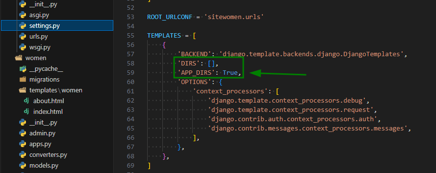
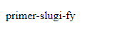
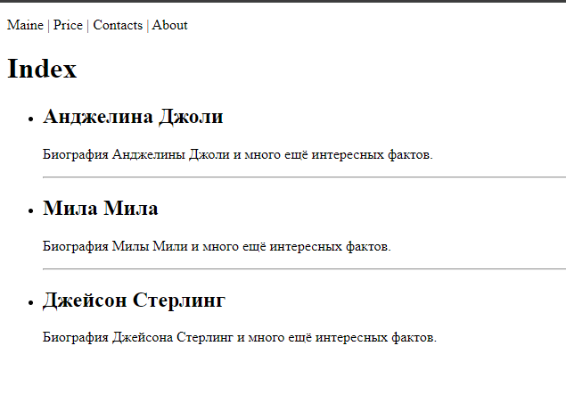
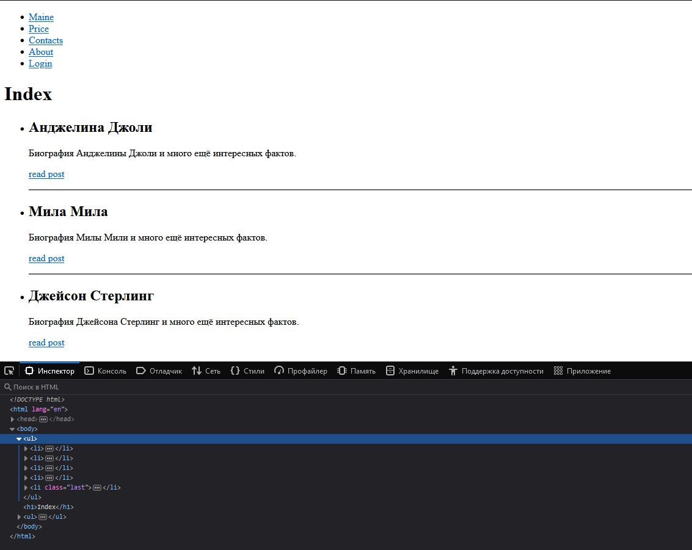
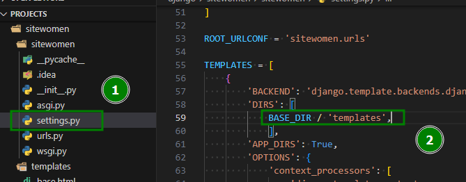
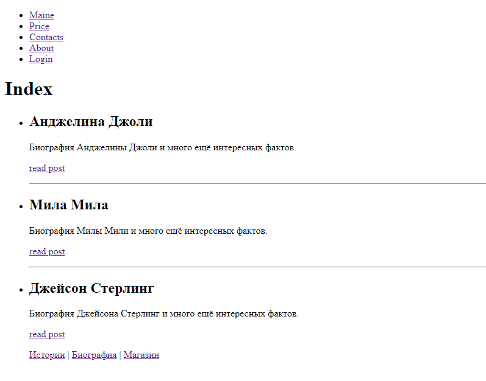

### Templates
По умолчанию, джанго ищет шаблоны внутри приложений(apps), в папке templates. После создания проекта этой папки нет - её нужно создать. Это прописано в корневой папке проекта джанго, в файле `settings.py`
* **'DIRS': []** - для кастомных путей к шаблонам (либо когда не инициализировано приложение в `settings.py` )
* **'APP_DIRS': True** - если True, значит джанго ищет шаблоны в папке `Templates`


Так как джанго ищет шаблоны в первой попавшейся папке `Templates`, когда у нас будет несколько приложений, может возникнуть путаница, из-за того, что другое приложение будет стоять выше по приоритету загрузки и шаблоны с именем идентичному с другими приложениями, будут подгружаться с него. Хорошим тоном, является создание в папке `templates`, ещё одной подпапки с именем самого приложения (наш пример `templates/women`). В папке `women` уже можно создавать файлы `html` шаблонов. 
Создадим, для примера, шаблон основной страницы `index.html`
> Для подключения шаблона в `sitewomen/women/views.py` используется функция `render_to_string`(её нужно импортировать из `django.template.loader`)
##### Простой пример `render_to_string`
```python
from django.http import HttpResponse
from django.template.loader import render_to_string

def index(request):
    t = render_to_string('women/index.html')
    return HttpResponse(t)
```
Теперь, при переходе на корневую страницу нашего сайта, у нас загрузиться шаблон `index.html`
##### Пример с `render`
Более красивым и правильным вариантом, является использование функции `render`
```python
from django.shortcuts import render

def index(request):
	return render(request, 'women/index.html')  
```
### Подстановка переменных с данными в шаблоны
#### Простой пример
Выведем название страници, меню, не целого числа, списка, множества, словаря и класса 
```python
from django.shortcuts import render
from django.http import HttpResponseNotFound, Http404

menu = ['Maine', 'Price', 'Contacts', 'About']
class MyClass:
    def __init__(self, a, b):
        self.a = a
        self.b = b

def index(request):
    data = {'title': 'Index',
            'menu': menu}
    return render(request, 'women/index.html', context=data)

def about(request):
    data = {'title': 'About',
            'menu': menu,
            'float': 23.44,
            'lst': [1, 2, 'rrr', 'fdd'],
            'set': {1, 2, 3, 2, 5},
            'dicts': {'key1': 'value1', 'key2': 'value2'},
            'obj': MyClass(10, 20),
            }
    return render(request, 'women/about.html', context=data)

def page_not_found(request, exception):
    return HttpResponseNotFound(f"<h1>Нет такой страницы</h1>")
```
Файл шаблона **about**
```django
<!DOCTYPE html>
<html lang="en">
<head>
    <meta charset="UTF-8">
    <meta name="viewport" content="width=device-width, initial-scale=1.0">
    <title>{{ title }}</title>
</head>
<body>
    <p>{{ menu }}</p>
    <p>{{ float }}</p>
    <p>{{ lst }}</p>
    <p>{{ set }}</p>
    <p>{{ dicts.key2 }} {{ dicts.key1 }}</p>  # на каждую переменную по {{}}
    <p>{{ obj.a }}</p>
    <h1>{{ title }}</h1>
</body>
</html>
```
Файл шаблона **Index**
```django
<!DOCTYPE html>
<html lang="en">
<head>
    <meta charset="UTF-8">
    <meta name="viewport" content="width=device-width, initial-scale=1.0">
    <title>{{ title }}</title>
</head>
<body>
<p>{{ menu }}</p>
<h1>{{ title }}</h1>
</body>
</html>
```
#### Filters
Конструкция фильтра:
**{{ "data"|"name filter":"value" }}** value не свегда есть у фильтра (записывается в виде строки) 
Некоторые примеры:
* **add** - `{{ float|add:"50"}}` добавить значению 50 (преобразует в целое число)
* **lower** - `{{ name|lower }}` преобразует текст в нижний регистр
* **capfirst** - `{{ name|capfirst }}` делает первую букву заглавной
* **cut** - `{{ name|cut:" " }}` удаляет с строки указанный в скобках символ. `{{ name|cut " "|cut "?" }}` - удалит все пробелы и знаки вопросов
* **default** - `{{ name|default:"Значение по умолчанию" }}` - если нет значения в переменной, то подставляет значение по умолчанию
* **divisibleby** - `{{ name|divisibleby:2 }}` - проверяет кратность числа, в данном случае - делится ли оно на 2. Возвращает Tru/False
* **first/last** - `{{ name|first }}` - или **last** выделяет первое или последнее значение данных в переменной
* **join** - `{{ name|join:" | " }}` - объединяет строку разделяя символом в скобках
* **lenght** - `{{ name|lenght }}` - считает количество элементов строке
* **slugify** - `{{ name|slugify }}` - преобразует строку в єлемvент slugi. Пример: `{{ "Primer slugi FY"|slugify }}`(primer-slugi-fy).

Так же фильтры можно применять в файлах питона импортировав предварительно библиотему:
```python
from django.template.defaultfilters import slugify

url = slugify("Primer SLUGY fY")
```
В шаблоне
```django
<p>{{ url }}</p>
```
Вывод

#### Tags
Синтаксис **{}** - прописываются внутри %
##### tag **for**
Перебор каждого элемента массива. Например, для отображения списка спортсменов, представленного в `athlete_list`:
```django
<ul>

    <li>{{ athlete.name }}</li>

</ul>
```
> Обязательно закрываем тег конструкцией ``

Цикл **for** устанавливает ряд переменных, доступных внутри цикла:

| Переменная            | Описание                                             |
| --------------------- | ---------------------------------------------------- |
| `forloop.counter`     | Текущая итерация цикла (с индексом 1)                |
| `forloop.counter0`    | Текущая итерация цикла (с индексом 0)                |
| `forloop.revcounter`  | Количество итераций с конца цикл (1-индексированный) |
| `forloop.revcounter0` | Количество итераций с конца цикл (с индексом 0)      |
| `forloop.first`       | Истинно, если это первый раз в цикле                 |
| `forloop.last`        | Истинно, если это последний раз в цикле              |
| `forloop.parentloop`  | Для вложенных циклов это цикл, окружающий текущий    |

##### tags **if**, **elif**, и **else**
Оценивает переменную, и если эта переменная равна «true», то содержимое блока выводится на экран:
```django

    Number of athletes: {{ athlete_list|length }}

    Athletes should be out of the locker room soon!

    No athletes.

```
В приведенном выше примере, если `athlete_list` не пуст, количество спортсменов будет отображаться переменной `{{ athlete_list|length }}`. В противном случае, если `athlete_in_locker_room_list` не пуст, будет отображено сообщение «Athletes should be out…». Если оба списка пусты, будет отображаться «No athletes.».

В теге **`if`** можно также использовать фильтры и различные операторы:
```django

   Team:  ... 

   Athlete: {{ athlete_list.0.name }}

```
Хотя приведенный выше пример работает, имейте в виду, что большинство шаблонных фильтров возвращают строки, поэтому математические сравнения с использованием фильтров обычно не работают так, как вы ожидаете. `length` является исключением.
примеры тегов с [django.fun](https://django.fun/docs/django/5.0/ref/templates/language/#filters)
#### Пример вывода переменных с тегами
`women/views.py`
```python
from django.shortcuts import render

menu = ['Maine', 'Price', 'Contacts', 'About']
data_db = [{"id": 1, "name": "Анджелина Джоли", 'content': 'Биография Анджелины Джоли и много ещё интересных фактов.', 'is_published': True},
            {"id": 2, "name": "Мила Мила", 'content': 'Биография Милы Мили и много ещё интересных фактов.', 'is_published': True},
            {"id": 3, "name": "Томми Хэнкс", 'content': 'Биография Томми Хэнкса и много ещё интересных фактов.', 'is_published': False},
            {"id": 4, "name": "Джейсон Стерлинг", 'content': 'Биография Джейсона Стерлинг и много ещё интересных фактов.', 'is_published': True},]

def index(request):
    data = {'title': 'Index',
            'menu': menu,
            'data_db': data_db
            }
    return render(request, 'women/index.html', context=data)

def about(request):
    data = {'title':'About',}  # даже для вывода одиночной переменной нам нужно поместить её в словарь
    return render(request, 'women/about.html', data)  # Выведет просто About
```
`women/templates/women/index.html`
```django
<!DOCTYPE html>
<html lang="en">
<head>
    <meta charset="UTF-8">
    <meta name="viewport" content="width=device-width, initial-scale=1.0">
    <title>{{ title }}</title>
</head>
<body>
<p>{{ menu|join:" | " }}</p>
<h1>{{ title }}</h1>
<ul>
    
    
        <li>
        <h2>{{ p.name }}</h2>
        <p>{{ p.content }}</p>
        
            <hr>
        
        </li>    
    
    
</ul>
</body>
</html>
```
`women/templates/women/about.html`
```django
<!DOCTYPE html>
<html lang="en">
<head>
    <meta charset="UTF-8">
    <meta name="viewport" content="width=device-width, initial-scale=1.0">
    <title>{{ title }}</title>
</head>
<body>
<p>{{ menu|join:" | " }}</p>
<h1>{{ title }}</h1>
</body>
</html>
```
Вывод главной страници:

#### Url-адреса
##### Самый просто вариант но не очень красивый, так как при изменении маршрутов, нам придется редактировать и эти ссылки
Синтаксис: `<a href="URL-aдрес страницы">Название ссылки</a>`
**Пример:**
```django
<!DOCTYPE html>
<html lang="en">
<head>
    <meta charset="UTF-8">
    <meta name="viewport" content="width=device-width, initial-scale=1.0">
    <title>{{ title }}</title>
</head>
<body>
<p>{{ menu|join:" | " }}</p>
<h1>{{ title }}</h1>
<ul>
    
    
        <li>
        <h2>{{ p.name }}</h2>
        <p>{{ p.content }}</p>
        <p><a href="post/{{ p.id }}">Читать пост</a></p>  %% пример тут %%
        
            <hr>
        
        </li>    
    
    
</ul>
</body>
</html>
```
##### Правильный вариант
Синтаксис: `<a href="">Название ссылки</a>`
Пример:
Пропишем новый маршрут для страницы с постами в `sitewomen/women/urls.py`
```python
from . import views, converters
from django.urls import path

urlpatterns = [
    path('', views.index, name='home'),
    path('about/', views.about, name='about'),
    path('post/<int:post_id>/', views.show_post, name='name_post'), # новый маршрут
]
```
Пропишем функцию представления для страницы постов в `sitewomen/women/views.py`
```python
def show_post(request, post_id):
    return HttpResponse(f"Страница с постом {post_id}")
```
В шаблоне `sitewomen/women/templates/women/index.html`
```django
<!DOCTYPE html>
<html lang="en">
<head>
    <meta charset="UTF-8">
    <meta name="viewport" content="width=device-width, initial-scale=1.0">
    <title>{{ title }}</title>
</head>
<body>
<p>{{ menu|join:" | " }}</p>
<h1>{{ title }}</h1>
<ul>
    
	    
	        <li>
		        <h2>{{ p.name }}</h2>
		        <p>{{ p.content }}</p>
		        <p> <a href="">read post</a></p>
		        
		            <hr>
		        
	        </li>    
	    
    
</ul>
</body>
</html>
```
#### Пример вывода переменных и тегов, плюс ссылки c авто-подстановкой данных
`sitewomen/women/urls.py`
```python
from . import views, converters
from django.urls import path
  
urlpatterns = [
    path('', views.index, name='home'),
    path('price/', views.price, name='price'),
    path('contacts/', views.contacts, name='contacts'),
    path('about/', views.about, name='about'),
    path('login/', views.login, name='login'),
    path('post/<int:post_id>/', views.show_post, name='name_post'),
]
```
`sitewomen/women/views.py`
```python
from django.shortcuts import render
from django.http import  HttpResponseNotFound, HttpResponse

menu = [{'title': 'Maine', 'url_name': 'home'},
        {'title': 'Price', 'url_name': 'price'},
        {'title': 'Contacts', 'url_name': 'contacts'},
        {'title': 'About', 'url_name': 'about'},
        {'title': 'Login', 'url_name': 'login'}]

data_db = [{"id": 1, "name": "Анджелина Джоли", 'content': 'Биография Анджелины Джоли и много ещё интересных фактов.', 'is_published': True},
            {"id": 2, "name": "Мила Мила", 'content': 'Биография Милы Мили и много ещё интересных фактов.', 'is_published': True},
            {"id": 3, "name": "Томми Хэнкс", 'content': 'Биография Томми Хэнкса и много ещё интересных фактов.', 'is_published': False},
            {"id": 4, "name": "Джейсон Стерлинг", 'content': 'Биография Джейсона Стерлинг и много ещё интересных фактов.', 'is_published': True},]

def index(request):
    data = {'title': 'Index',
            'menu': menu,
            'data_db': data_db
            }
    return render(request, 'women/index.html', context=data)

def price(request):
    return HttpResponse("Страница Price")

def contacts(request):
    return HttpResponse("Страница Сontacts")

def about(request):
    data = {'title':'About',}
    return render(request, 'women/about.html', data)

def login(request):
    return HttpResponse("Страница Login")

def show_post(request, post_id):
    return HttpResponse(f"Страница с постом {post_id}")

def page_not_found(request, exception):
    return HttpResponseNotFound(f"<h1>Нет такой страницы, уходи!</h1><a href='http://127.0.0.1:8000'> Главная</a>")
```
`sitewomen/women/templates/women/templates/index.html`
```django
<!DOCTYPE html>
<html lang="en">
<head>
    <meta charset="UTF-8">
    <meta name="viewport" content="width=device-width, initial-scale=1.0">
    <title>{{ title }}</title>
</head>

<body>
<ul>
     <li><a href="">Главная</a></li> 
    
        
            <li>
        
            <li class="last">
        
        <a href="">{{ p.title }}</a></li>
    
</ul>

<h1>{{ title }}</h1>

<ul>
    
        
            <li>
                <h2>{{ p.name }}</h2>
                <p>{{ p.content }}</p>
                <p> <a href="">read post</a></p>
                
                    <hr>
                
            </li>    
        
    
</ul>
</body>
</html>
```
Вывод:

#### Наследование базовых шаблонов
Базовые шаблоны создаются на уровне приложения sitewomen/**templates**/base.html
Что б его видел движок джанго, в `sitewomen/settings.py`  в списке `TEMPLATES` в его подсписке `BASE_DIR [] `нужно указать путь к папке этих шаблонов

Теперь мы будем использовать для одинакового контента типа футера и html шапки базовый/общий шаблон `sitewomen/templates/base.html`, а шаблоны страниц будут использоваться для уникального контента каждой.
##### Синтаксис: **block**
```django

<p>Контент</p>

```
Далее в общем шаблоне вставим контент выше
```django


```
##### Синтаксис **extends**
Для подключения с базового шаблона общего контента типа футера, каркаса страници и тд используется тег `extends`
```django

```
##### Синтаксис **include**
```django

```
создаем `women/includes/nav.html`
```django
<nav>
    <a href="#">Истории</a> |
    <a href="#">Биография</a> |
    <a href="#">Магазин</a>
</nav>
```
> при импорте можно запретить передачу переменных
```django

```
> либо передать дополнительные переменные
```django

```
##### Пример
`base.html`
```django
<!DOCTYPE html>
<html lang="en">
<head>
    <meta charset="UTF-8">
    <meta name="viewport" content="width=device-width, initial-scale=1.0">
    <title>{{ title }}</title>
</head>

<body>
<ul>
     <li><a href="">Главная</a></li> 
    
        
            <li>
        
            <li class="last">
        
        <a href="">{{ p.title }}</a></li>
    
</ul>

  /* подключаем контент с страниц */

</body>
</html>
```
`index.html`
```django


<h1>{{ title }}</h1>
<ul>
    
        
            <li>
                <h2>{{ p.name }}</h2>
                <p>{{ p.content }}</p>
                <p> <a href="">read post</a></p>
                
                    <hr>
                
            </li>    
        
    
    

```
`about.html`
```django


<h1>{{ title }}</h1>

```
Вывод
